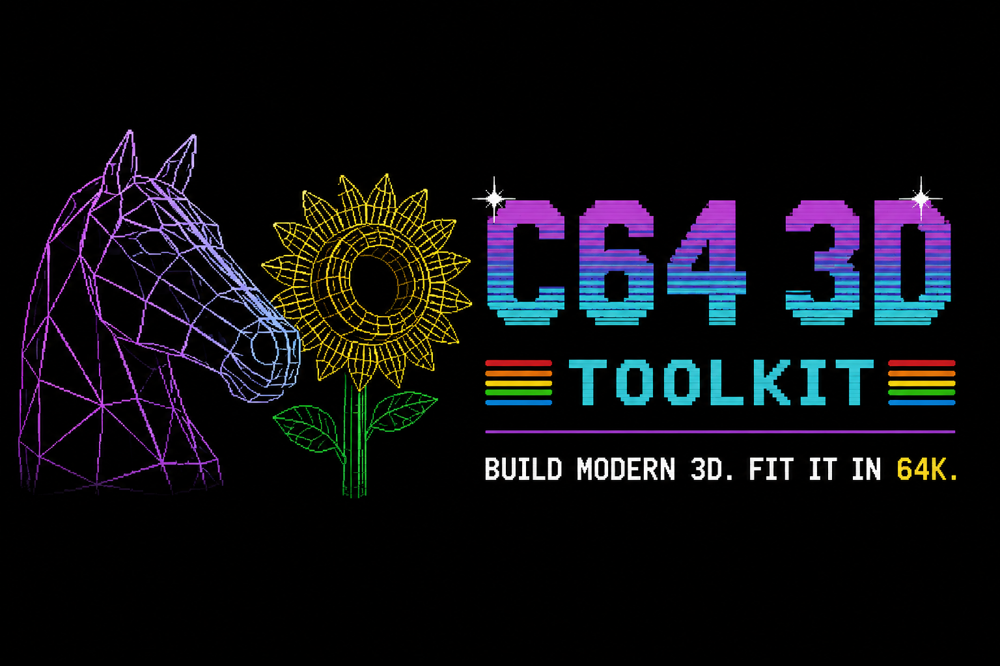

<p align="center">
  
</p>

# c64-3d-toolkit

Host-assisted low-poly wireframe 3D compiler/runtime for a **stock Commodore 64**, with first-class support for animated **Blender `.blend` scenes**, **Wavefront OBJ + MTL**, **SVG artwork**, and built-in procedural geometry.

Animate objects, cameras, modifiers, armatures, or rigid-body scenes in Blender; import coloured OBJ/MTL meshes or SVG paths; or use the classic procedural meshes and animation transforms. The toolkit preprocesses the result on the host, performs projection and hidden-line visibility, then generates 6510/6502 assembly data and runnable C64 `.prg` files whose vectors are drawn live by the C64.

## Requirements

Required:

* [VICE](https://vice-emu.sourceforge.io/) — Commodore 64 emulator; the toolkit uses `x64sc` by default.
* [64tass](https://tass64.sourceforge.net/) — 6502/6510 cross-assembler.
* Python 3.

Recommended for the authored `.blend` scene path:

* [Blender](https://www.blender.org/) — use the current Blender LTS for newly authored scenes. Blender 4.0.2 remains a supported older fallback on Ubuntu 24.04. Animate geometry, physics, modifiers, armatures, materials, and a virtual camera in Blender, then compile sampled scene frames into vectors drawn live on the C64. Blender supplies its own `bpy` Python environment; do **not** add `bpy` to `requirements.txt` or install it with `pip`.

Blender is required for `.blend` scene builds. Classic procedural, OBJ/MTL,
and SVG builds remain fully usable without it.

### 🐧 Linux setup

On Debian/Ubuntu and derivatives, VICE and 64tass can normally be installed with:

```bash
sudo apt install vice 64tass
```

Blender is recommended. Ubuntu 24.04 LTS (`noble`) provides Blender 4.0.2 with
a working bundled `bpy`; install it to use the animated `.blend` scene pipeline:

```bash
sudo apt install blender
```

The same distribution-package route is appropriate on later Ubuntu/Debian
releases when `apt show blender` reports an available package. Verify the
headless Python integration with:

```bash
blender --background --disable-autoexec --python-expr 'import bpy; print("BLENDER:", bpy.app.version_string); print("BPY OK")'
```

Verify that the required tools are available with:

```bash
./build.sh doctor
```

Preflight reports resolved executable paths and versions for 64tass and VICE.
`doctor` additionally launches optional Blender headlessly and reports both its
version and whether `bpy` imports successfully. Every `--blend` build repeats
that Blender/`bpy` check before reading the scene.

### 🪟 Windows setup

If Git is not already installed, install Git for Windows first through WinGet:

```powershell
winget install --id Git.Git -e --source winget
```

Then clone the toolkit and run the Windows setup helper:

```powershell
git clone https://github.com/FlyingFathead/c64-3d-toolkit.git
cd c64-3d-toolkit
.\setup-windows.cmd
```

For the optional Blender scene pipeline, install the official Blender package
through WinGet:

```powershell
winget install -e --id BlenderFoundation.Blender
```

Open a new PowerShell window after installation and verify Blender's bundled
Python environment:

```powershell
blender --background --disable-autoexec --python-expr 'import bpy; print("BLENDER:", bpy.app.version_string); print("BPY OK")'
```

If `blender` is not added to `PATH`, the toolkit also searches normal Blender
Foundation installation directories under Program Files. An exact executable
can be selected with `--blender` or `config/c643d.ini`.

For installer and recovery help:

```powershell
.\setup-windows.cmd -Help
```

If the toolkit came from a release ZIP or was copied from another machine, run `setup-windows.cmd` directly from the toolkit directory. The helper detects existing tools and can install missing Python, Git, and VICE through Microsoft's WinGet `winget` source. Existing WinGet packages are kept by default, with explicit upgrade and same-version reinstall choices.

64tass remains a deliberate manual trust decision on Windows: setup does not automatically download or execute it. You can provide an existing `64tass.exe`, search common locations, or optionally scan a selected drive. Manual candidates are validated without execution and SHA-256 is shown before confirmation. Existing `[windows]` paths in `config/c643d.ini` are preserved unless you explicitly change them.

See [`docs/WINDOWS_SETUP.md`](docs/WINDOWS_SETUP.md) for the complete Windows bootstrap, recovery, path-search, and trust/provenance notes.

### Toolchain configuration and macOS/Windows paths

The toolkit now has an optional local configuration file for tool paths and default arguments. Copy the example if `64tass` or `x64sc` are not directly in `PATH`, or if your installation needs custom command-line arguments:

```bash
cp config/c643d.ini.example config/c643d.ini
```

`config/c643d.ini` is gitignored. If it is absent, built-in defaults are used. Command-line options override the config. The default VICE arguments include `+VICIIfull`, so `--run` opens VICE windowed rather than inheriting a saved fullscreen setting.

```ini
[toolchain]
tass = 64tass
vice = x64sc
tass_args =
vice_args = +VICIIfull

[macos]
# tass = /opt/homebrew/bin/64tass
# vice = /Applications/vice-arm64-gtk3-3.8/bin/x64sc

[windows]
# tass = C:\Tools\64tass\64tass.exe
# vice = C:\Tools\VICE\bin\x64sc.exe
```

On macOS, the easiest command-line installation is typically:

```bash
brew install tass64 vice
```

For a VICE package downloaded from the VICE site and moved into `/Applications`, prefer the package's real command-line binary directly, for example `vice = /Applications/vice-arm64-gtk3-3.8/bin/x64sc`. The architecture/frontend/version part of the directory name varies by download (for example ARM64 vs. Intel and GTK3 vs. SDL2). The toolkit also probes common package layouts and accepts a VICE distribution directory or `.app` path, but pointing straight at `bin/x64sc` is the least ambiguous option.

Existing direct overrides still work:

```bash
./build.sh --shape torus --tass /path/to/64tass --vice /path/to/x64sc --run
./build.sh --shape torus --vice-arg=+VICIIfull --run
./build.sh --shape torus --no-vice-default-args --run
```

See [`docs/CONFIGURATION.md`](docs/CONFIGURATION.md) for precedence, per-platform sections, `C643D_CONFIG`, `--config`/`--no-config`, and macOS package details.

## Quickstart

Build and run one of the included procedural objects:

```bash
./build.sh --shape torus --run
```

Build and run an imported OBJ preset:

```bash
./build.sh --object horse_head --run
```

Compile the included authored Blender rigid-body scene:

```bash
./build.sh --blend examples/blender_falling_cubes/falling_cubes_c64.blend \
    --frame-start 1 --frame-end 72 --sample-step 4 --run
```

The toolkit checks that Blender can run headlessly and import its bundled
`bpy` module before processing a `.blend` file. Blender is invoked with
`--disable-autoexec` before the scene is opened, so embedded scripts in a
`.blend` file are not auto-executed by the toolkit. See
[`docs/BLENDER_PIPELINE.md`](docs/BLENDER_PIPELINE.md) for installation,
stable-topology constraints, material colours, and the generated falling-cubes
rigid-body example.

The Blender examples live under `examples/blender_falling_cubes/`, not in the project root:

```bash
# Generate the C64-budget-oriented six-cube scene beside its script.
blender --background --python examples/blender_falling_cubes/falling_cubes_c64.py

# Compile 18 samples from that generated scene.
./build.sh --blend examples/blender_falling_cubes/falling_cubes_c64.blend \
    --frame-start 1 --frame-end 72 --sample-step 4 --run
```

For stateful simulations such as rigid bodies, the exporter evaluates every
intervening Blender frame sequentially and stores only the requested samples.
Thus `--sample-step 4` keeps the 72-frame motion span while reducing the stored C64 table frames enough for the expanded 192-line default viewport, without skipping physics evaluation between samples.
The exporter warns explicitly if every sampled frame is geometrically identical.

`falling_cubes_full.py` and the included Blender-4.00
`falling_cubes_full.blend` contain Harry's deterministic 40-cube authoring
scene. They are useful as a Blender/rigid-body stress example; the smaller
variant exists because the full scene can exceed the C64 renderer's per-frame
vector and table-RAM budgets.

or:

```bash
./build.sh --object sunflower_torus --run
```

The sunflower reads `usemtl`/`Kd` data from `sunflower_torus.mtl` and maps it to
C64 brown, yellow, and green. To deliberately keep the historical white-on-black
wireframe path:

```bash
./build.sh --object sunflower_torus --no-colors --run
```

The bundled SVG logo can be spun as a 3-D plane or sent away on a tilted crawl plane:

```bash
./build.sh --object space_horse --run
./build.sh --object space_horse_crawl --run
```

Build the manifest-driven procedural/OBJ/SVG reference `.prg` files and all release regression variants:

```bash
./build.sh --generate-examples
```

Reference PRGs are grouped into per-example directories under `examples/`. The unsuffixed overlay build uses the current 256x192 viewport; `_legacy144.prg` keeps the older 256x144 performance/reference framing; `_no_overlay.prg` uses the full 256x200 bitmap height; `_rastertime_profiler.prg` is the separate debug renderer. This makes viewport/FPS comparisons explicit instead of silently replacing the old 144-line behavior.

When upgrading an existing pre-0.6.2 checkout by overlay ZIP, preview and then apply the one-time layout migration so old flat PRGs / `examples/blender/` copies do not remain behind:

```bash
python tools/migrate_examples_layout.py
python tools/migrate_examples_layout.py --apply
```

The migration never overwrites a differing destination file; identical duplicates are removed and conflicts are left untouched with a warning.

The Blender regression set is kept separate because Blender is optional. The historical colour `falling_cubes_c64_color-yunroll_legacy144.prg` is retained in `examples/blender_falling_cubes/`; current 192/200/debug PRGs are generated and checksum-verified with `test-examples --blender-only` / `generate-examples --blender-only`.

Build + run the reference torus with the current fastest renderer:

```bash
./build.sh --shape torus --run
```

Make the torus denser:

```bash
# 72 vertices / 72 quad faces = 12 x 6 torus
./build.sh --shape torus --vertices 72 --run

# same topology, explicitly
./build.sh --shape torus --major-segments 12 --minor-segments 6 --run

# target approximate face/poly count
./build.sh --shape torus --polycount 100 --run
```

Run the included low-poly horse head or sunflower:

```bash
./build.sh --object horse_head --run
./build.sh --object sunflower_torus --run
```

The horse OBJ is open/non-manifold in a few places, so its preset uses full `surface` Z-buffer visibility. This intentionally avoids face-normal pre-culling on unreliable topology; the Z-buffer also tracks face ownership so muzzle edges cannot self-occlude against their own adjacent faces. You can compare the lighter modes or the older front-face-only method with:

```bash
./build.sh --object horse_head --visibility surface_features --run
./build.sh --object horse_head --visibility surface_creases --feature-angle 40 --run
./build.sh --object horse_head --visibility frontface --run
```

Import your own OBJ into the project, then build it:

```bash
./build.sh import-obj ~/models/my_ship.obj --as my_ship --up z
./build.sh --object my_ship --run
```

Or compile a one-off OBJ without importing it:

```bash
./build.sh --obj ~/models/my_ship.obj --obj-up z --name MY_SHIP --run
```

SVG artwork can be imported as wire geometry too. Curves are flattened and simplified on the host; `--svg-depth` optionally gives the contours a shallow Z extrusion:

```bash
./build.sh import-svg ~/art/logo.svg --as logo --animation spin
./build.sh --object logo --run

# one-off, shallow 3-D extrusion
./build.sh --svg ~/art/logo.svg --svg-depth 4 --color yellow --run
```

Animation modes are `spin`, `recede`, and `crawl`. `recede` keeps the artwork front-facing while moving it away from the camera; `crawl` tilts it onto a virtual plane and moves it upward/away toward a horizon:

```bash
./build.sh --object space_horse --animation recede --run
./build.sh --object space_horse --animation crawl --animation-tilt 62 --run
```

Renderer comparison:

```bash
./build.sh --shape torus --renderer step --run       # v0.7-style reference
./build.sh --shape torus --renderer bytechunk --run  # v0.8 stable path
./build.sh --shape torus --renderer yunroll --run    # current fastest path
```

Useful inspection commands:

```bash
./build.sh inspect --shape torus --vertices 72
./build.sh inspect --object horse_head
./build.sh list-shapes
./build.sh list-objects
```

## Horse-head visibility note

The bundled horse is deliberately compiled with `--visibility surface`. Its OBJ contains boundary and non-manifold topology, so using adjacent face normals as a pre-cull can make legitimate muzzle/snout edges disappear at some rotations. Full surface mode lets the host-side Z-buffer decide visibility instead.

`surface_features` retains the cheaper v0.3.1 behavior: ordinary two-face manifold edges are pre-culled when both adjacent faces are back-facing, while boundary/non-manifold edges survive to the surface depth test. `surface_creases` is the crease-aware variant and preserves sharp manifold edges according to `--feature-angle`.

```bash
./build.sh --object horse_head --visibility surface_features --run
./build.sh --object horse_head --visibility surface_creases --feature-angle 40 --run
```

The emitter can spill whole per-orientation line blocks into otherwise-unused RAM below bitmap #2, so the full horse surface mode still fits 36 sampled orientations without reducing the mesh.


## v0.6.2 render/build controls

v0.6.2 expands the default drawable area while keeping alternate/debug paths out of the production renderer:

```bash
# production HUD/FPS path: automatic 256x192 drawable viewport
./build.sh --shape torus --run

# legacy/performance framing: same production renderer, 256x144 drawable viewport
./build.sh --shape torus --viewport-height 144 --run

# separate no-overlay ASM: no HUD/FPS/text, automatic full 256x200 viewport
./build.sh --shape torus --no-text-overlay --run

# derivative yunroll debug ASM: border marks actual main-loop render CPU time
./build.sh --shape torus --rastertime-profiler --run
```

`--viewport-height LINES` may override the automatic height (8..200, multiple of 8). `--overwrite-policy allow|warn|error` controls existing PRG/LBL/LST outputs; the built-in default is `warn`. These defaults may also be stored in `[render_defaults]` in `config/c643d.ini`; command-line options take precedence.

The no-overlay and raster-profiler implementations are separate ASM derivatives. Normal `step`, `bytechunk`, and `yunroll` production sources contain no conditional profiler/overlay-removal instrumentation and pay no extra byte or cycle cost for these modes.

### PRG checksum regression tests

```bash
# test every manifest example in 192-line normal, 144-line legacy, 200-line no-overlay and profiler variants
./build.sh test-examples

# one example only
./build.sh test-examples --only cube

# compare against a named historical/current checksum set
./build.sh test-examples --reference-set legacy-v0.6.0-v0.6.1

# actually reproduce that reference set's recorded historical build settings
./build.sh test-examples --variants normal --reference-set legacy-v0.6.0-v0.6.1 --reproduce-reference
```

Each generated PRG is reported as `MATCHING`, `CHANGED`, or `ABSENT`, followed by totals. Reference SHA-256 values and byte sizes live in `tests/data/golden_prg_checksums.json`. The historical v0.6.0/v0.6.1 set is retained alongside the current v0.6.2 baseline instead of being overwritten.

To install all deterministic reference PRGs into their per-example directories (normal, `_legacy144`, `_no_overlay`, and `_rastertime_profiler`):

```bash
./build.sh --generate-examples
```

## Examples

The repository has an `examples/` manifest for the dependency-free procedural,
OBJ/MTL, and SVG reference builds:

```bash
./build.sh --generate-examples
# equivalent:
./build.sh generate-examples
```

For each manifest entry this produces the current 192-line normal `.prg`, a byte-comparable `_legacy144.prg` performance/reference build, a `_no_overlay.prg` full-height build, and a `_rastertime_profiler.prg` debug build. Auxiliary labels/listings remain transient; runnable reference PRGs are placed in the manifest entry's `examples/<name>/` directory.

Blender-authored examples are intentionally outside `examples.json` because
Blender is optional. `examples/blender_falling_cubes/` contains the six-cube C64 scene, the 40-cube authoring/stress scene, and the byte-exact historical 144-line colour PRG. Current Blender PRGs are regenerated only on Blender-capable hosts and verified against the current v0.6.2 checksum manifest.

## Dependency checks

Every build now performs an early preflight. `64tass` is required unless `--no-assemble` is used. VICE is optional for build-only work but required for `--run`. Override executable names/paths with `--tass` and `--vice`.

```bash
./build.sh doctor
```

On Debian/Ubuntu, distro VICE packages can be DFSG-stripped and omit Commodore ROM images. The emulator executable may therefore exist but still fail at machine startup until compatible ROMs are installed/configured. This is separate from the toolkit preflight, which only verifies that the executable is present.

## Current state

The historical 256x144 `yunroll` torus (`torus_legacy144.prg`) measured around
**15-18 FPS** on stock PAL C64 timing in VICE during development. The current
256x192 default and 256x200 no-overlay builds deliberately draw/clear more of
the bitmap and can therefore run slower depending on scene complexity. All
variants remain native hires, hidden-line clipped, triple-buffered, and do not
use pre-rendered bitmap animation frames.

As of **v0.6.2**, the toolkit is a reusable multi-source compiler/runtime rather
than only a rotating-mesh benchmark. It accepts procedural geometry, OBJ/MTL,
SVG, versioned `.c643dscene` interchange data, and animated Blender `.blend`
scenes. Blender-authored builds can preserve arbitrary object motion, stable-
topology deformation, rigid-body simulation, materials, and active-camera
animation while the stock C64 still rasterizes the resulting vectors itself.

The project grew out of the rotating-torus benchmark, a.k.a. **THE WORLD'S MOST
DANGEROUS ROTATING DONUT**.

The repository includes the actual `objects/horse_head.obj` low-poly model
(64 vertices / 124 edges / 65 faces), `objects/sunflower_torus.obj` + `.mtl`
(76 vertices / 142 edges / 70 faces), the bundled `objects/space_horse.svg`
vector-logo demo, and Blender rigid-body examples under `examples/blender_falling_cubes/`.

## What happens on the host vs. the C64?

The host side performs the expensive/general work that makes sense to precompute
for a ~1 MHz target:

- procedural mesh generation, Wavefront OBJ/MTL parsing, and SVG contour
  flattening/simplification
- optional headless Blender scene evaluation through Blender's bundled `bpy`
- dependency-graph evaluation of object transforms, rigid bodies, modifiers,
  armatures, stable-topology deformation, materials, and the active camera
- versioned `.c643dscene` interchange loading for Blender-neutral scene builds
- normalization, coordinate conversion, and face-winding repair for legacy
  procedural/OBJ/SVG sources
- sampled legacy transforms (`spin`, `recede`, or tilted-plane `crawl`) or
  authored Blender frame selection
- perspective projection and viewport clipping for authored scene sources
- face visibility and host-side Z-buffer hidden-line clipping
- C64-oriented line-step encoding
- dirty-area and hires screen-colour span generation

Blender scenes use strict authored-frame semantics: if the selected samples do
not fit the C64 table budget, the build fails with sampling/range/detail
suggestions rather than silently discarding authored frames.

The C64 still rasterizes the visible wireframe itself into VIC-II hires bitmap
RAM. `step`, `bytechunk`, and `yunroll` are vector/line renderers, not
bitmap-frame players.

## Shapes and topology

Built-ins:

```text
torus
cube
sphere
```

Repository objects:

```text
objects/horse_head.obj
objects/horse_head.json
objects/sunflower_torus.obj
objects/sunflower_torus.mtl
objects/sunflower_torus.json
objects/space_horse.svg
objects/space_horse.json
objects/space_horse_crawl.json
```

For procedural shapes, use either the actual segmentation or an approximate target:

```bash
--major-segments N --minor-segments N    # torus
--lat-segments N --lon-segments N        # sphere
--polycount N                            # approximate face count
--vertices N                             # approximate vertex count
```

For the torus, `major_segments * minor_segments` equals both the vertex count and quad-face count. Example:

```text
10 x 5  ->  50 verts, 100 edges, 50 faces
12 x 6  ->  72 verts, 144 edges, 72 faces
14 x 7  ->  98 verts, 196 edges, 98 faces
```

Higher detail consumes both CPU time and generated table RAM. If a requested mesh no longer fits with 48 orientations, the compiler preserves mesh detail and automatically reduces the orientation-table count unless `--strict-frames` is used.

## OBJ pipeline

### Import a model into `objects/`

```bash
./build.sh import-obj path/to/model.obj --as model_name --up y
```

This creates:

```text
objects/model_name.obj
objects/model_name.json
```

The JSON sidecar stores object-specific metadata such as:

- display name
- source up-axis (`y` or `z`)
- preferred spin axis (`x`, `y`, or `z`)
- initial rotation
- object scale

Then build it with:

```bash
./build.sh --object model_name --run
```

List imported/preset objects:

```bash
./build.sh list-objects
```

Inspect topology before compiling:

```bash
./build.sh inspect --object model_name
```

The inspector reports vertices, edges, faces, n-gon mix, boundary edges, non-manifold edges, and isolated vertices.

### Current OBJ support

The parser supports:

- `v` vertices
- polygonal `f` faces
- positive and negative OBJ indices
- `v/vt`, `v//vn`, and `v/vt/vn` tokens
- triangles, quads, and n-gons

Texture/normal indices are currently ignored. Polygon faces are triangulated internally for visibility/Z-buffer work while polygon boundary edges remain the wireframe edges. Direct `mtllib` references are preserved by `import-obj`; `usemtl` assignments and diffuse `Kd` colours are read and mapped to the nearest C64 palette entries.

OBJ/MTL and SVG source colours are enabled automatically. Disable them with any
of the equivalent flags below; this retains the original monochrome table format
and hot renderer loop:

```bash
./build.sh --object sunflower_torus --no-color --run
./build.sh --object sunflower_torus --no-colors --run
./build.sh --object sunflower_torus --ignore-colors --run
```

If an OBJ has no usable `mtllib`/`usemtl`/`Kd` data, or an SVG has no explicit
usable stroke/fill colour, the compiler simply uses the single-colour path
(white by default). It does not enable the per-cell colour machinery. Before
frame generation, the build prints which of those paths it selected and names
the source file it inspected.

`--color yellow` (or `--color 7`) forces one monochrome foreground colour and
also bypasses per-material/per-contour mapping.

### Current limitation

The toolkit does **not yet contain a general mesh decimator**. Imported meshes should currently already be reasonably low-poly. Automatic simplification to a requested C64 face/edge budget is on the roadmap; it will be implemented as a real topology-aware stage rather than deleting random faces and pretending that is decimation.

## SVG pipeline

SVG artwork is treated as vector contour geometry rather than as a bitmap. The importer understands common SVG path commands and basic vector primitives, flattens Bezier/arc curves to line segments, simplifies them for the C64 budget, flips SVG Y-down coordinates into the toolkit's Y-up space, and stores the result as explicit wire edges. This avoids inventing filled triangles through concave glyphs or letter holes.

Import and build:

```bash
./build.sh import-svg path/to/logo.svg --as logo
./build.sh --object logo --run
```

Useful controls:

```text
--svg-tolerance N          contour simplification tolerance in source SVG units
--svg-curve-step N         curve sampling step before simplification
--svg-depth N              shallow wire extrusion depth; 0 keeps a flat plane
--svg-connector-stride N   connect every Nth front/back vertex when extruded
--color NAME|0..15         force one C64 foreground colour
--no-colors                ignore source colours; classic white-on-black
--animation spin|recede|crawl
--animation-tilt DEG       crawl-plane tilt
--animation-travel N       distance travelled away from the camera
--animation-rise N         upward travel for crawl mode
```

`import-svg` inspects each visible contour's stroke/fill colour and maps it to the nearest C64 palette entry. The bundled SPACE HORSE asset uses `#FFE81F`, which maps to C64 yellow. Multi-colour SVGs retain distinct contour colours.

Native hires bitmap mode selects foreground/background per 8x8 character cell,
not per pixel. The host therefore counts the visible coloured line pixels in each
touched cell and assigns the dominant colour when several materials/contours
share that cell. It emits horizontal screen-colour spans containing ready-to-store
VIC-II colour bytes. RGB parsing and nearest-colour searches never run on the C64.
Single-colour sources use the existing global hires foreground byte and therefore
need no colour table or runtime update pass.

The bundled examples are:

```bash
./build.sh --object space_horse --run        # Y-axis spinner
./build.sh --object space_horse_crawl --run  # tilted plane -> horizon
```

`recede` is also available for the front-facing logo-moving-away effect:

```bash
./build.sh --object space_horse --animation recede --run
```

See [`docs/SVG_PIPELINE.md`](docs/SVG_PIPELINE.md) for the current parser/geometry details and limitations.

## Horse head

The canonical included object is:

```text
objects/horse_head.obj
```

Topology:

```text
VERTS: 64
EDGES: 124
FACES: 65
```

Its metadata declares the source as Z-up and the toolkit converts it to internal Y-up coordinates before compiling:

```bash
./build.sh --object horse_head --renderer yunroll --run
```

On the host-side compiler, the full horse currently exceeds the line-table budget at 48 and 40 orientations, so the compiler automatically selects **36 orientations** while preserving all 64 vertices / 65 faces.

Table-RAM messages during auto-fit are informational: the compiler retries with fewer precomputed rotation orientations while keeping the mesh itself intact. It now explicitly prints that vertices/edges/faces are preserved. Use `--strict-frames` if you would rather fail than auto-reduce the orientation count.

## Spin axis and pose

Named objects can define a preferred spin axis in their JSON metadata. Override it from the CLI:

```bash
./build.sh --object horse_head --spin-axis x --run
./build.sh --object horse_head --spin-axis y --run
./build.sh --object horse_head --spin-axis z --run
```

Initial pose can be changed with:

```bash
--rotate-x DEG --rotate-y DEG --rotate-z DEG
```

The historical spinner is now one animation mode. Named presets may select another mode, and the CLI can override it:

```bash
--animation spin
--animation recede
--animation crawl --animation-tilt 62 --animation-travel 105 --animation-rise 42
```

## Renderers

### `step`

The v0.7-style packed-step renderer. The host precomputes minor-axis decisions and the 6510 rasterizes the lines pixel-by-pixel. Kept as a regression/benchmark reference.

### `bytechunk`

The v0.8 renderer. Full aligned X-major chunks are combined into VIC-II bitmap-byte masks, reducing repeated bitmap read/modify/write operations. Stable reference path.

### `yunroll`

Current fastest production renderer. Keeps byte-chunk X-major rendering and additionally unrolls Y-major scanline phases. The historical 256x144 default 10x5 torus measured around **15-18 FPS** in the development setup; wider 192/200-line viewport builds perform more drawing/clearing work and may run slower.

## HUD

Generated demos show topology at lower left and live guest-side FPS at lower right:

```text
TORUS V:050 E:100                 FPS:017
HORSE HEAD V:064 E:124            FPS:...
```

`V` means vertices and `E` means unique mesh edges. `--polycount` refers to faces, not vertices.

## Repository layout

```text
c64-3d-toolkit/
├── README.md
├── build.sh
├── c643d.py
├── setup-windows.cmd
├── setup-windows.ps1
├── config/
│   └── c643d.ini.example
├── c64/
│   ├── renderer-step.asm
│   ├── renderer-bytechunk.asm
│   └── renderer-yunroll.asm
├── tools/
│   ├── blender_export.py
│   ├── asm_sanity.py
│   └── c643d/
│       ├── assets.py
│       ├── blender.py
│       ├── cli.py
│       ├── checksums.py
│       ├── colors.py
│       ├── emit.py
│       ├── font.py
│       ├── mesh.py
│       ├── objio.py
│       ├── pipeline.py
│       ├── sceneio.py
│       ├── shapes.py
│       ├── svgio.py
│       └── toolchain.py
├── examples/
│   ├── blender/
│   │   ├── falling_cubes_c64.py
│   │   ├── falling_cubes_c64.blend
│   │   ├── falling_cubes_full.py
│   │   └── falling_cubes_full.blend
│   ├── examples.json
│   └── *.prg
├── objects/
│   ├── README.md
│   ├── horse_head.obj
│   ├── horse_head.json
│   ├── sunflower_torus.obj
│   ├── sunflower_torus.mtl
│   ├── sunflower_torus.json
│   ├── space_horse.svg
│   ├── space_horse.json
│   └── space_horse_crawl.json
├── generated/
├── build/
├── tests/
│   └── data/golden_prg_checksums.json
└── docs/
    ├── ARCHITECTURE.md
    ├── BLENDER_PIPELINE.md
    ├── CONFIGURATION.md
    ├── OBJ_PIPELINE.md
    ├── SVG_PIPELINE.md
    ├── WINDOWS_SETUP.md
    ├── REFERENCES.md
    └── ROADMAP.md
```

## Roadmap

The current source paths already converge on the same host compiler/runtime:

```text
Blender .blend      .c643dscene      OBJ/MTL      SVG      procedural
     |                   |              |          |           |
     v                   |              v          v           v
headless bpy export -----+------> source-specific ingest / scene frames
                                      |
                                      v
                         projection / visibility / clipping
                                      |
                                      v
                           vector + colour table emission
                                      |
                                      v
                                   64tass
                                      |
                                      v
                              PRG -> VICE / real C64
```

Future work includes topology-aware mesh simplification, better host-side preview
and C64 cost estimation, and richer authoring tools. A graphical importer/
previewer is planned, but the command-line path will remain first-class.

## Status

**Version 0.6.0** adds the optional animated Blender scene pipeline and the
versioned `.c643dscene` interchange path. `.blend` builds run Blender headlessly
with its own bundled `bpy`, evaluate authored object/camera/material state
including stable-topology deformation and rigid-body motion, and feed the same
hidden-line, colour, vector-table, assembler, and stock-C64 runtime used by the
existing procedural, OBJ/MTL, and SVG paths.

Authored Blender frame selection is strict: table overflow fails with actionable
sampling/range/detail suggestions instead of silently reducing the animation.
Legacy procedural/OBJ/SVG behaviour remains available without Blender, with
regression checks preserving the established generated output.

The Windows setup helper introduced in v0.5.1 remains included: Python, Git, and
VICE can be detected or installed through WinGet, while 64tass remains an
explicit manual trust decision on Windows.

---

For the complete release history and detailed changes, see
[`CHANGELOG.md`](CHANGELOG.md).

---

## Credits

By [FlyingFathead](https://github.com/FlyingFathead), _with ChaosWhisperer lurking somewhere in the machinery._
