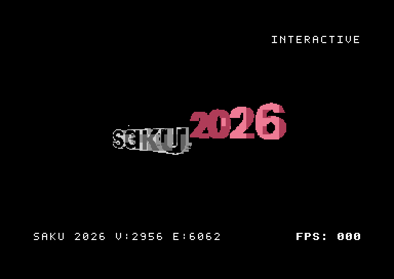

# c64-3d-toolkit

> **ATTENTION:** [FlyingFathead/c64-3d-toolkit](https://github.com/FlyingFathead/c64-3d-toolkit/) is the one and only official, original source for `c64-3d-toolkit`. Steer clear of other sources or repositories claiming to be the official project.

## v0.7.9: The Golden Dragon & SAKU 2026

<table>
<tr>
<td width="50%" align="center"><a href="examples/stanford_dragon/README.md"></a></td>
<td width="50%" align="center"><a href="examples/saku_2026/README.md"></a></td>
</tr>
<tr><td align="center"><a href="examples/stanford_dragon/README.md">The Golden Dragon</a></td><td align="center"><a href="examples/saku_2026/README.md">SAKU 2026 — interactive</a></td></tr>
</table>

SAKU: [official home page](https://suomenamigakayttajat.fi/) · [Saku magazine](https://sakulehti.fi/)

**HORS-V3 now powers normal object and authored-wireframe conversion.** Choose
nearest-palette material/image colours, every native hue family, or your own
metallic gradient with `--surface-ramp brown,orange,yellow,white`.
SVG builds preserve mapped fills and strokes and fit proportionally; `--fill-style gradient` adds Dragon-style colour ramps. Explicit outline, diagnostic and single-colour switches are available. The SAKU interactive cart starts with gradients and stars, with speed controls and a complete key map.

New interactive builds retain the original intro and wait for SPACE, with **press SHIFT+H for help** on the row above. They have **RUN/STOP (Esc in VICE) or Shift+H** help, plus `+` / `-` / `0` speed controls. Stars start disabled unless `--starfield-default enabled` is set; `--no-starfield` excludes their code and data entirely. SAKU explicitly enables the **light** field (`--starfield-profile light`); the full field remains available with `4`. `--hide-hud` starts with all HUD text hidden; Shift+I / Shift+F / Shift+U toggle the name/counts, FPS/speed feedback, or all HUD text including INTERACTIVE. Star density uses **1 = reset, 2 = more, 3 = less**; **4 switches original light / full stars**, preserving each density and the on/off state. [Latest correction notes](docs/RELEASE_FINAL_V5.md) and [interactive options and implementation](docs/STARFIELD.md) cover startup visibility and `--no-hud-toggle`.

Interactive help now has **two pages**, navigated with left/right. **5** toggles exhibition, **6** selects ordered/random styles, and **7/8** adjusts the five-second interval. Exhibition starts with HUD/stars off and preserves manual star choices across scene changes. [Exhibition controls and CLI defaults](docs/EXHIBITION.md).

V3 can compact fragmented clear/colour metadata without discarding geometry,
pixels or animation samples. Blender cache diagnostics now explain missing
files and unsupported Alembic builds.

[SVG paint and gradients](docs/SVG_PIPELINE.md) · [Starfield and speed controls](docs/STARFIELD.md) · [Release notes and installation](docs/RELEASE_0.7.9.md) · [Colours, gradients and Blender cache guide](docs/HORS_V3_DEFAULTS_CHECKPOINT.md)

## v0.7.8: The Stanford Dragon Has Arrived!

<p align="center">
  
</p>

Five HORS-V3 demo carts bring Stanford's **5,205-vertex / 11,102-triangle Dragon** to the C64: **wireframe, metallic (grey), red, green and blue**. The showcase above presents one complete rotation of each, in that order, with the measured PAL playback timing.

**HORS-V3 conversion is now the default** for objects and authored wireframe scenes. Surface shading supports every native colour family plus custom gradients with `--surface-ramp brown,orange,yellow,white`. Materials and texture pixels map to the nearest C64 palette colour. [Checkpoint guide, colour mapping and cache troubleshooting](docs/HORS_V3_DEFAULTS_CHECKPOINT.md).

[Download the five Dragon carts, watch individual GIFs and see performance](examples/stanford_dragon/README.md) · [v0.7.8 release notes and installation](docs/RELEASE_0.7.8.md)

## Previous release: v0.7.7 — Pretzel Logic - The Great Texture Update

<p align="center">
  
</p>

**Sande's Pretzel** introduced HORS-V3's metallic shading, MTL surface colours and image textures, with an optional compact colour dictionary. The GIF shows the metallic (grey) version with direct colour encoding. Separate interactive carts add rotation and background controls.

[Play the metallic Pretzel](examples/hors_v3_preview/cartridges/sande_pretzel-surface-metallic-128-v3.crt) · [Try the interactive version](examples/hors_v3_preview/cartridges/sande_pretzel-surface-metallic-128-v3-interactive.crt) · [All HORS-V3 examples and controls](examples/hors_v3_preview/README.md) · [v0.7.7 release notes](docs/RELEASE_0.7.7.md)

[Older releases and announcements](docs/RELEASE_HISTORY.md) · [Full changelog](CHANGELOG.md)

## Examples showreel

<p align="center">
  <a href="assets/c64-3d-toolkit-examples-showreel-v0.7.7.mp4">
    
  </a>
</p>

<p align="center">
  <strong><a href="assets/c64-3d-toolkit-examples-showreel-v0.7.7.mp4">Watch the full 71-second MP4</a></strong>
</p>

The footage uses verified completed display buffers captured in PAL VICE 3.10.
For the showreel, every authored animation sample is presented on a fixed 25 fps
clock instead of inheriting renderer-dependent capture delays; HUD FPS values
remain the cartridge's benchmark counters. The reel includes Horse & Sunflower,
the HiFi horse head and 243-vertex sunflower, Sande's TAC-2, the complete
1,552-vertex Pretzel wireframe, the HORS-V3 metallic Pretzel, Blender Falling
Cubes and every Demo Cart 2.0 scene. The video is silent; the featured
cartridges do not share a soundtrack.

## Try the toolkit

HORS-V3 is the default conversion renderer; use `--surface-fill material`, `textured` or `metallic` to select filled surfaces. The prebuilt cartridges below are ready to run. See [cartridge loading](docs/CARTRIDGE_LOADING.md) and [output colours](docs/OUTPUT_COLORS.md) for setup and controls.

**Performance tables:** [Original twelve animations](docs/PERFORMANCE_COMPARISON.md#best-method-for-each-animation) · [Demo Cart 2.0: all seven scenes](docs/PERFORMANCE_COMPARISON.md#demo-cart-20) · [Sande test kit](docs/PERFORMANCE_COMPARISON.md#sandes-models)

### Grab a cartridge and hit SPACE

| Prebuilt | What is inside |
| --- | --- |
| [Stanford Dragon: all six looks](examples/stanford_dragon/README.md) | HORS-V3 wireframe, metallic (grey), golden, red, green and blue; carts, timed GIFs and performance |
| [SAKU 2026 — interactive](examples/saku_2026/README.md) | SVG source/gradient colours, starfield, spin/crawl, speed controls and keyboard map |
| [Metallic Pretzel — interactive](examples/hors_v3_preview/cartridges/sande_pretzel-surface-metallic-128-v3-interactive.crt) | HORS-V3 shaded surfaces, rotation and background controls |
| [Sande's Pretzel](examples/demos_sande/sande_pretzel-hors-render-v2-interactive.crt) | Sande's 1,552-vertex knot; left/right rotation and F-key colours |
| [Sande's TAC-2](examples/demos_sande/sande_tac2-hors-render-v2-interactive.crt) | Sande's joystick model; the same interactive controls |
| [Color Combo Test](examples/color_combo_test/color-combo-test.crt) | Four colour pairs, ten seconds each, automatic looping, F3/F4 cycling |
| [Twelve-demo cart — FPS](examples/cart_demos/c643d-demo-v0.7.9-hors-render-v2-all.crt) | The original twelve animations, menu styles, PLAY ALL, HiFi mode and colour controls |
| [Twelve-demo cart — RAM](examples/cart_demos/c643d-demo-v0.7.9-hors-render-v2-all-ram.crt) | Same material and colour controls, smaller drawing kernels |
| [Demo Cart 2.0](examples/cart_demos_v2/demo-cart-2-preview-hors-v2.crt) | Colour cube, colour torus, twist tunnel, ribbon dance, orbital cubes, wave lattice and Ripples Lite |
| [HiFi reel](examples/cart_hifi/c643d-hifi-v0.7.9-hors-render-v2.crt) | Horse & Sunflower followed by two HiFi spinners |
| [Marbles](examples/cart_marbles/marbles-hors-render-v2-16fps-force-bytes.crt) | All 640 authored samples, original 16 FPS target, native intro and ending |
| [Horse & Sunflower](examples/cart_horse_and_sunflower/horse_and_sunflower-hors-render-v2-scene.crt) | Authored scene, with a separate RAM build in the same folder |

```bash
python c643d.py run-cart examples/cart_demos/c643d-demo-v0.7.9-hors-render-v2-all.crt
python c643d.py run-cart examples/cart_demos_v2/demo-cart-2-preview-hors-v2.crt
```

Use `--vice-clean-settings` to try temporary VICE defaults when diagnosing a
loading failure. See [cartridge loading](docs/CARTRIDGE_LOADING.md) for the
standalone VICE command, write-back protection and the loader changes.

Press **SPACE** on the identification screen. In the menu, use the cursor keys
and RETURN; F1 changes styles or returns from playback. Normal PLAY ALL is the
benchmark path. **F5 is an exhibition mode and must not be used to compare FPS.**

[Browse all current examples](examples/README.md).

## What the toolkit does

<p align="center">
  
</p>

A host-assisted 3D compiler and native C64 renderer: import OBJ, SVG or baked
Blender scenes; compute projection and visibility on the host; pack drawing
data into EasyFlash; let the 6510 update VIC-II bitmaps and colours at runtime.
It is not a general live-geometry engine. No cartridge coprocessor is required.

V2 groups literal bitmap spans into bounded cartridge-mapping batches, reducing
repeated mapping setup. Every frame is an independent picture. It reuses the
vector-dispatch page only after requiring all frames to use direct spans.
No extra RAM allocation is introduced by the drawing helper. ROM usage can
grow when a measured gap-bridging choice buys higher display throughput.

The stable host encoder also avoids constructing an unused vector stream just
to obtain metadata. A large intermediate vector representation therefore does
not reject a valid literal picture. Final metadata, frame-bank and cartridge
capacity limits still apply; inputs are never silently simplified to fit.

## Build your own

Python 3, 64tass and VICE/cartconv are required for cartridge builds and tests.
Blender is optional for `.blend` export; shipped example rebuilds use frozen
pictures and do not require Blender or a physics rebake.

```bash
python c643d.py doctor
python c643d.py build --shape cube --frames 192
python c643d.py build --object horse_head
python c643d.py build --scene examples/autotune/colour-cube.c643dscene --frame-ticks 1
python c643d.py cart-demos --prefer fps
python c643d.py cart-demos --prefer ram
python c643d.py color-combo-test
python c643d.py build --shape torus --foreground-color black --background-color white --border-color white
```

`build` and `cart-stream` default to **hors-renderer-v3**, including authored
wireframe scenes. `hors-render-v3` is an alias. `cart-demos` retains the V2
comparison/menu pipeline. Explicit `--renderer hors-render-v2` and
`--renderer hors-render-v2-scene` still select the previous implementation.
Use `--renderer yunroll` explicitly when you want resident PRG output.

- [Configuration](docs/CONFIGURATION.md), [Windows setup](docs/WINDOWS_SETUP.md)
- [OBJ](docs/OBJ_PIPELINE.md), [SVG](docs/SVG_PIPELINE.md), [Blender](docs/BLENDER_PIPELINE.md)
- [Stable v2 details](docs/HORS_RENDER_V2.md), [architecture](docs/ARCHITECTURE.md)

## Measure, choose, measure again

```bash
python tools/autotune_scene.py examples/cart_demos_v2/scenes/ripples_lite.c643dscene \
  --out ../ripples-v2-search --mono --width 320 --jobs 3 \
  --renderers hors-render-v1-scene hors-render-v2 \
  --ticks 1 2 3 4 --plans optimized raw --gaps 3 6 10 --batches 1024 2048 \
  --tass 64tass --cartconv cartconv --vice ./VICE-BATCH.sh \
  --vice-data /usr/local/share/vice
```

Geometry is frozen once. Each candidate is built and checked against the same
pictures, then measured in VICE. CLI, Markdown, JSON and CSV reports retain
wins, losses, failed candidates, display pacing, stage costs and RAM/ROM
allocation components. The search covers its requested candidates; it does not
claim a universal maximum. A pacing change is reported separately from a
renderer throughput improvement.

## Compile and validate an entire release

```bash
cd path/to/c64-3d-toolkit
JOBS=3 VICE_DATA=/usr/local/share/vice bash COMPILE-RELEASE.sh \
  --workspace ../c64-079-release-build
```

This makes an isolated source copy, builds every stable example, validates
pictures, endings and menus, runs the original renderer matrix, updates the
chart and produces a complete ZIP. Results and logs stay beside the checkout.
Add `--install` to install only after all checks pass. Add `--baseline-zip PATH`
to also generate a patch ZIP. The pipeline never commits, tags or pushes. Root `VERSION` supplies the build
identity; an alternate-version VICE test guards startup, menu and thanks labels.

To install the supplied 0.7.9 release, save the ZIP one level above your
checkout and extract it from that parent directory:

```bash
unzip -o c64-3d-toolkit-v0.7.9-incremental.zip
cd c64-3d-toolkit
python examples/stanford_dragon/verify.py --check
python tools/compare_renderers.py --check
python tools/run_hors_v3_perfs.py --check
```

The ZIP contains its own `c64-3d-toolkit/` directory. Current cartridges are
already rebuilt. Previous versioned menu/HiFi carts remain as historical
references; use the 0.7.9 links above for the updated builds. See the
[release guide](docs/RELEASE_0.7.9.md) for checks and rebuilds.

## Earlier renderers remain available

| Selection | Preserved implementation |
| --- | --- |
| `step`, `bytechunk`, `yunroll` | Resident PRG renderers |
| `yunroll-cart` | Original resident cartridge scaffold |
| `yunroll-cart-v2` through `yunroll-cart-v9` | Earlier streamed generations |
| `hors-render-v1`, `hors-render-v1-scene` | Original v1 / internal V10 implementations |
| `hors-render-v2`, `hors-render-v2-scene` | Previous object/scene implementation; comparison/menu default |
| **`hors-renderer-v3`** (alias `hors-render-v3`) | **Default object and authored-wireframe conversion; selectable surface/material/texture pipeline** |

A new pipeline is added incrementally. Old assembly, encoders and comparisons
stay intact. The resident `yunroll` method still narrowly wins the canonical
CUBE workload; the chart retains that result. See [pipeline versioning](docs/PIPELINE_VERSIONING.md).

[Release history](docs/RELEASE_HISTORY.md) · [Changelog](CHANGELOG.md) · [Documentation index](docs/README.md)

---

# Credits

`c64-3d-toolkit` by [FlyingFathead](https://github.com/FlyingFathead/)<br>

Thanks to: ChaosWhisperer<br>

Additional 3D models supplied by: **Sande**

Inspired by Saku magazine demo competition.

Saku's home page: [https://sakulehti.fi](https://sakulehti.fi)

A big thank you to everyone who has contributed, collaborated and given ideas for the project.

**Stanford Dragon:** model data from the [Stanford University Computer Graphics Laboratory's 3D Scanning Repository](https://graphics.stanford.edu/data/3Dscanrep/#dragon). The [Dragon example](examples/stanford_dragon/README.md) includes the original source credit, provenance and usage terms.

**EasyFlash / EasyAPI:** thanks to **Thomas "skoe" Giesel** for the [EasyFlash project and developer documentation](https://skoe.de/easyflash/develdocs/) and the original EasyAPI AM/M29F040 V1.4 flash driver embedded in standard toolkit cartridges. [Bundled source, original notice and attribution](tools/c643d/data/easyapi/README.md). CRT files are generated with VICE's `cartconv`; these demos do not call EasyAPI to write flash.

[Final v0.7.9 refinements: original SPACE intro, adjustable stars and red SVG shadows](docs/RELEASE_FINAL_V1.md).

### Blender framing and input flips

New Blender exports draw across 320 pixels, with `--viewport-width 256` for legacy framing. [Zoom and tracking-camera test scenes](examples/blender_viewport_test/README.md) include editable .blend files, HORS-V3 carts, VICE screenshots and timings. [Blender FAQ](docs/BLENDER_FAQ.md) explains the right-edge cutoff, preview settings and rebuilding old scenes. [Flip controls](docs/INPUT_FLIPS.md) add optional horizontal/vertical artwork reflection to all conversion inputs; HUD and help stay normally oriented.
