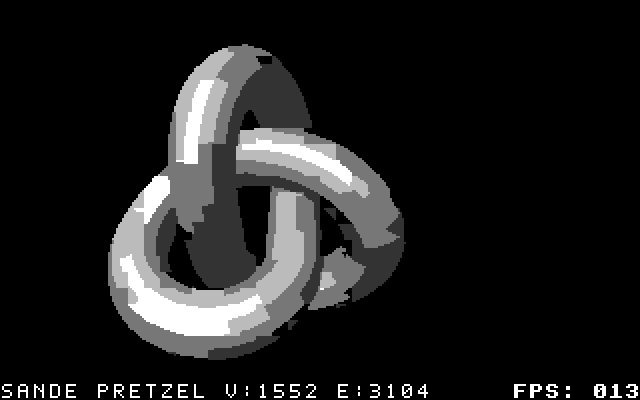

<p align="center">
  
</p>

# c64-3d-toolkit

> **ATTENTION:** [FlyingFathead/c64-3d-toolkit](https://github.com/FlyingFathead/c64-3d-toolkit/) is the one and only official, original source for `c64-3d-toolkit`. Steer clear of other sources or repositories claiming to be the official project.

**Version 0.7.7: Pretzel Logic - The Great Texture Update**

<p align="center">
  
</p>

HORS-V3 adds solid metallic shading, MTL surface colours and image textures, with an optional compact colour dictionary. Try the [interactive metallic Pretzel](examples/hors_v3_preview/cartridges/sande_pretzel-surface-metallic-128-v3-interactive.crt), or browse [all HORS-V3 cartridges and controls](examples/hors_v3_preview/README.md).

Use `--renderer hors-renderer-v3 --surface-fill metallic` to build a filled object. HORS-V2 wireframe remains the default. [Measured FPS and storage costs](docs/PERFORMANCE_COMPARISON.md#hors-v3-surfaces-and-textures).

New models by **Sande**, with reproducible builds, a separate
[Sande performance comparison](docs/PERFORMANCE_COMPARISON.md#sandes-models),
and optional cursor/joystick rotation and F-key palette controls.
See [Sande's demo kit](examples/demos_sande/README.md).
Defaults are black and white. Separate HORS-V2 `-color` carts use Sande's
original MTL materials: [Pretzel](examples/demos_sande/sande_pretzel-hors-render-v2-color.crt)
and [TAC-2](examples/demos_sande/sande_tac2-hors-render-v2-color.crt).

By default, generated carts include genuine EasyAPI and PETSCII names, checked metadata
placement, and stronger reset initialization. The shared VICE launcher disables
CRT write-back and offers temporary default settings for troubleshooting.
Use `--legacy-cart` to reproduce the discontinued cartridge packing and boot method.
It warns before conversion, omits EAPI/name metadata and keeps the original scene
layout. Standard generation remains the default; generated legacy names end in
`-legacy`. See [legacy compatibility mode](docs/CARTRIDGE_LOADING.md#legacy-compatibility-mode).

See [0.7.7 release notes and installation](docs/RELEASE_0.7.7.md) and
[cartridge loading](docs/CARTRIDGE_LOADING.md).

The independent colours and F3/F4/F7/F8 controls introduced in 0.7.3 remain
available in Demo Cart 1, Demo Cart 2.0 and [COLOR COMBO TEST](examples/color_combo_test/README.md).
See [output colours](docs/OUTPUT_COLORS.md) for options and inversion examples.

## 👀💦👉 `hors-render-v2` out now (Sep 2026) and is UP TO 35.5% FASTER!

**Since version 0.7.2, `hors-render-v2` is the default.** Prebuilt cartridges,
measured multi-pass optimization, and a complete release build/check pipeline.

The biggest measured gain is **Ripples Lite: 12.46 → 16.88 display FPS,
+35.48%**, using matching samples in normal PAL VICE PLAY ALL. The new
seven-scene showcase improved by **5.71–35.48%** over hors-render-v1.
The original twelve-animation comparison improved by **2.53–10.00%**.
The independent Linux run reproduced the beta measurements exactly; stable
v2 retains that drawing kernel. See the [complete comparison](docs/PERFORMANCE_COMPARISON.md)
and [showcase results](docs/HORS_RENDER_V2_RESULTS.md) for the actual workloads.
These are emulated C64 timings, not host wall-clock speed or the HUD counter.

**Performance tables:** [Original twelve animations](docs/PERFORMANCE_COMPARISON.md#best-method-for-each-animation) · [Demo Cart 2.0: all seven scenes](docs/PERFORMANCE_COMPARISON.md#demo-cart-20) · [Sande test kit](docs/PERFORMANCE_COMPARISON.md#sandes-models)

### Grab a cartridge and hit SPACE

| Prebuilt | What is inside |
| --- | --- |
| [Metallic Pretzel — interactive](examples/hors_v3_preview/cartridges/sande_pretzel-surface-metallic-128-v3-interactive.crt) | HORS-V3 shaded surfaces, rotation and background controls |
| [Sande's Pretzel](examples/demos_sande/sande_pretzel-hors-render-v2-interactive.crt) | Sande's 1,552-vertex knot; left/right rotation and F-key colours |
| [Sande's TAC-2](examples/demos_sande/sande_tac2-hors-render-v2-interactive.crt) | Sande's joystick model; the same interactive controls |
| [Color Combo Test](examples/color_combo_test/color-combo-test.crt) | Four colour pairs, ten seconds each, automatic looping, F3/F4 cycling |
| [Twelve-demo cart — FPS](examples/cart_demos/c643d-demo-v0.7.7-hors-render-v2-all.crt) | The original twelve animations, menu styles, PLAY ALL, HiFi mode and colour controls |
| [Twelve-demo cart — RAM](examples/cart_demos/c643d-demo-v0.7.7-hors-render-v2-all-ram.crt) | Same material and colour controls, smaller drawing kernels |
| [Demo Cart 2.0](examples/cart_demos_v2/demo-cart-2-preview-hors-v2.crt) | Colour cube, colour torus, twist tunnel, ribbon dance, orbital cubes, wave lattice and Ripples Lite |
| [HiFi reel](examples/cart_hifi/c643d-hifi-v0.7.7-hors-render-v2.crt) | Horse & Sunflower followed by two HiFi spinners |
| [Marbles](examples/cart_marbles/marbles-hors-render-v2-16fps-force-bytes.crt) | All 640 authored samples, original 16 FPS target, native intro and ending |
| [Horse & Sunflower](examples/cart_horse_and_sunflower/horse_and_sunflower-hors-render-v2-scene.crt) | Authored scene, with a separate RAM build in the same folder |

```bash
python c643d.py run-cart examples/cart_demos/c643d-demo-v0.7.7-hors-render-v2-all.crt
python c643d.py run-cart examples/cart_demos_v2/demo-cart-2-preview-hors-v2.crt
```

Use `--vice-clean-settings` to try temporary VICE defaults when diagnosing a
loading failure. See [cartridge loading](docs/CARTRIDGE_LOADING.md) for the
standalone VICE command, write-back protection and the loader changes.

Press **SPACE** on the identification screen. In the menu, use the cursor keys
and RETURN; F1 changes styles or returns from playback. Normal PLAY ALL is the
benchmark path. **F5 is an exhibition mode and must not be used to compare FPS.**

[Browse all current examples](examples/README.md).

## What the toolkit does

A host-assisted 3D compiler and native C64 renderer: import OBJ, SVG or baked
Blender scenes; compute projection and visibility on the host; pack drawing
data into EasyFlash; let the 6510 update VIC-II bitmaps and colours at runtime.
It is not a general live-geometry engine. No cartridge coprocessor is required.

V2 groups literal bitmap spans into bounded cartridge-mapping batches, reducing
repeated mapping setup. Every frame is an independent picture. It reuses the
vector-dispatch page only after requiring all frames to use direct spans.
No extra RAM allocation is introduced by the drawing helper. ROM usage can
grow when a measured gap-bridging choice buys higher display throughput.

The stable host encoder also avoids constructing an unused vector stream just
to obtain metadata. A large intermediate vector representation therefore does
not reject a valid literal picture. Final metadata, frame-bank and cartridge
capacity limits still apply; inputs are never silently simplified to fit.

## Build your own

Python 3, 64tass and VICE/cartconv are required for cartridge builds and tests.
Blender is optional for `.blend` export; shipped example rebuilds use frozen
pictures and do not require Blender or a physics rebake.

```bash
python c643d.py doctor
python c643d.py build --shape cube --frames 192
python c643d.py build --object horse_head
python c643d.py build --scene examples/autotune/colour-cube.c643dscene --frame-ticks 1
python c643d.py cart-demos --prefer fps
python c643d.py cart-demos --prefer ram
python c643d.py color-combo-test
python c643d.py build --shape torus --foreground-color black --background-color white --border-color white
```

`build`, `cart-stream` and `cart-demos` default to **hors-render-v2**.
Scene inputs select its scene integration. Explicit `--renderer hors-render-v2-scene`
is also accepted. The command name is **hors-render-v2**, not `hors-renderer-v2`.
Use `--renderer yunroll` explicitly when you want resident PRG output.

- [Configuration](docs/CONFIGURATION.md), [Windows setup](docs/WINDOWS_SETUP.md)
- [OBJ](docs/OBJ_PIPELINE.md), [SVG](docs/SVG_PIPELINE.md), [Blender](docs/BLENDER_PIPELINE.md)
- [Stable v2 details](docs/HORS_RENDER_V2.md), [architecture](docs/ARCHITECTURE.md)

## Measure, choose, measure again

```bash
python tools/autotune_scene.py examples/cart_demos_v2/scenes/ripples_lite.c643dscene \
  --out ../ripples-v2-search --mono --width 320 --jobs 3 \
  --renderers hors-render-v1-scene hors-render-v2 \
  --ticks 1 2 3 4 --plans optimized raw --gaps 3 6 10 --batches 1024 2048 \
  --tass 64tass --cartconv cartconv --vice ./VICE-BATCH.sh \
  --vice-data /usr/local/share/vice
```

Geometry is frozen once. Each candidate is built and checked against the same
pictures, then measured in VICE. CLI, Markdown, JSON and CSV reports retain
wins, losses, failed candidates, display pacing, stage costs and RAM/ROM
allocation components. The search covers its requested candidates; it does not
claim a universal maximum. A pacing change is reported separately from a
renderer throughput improvement.

## Compile and validate an entire release

```bash
cd path/to/c64-3d-toolkit
JOBS=3 VICE_DATA=/usr/local/share/vice bash COMPILE-RELEASE.sh \
  --workspace ../c64-077-release-build
```

This makes an isolated source copy, builds every stable example, validates
pictures, endings and menus, runs the original renderer matrix, updates the
chart and produces a complete ZIP. Results and logs stay beside the checkout.
Add `--install` to install only after all checks pass. Add `--baseline-zip PATH`
to also generate a patch ZIP. The pipeline never commits, tags or pushes. Root `VERSION` supplies the build
identity; an alternate-version VICE test guards startup, menu and thanks labels.

To install the supplied 0.7.7 release, save the ZIP one level above your
checkout and extract it from that parent directory:

```bash
unzip -o c64-3d-toolkit-v0.7.7.zip
cd c64-3d-toolkit
python tools/compare_renderers.py --check
python tools/run_hors_v3_perfs.py --check
```

The ZIP contains its own `c64-3d-toolkit/` directory. Current cartridges are
already rebuilt. Previous versioned menu/HiFi carts remain as historical
references; use the 0.7.7 links above for the updated builds. See the
[release guide](docs/RELEASE_0.7.7.md) for checks and rebuilds.

## Earlier renderers remain available

| Selection | Preserved implementation |
| --- | --- |
| `step`, `bytechunk`, `yunroll` | Resident PRG renderers |
| `yunroll-cart` | Original resident cartridge scaffold |
| `yunroll-cart-v2` through `yunroll-cart-v9` | Earlier streamed generations |
| `hors-render-v1`, `hors-render-v1-scene` | Original v1 / internal V10 implementations |
| **`hors-render-v2`, `hors-render-v2-scene`** | **Current default, with object, scene and menu integration** |

A new pipeline is added incrementally. Old assembly, encoders and comparisons
stay intact. The resident `yunroll` method still narrowly wins the canonical
CUBE workload; the chart retains that result. See [pipeline versioning](docs/PIPELINE_VERSIONING.md).

[Changelog](CHANGELOG.md) · [Documentation index](docs/README.md)

---

# Credits

`c64-3d-toolkit` by [FlyingFathead](https://github.com/FlyingFathead/)<br>
Thanks: ChaosWhisperer<br>
Additional 3D models supplied by: **Sande**

A big thank you to everyone who has contributed, collaborated and given ideas for the project.

Inspired by Saku magazine demo competition.
Saku's home page: [https://sakulehti.fi](https://sakulehti.fi)