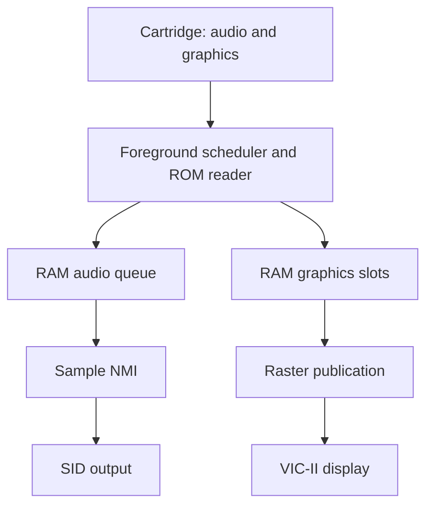

# C64 cartridge graphics and digi audio: findings and implementation direction

**Projects:** audio-bitsqueezer and c64-3d-toolkit  
**Date:** 2026-09-14  
**Audio baseline:** supplied audio-bitsqueezer workspace, `VERSION = 0.14.0`  
**Graphics baseline:** supplied c64-3d-toolkit workspace, `VERSION = 0.7.9`  
**Historical reference:** Pex “Mahoney” Tufvesson, *Cubase64*, October 2010  
**Status:** consolidated source findings, file measurements, calculations, and proposed design. A combined cartridge A/V runtime has not been built or benchmarked for this report.

This is shared reference documentation for both projects. It describes possible sampled and reconstructed audio pipelines **alongside the option of conventional SID music**. It does not propose removing existing pipelines or imply that all audio methods can safely run together.

**Contents:** [Conclusion and scope](#1-conclusion-and-scope) · [ROM architecture](#2-what-the-rom-architecture-buys-us) · [Cubase64 representation](#3-what-cubase64-actually-plays) · [UI and timing](#4-how-the-interactive-ui-coexists-with-playback) · [Current audio player](#5-the-actual-audio-bitsqueezer-integration-baseline) · [Shared runtime](#6-proposed-shared-runtime) · [Budgets](#7-timing-bandwidth-and-synchronization-budgets) · [Noise reconstruction](#8-high-frequency-reconstruction-and-the-existing-profiler) · [Video and GMod3](#9-video-input-and-gmod3-as-optional-extensions) · [Checkpoints](#10-implementation-checkpoints) · [Validation](#11-validation-records-and-unresolved-questions) · [Sources](#12-source-index-provenance-and-corrections-to-preserve)

## 1. Conclusion and scope

**Simultaneous cartridge-streamed graphics, hardware sprites, and digi-like audio are feasible on a stock C64.** The useful architecture keeps prepared media in cartridge ROM and uses C64 RAM for active display buffers, an audio queue, resident code, tables, and current state. The exact attainable combination of audio quality, animation rate, and sprite workload still requires implementation and measurement.

The complete soundtrack and animation do not need to fit together in 64 KiB. Presentation length primarily consumes ROM capacity. This changes the optimization target: we can spend available RAM on substantial buffers and spend ROM on representations that are cheap for the CPU to consume.

The recommended first integration is:

1. Retain audio-bitsqueezer’s four-bit sample representation and `$D418` output initially.
2. Feed a dedicated RAM queue from cartridge ROM in the foreground.
3. Deliver queued samples through a short, mapping-safe CIA2 Timer A NMI.
4. Give one shared runtime ownership of cartridge access, memory allocation, and startup/shutdown.
5. Measure the resulting audio deadlines and graphics throughput with the intended display and sprites.

A larger queue prevents the producer from having to refill constantly. A compatible interrupt arrangement lets the consumer reach the SID on time. Both are necessary: buffering cannot compensate for an output routine that is prevented from executing.

The target here has the ordinary 6510, VIC-II, and one SID. No accelerator, REU, cartridge coprocessor, or audio DMA device is assumed. Host preprocessing removes runtime calculation; a memory-mapped ROM cartridge supplies prepared bytes. The CPU still fetches and applies those bytes.

### Evidence boundaries

| Evidence | Treatment in this report |
|---|---|
| Supplied audio-bitsqueezer ZIP | Authoritative audio workspace; active player, exporters, build selection, and profiler documentation inspected directly. |
| Supplied Cubase64 source, binaries, and white paper | Source inspected, selected binary sequences checked, sizes and data-array counts recalculated; the paper’s memory-map page also inspected visually. |
| Supplied c64-3d-toolkit ZIP | Version 0.7.9; mapper/helper, base renderer, picture encoding, sprite effects, stream limits, builder patches, and existing roadmaps inspected directly. No new cartridge-specific symbol map generated. |
| Supplied graphics and GMod3 notes | Consolidated and checked against the supplied source and hardware references where relevant. Their proposed features remain proposals. |
| Hardware documentation | VIC-II behavior, EasyFlash mapping, SID container semantics, and GMod3 register behavior checked against the linked references. |
| Earlier reported tests | Historical evidence only. The GMod3 note’s 50-test result and `cartconv` experiment were not rerun here. |
| Runtime performance and sound quality | No new emulator playback, combined-runtime benchmark, or physical SID recording performed. |

Both supplied workspaces are the source baselines. Archive hashes in section 12 identify them; version-tag links provide navigation rather than proof that a local workspace equals public `main`. The supplied toolchain archive was not needed for this documentation-only consolidation.

### Audio-pipeline choices

An audio pipeline has separate **content**, **reconstruction**, **output**, and **scheduling** choices. A `.sid` file is a container, four-bit PCM is a sample representation, Cubase64 is a specialized reconstruction approach, and `$D418` or oscillator-based output describes how values reach the SID. These are not interchangeable labels.

| Pipeline | Best fit | Main runtime work | Status in the inspected material |
|---|---|---|---|
| Conventional SID composition and player | Chip music authored for SID instruments; usually compact song data. | An audited music play routine, commonly at a frame or CIA cadence. | Retain as a separate integration option. The toolkit roadmap proposes measuring SID headroom; this review establishes no general `.sid` importer/player. |
| Packed four-bit samples through `$D418` | Recorded music, speech, and effects with a simple decoder. | Sample-rate output plus ROM refill/copy work. | Standalone RAM and EasyFlash audio-bitsqueezer players exist; shared graphics integration is proposed. |
| Four-bit samples plus controlled SID noise | Experimental perceptual high-frequency detail. | Sample output plus lower-rate noise controls and shared SID management. | Desktop Consonant Clarity experiment exists; hardware playback is proposed. |
| Cubase64-style waveform dictionary and controls | Suitable monophonic vocal/instrument material with very small storage requirements. | Foreground sample reconstruction, control decoding, and high-rate delivery. | Demonstrated by Cubase64; no port in either inspected project. |
| Prepared samples with oscillator-based output | Exploring a different sample-output/quality tradeoff. | Timing-sensitive oscillator setup/output, plus refill or reconstruction. | Cubase64 provides a reference; no audio-bitsqueezer backend established. |
| Conventional SID music with occasional digi effects | Deliberately authored hybrid soundtracks. | Music ticks and sample-rate output with coordinated voices, filter, and gain. | A separate future integration profile; arbitrary `.sid` files cannot be assumed compatible. |

For conventional music, inspect the actual player’s code, load range, zero page, SID writes, timer use, cadence, and worst play-call cost. A conventional tune often needs fewer CPU invocations than sample playback, but the file extension alone does not prove a cheap or embeddable routine. Some SID files contain digis or require their own execution environment. [SID container specification][sid-format]; [toolkit cartridge roadmap][graphics-roadmap]

“Additional pipelines” should first mean selectable, documented backends. Simultaneous mixing is a separate feature: `$D418` controls master volume, so digi writes can modulate ordinary SID voices too. A music routine may overwrite the same register or a voice needed for bias/noise. Supporting both in one soundtrack requires an explicit mixer/register policy and usually cooperation from the music player. Do not promise arbitrary SID-plus-PCM composition by simply calling both routines.

## 2. What the ROM architecture buys us

The intended responsibilities are:

| Location | Responsibilities |
|---|---|
| Host computer | Audio preparation, geometry rendering or video quantization, encoding, scheduling metadata, cartridge layout. |
| Cartridge ROM | Long-lived audio and graphics payloads, immutable assets, directories, initialization data. |
| C64 RAM | Active graphics slots, queued audio, resident routines, mutable tables, pointers, counters, and staging. |
| SID and VIC-II | Produce sound and the configured display under CPU control. |

The toolkit’s reviewed HORS literal-span path already uses host-prepared picture data. This can save both runtime calculation and full-animation RAM residency. Those are distinct advantages. Neither implies that the cartridge executes the renderer or transfers a frame autonomously. [HORS stable encoder][hors-stable]

Mahoney’s original demo addresses a different storage problem: the complete encoded vocal, waveform dictionary, and reconstruction machinery are resident. Its tiny stack-based audio buffer is an optimization for that particular program. A cartridge A/V runtime need not inherit it.

For illustration, at **8,000 output samples/s**, a fully populated queue provides:

| RAM allocation | Packed four-bit samples | One byte per output sample |
|---|---:|---:|
| 4 KiB | 1.024 s | 0.512 s |
| 8 KiB | 2.048 s | 1.024 s |
| 16 KiB | 4.096 s | 2.048 s |

At 4,000 samples/s these durations double. They are capacities, not measured refill reserves or a claim that every generated cartridge has these amounts free. A queue may reserve a page or other space for safe handoff.

One byte per sample can mean an expanded four-bit `$D418` value; it does not imply eight-bit output resolution. Keeping nibbles packed in ROM while expanding them into RAM can simplify the sample interrupt. Compare total producer-plus-consumer cost as well as the consumer’s worst path.

Exact free RAM must come from the selected generated build. Memory that is unused while ROM is hidden may be unreadable by an interrupt while ROM is exposed. The queue and handler need continuously accessible locations across the actual playback mappings.

## 3. What Cubase64 actually plays

### 3.1 A specialized analysis/synthesis codec

Cubase64 reconstructs a recorded vocal from a small dictionary of short waveform shapes and compressed control streams. It does not store the complete recording as conventional PCM, and it does not turn the vocal solely into ordinary SID notes.

The host encoder estimates pitch, normalizes and aligns waveform material, selects representative waveforms, and produces waveform-selection, amplitude, pitch, and noise controls. On the C64, the foreground selects and blends waveform data, applies volume-table lookups, advances phase, and places generated samples in a buffer. The output NMI consumes those samples. The six supplied MATLAB encoder scripts and `demo/main.s` describe the actual division of work. [Cubase64 source][cubase-source]; [white paper, sections VIII–IX][cubase-paper]

This representation suits a predominantly monophonic vocal. It is not evidence of a general-purpose full-mix codec with the same compression ratio or quality. A cartridge soundtrack can instead use more ROM to avoid this reconstruction cost.

The paper discusses 255 waveforms of 51 bytes. The supplied encoder emits 256 slots, including special silence handling, plus alignment padding. The implementation’s counts should be kept separate from the paper’s simplified arithmetic.

The paper uses phase-vocoder terminology when explaining pitch and time changes. The safe implementation description is the one above: **host analysis followed by waveform-table reconstruction and control-stream advancement**. The C64 is not running a general STFT/FFT analysis pipeline while the user adjusts the controls.

### 3.2 Two different uses of noise

Cubase64 models high-frequency vocal noise separately from the sampled component, using a controlled SID noise oscillator and filtering. This supplies an approximation of sibilance and breath activity beyond the sampled baseband. It does not recover the original upper-band waveform or evade Nyquist’s limit.

The paper also describes a user-selectable noise effect for masking quantization artifacts. That is a different purpose from reconstructing recorded high-frequency activity. The two should not be collapsed into one “dither” feature. [White paper, sections VIII and XI][cubase-paper]

### 3.3 Is it effectively a `.sid` file?

It is **C64 data plus a playback program**, but that description does not remove the sample engine. The supplied archive contains PRG executables and no `.sid` or `.d64` file.

PSID and RSID are containers with execution requirements. A `.sid` extension does not specify a compression codec, make the SID autonomous, or replace sample-rate interrupts with a cheap once-per-frame music call. Packaging an adapted engine would require a separate compatibility assessment. For this project, the immediate deliverable should be an embeddable audio engine with explicit resource ownership. [HVSC SID file-format specification][sid-format]

### 3.4 Why the program is small

Direct measurements of the supplied files:

| Artifact | Size or duration |
|---|---:|
| `cubase64.prg` | 47,197 bytes |
| `demo/cubase64.prg` | 47,197 bytes; identical to the top-level executable |
| `demo/packed.prg` | 44,528 bytes |
| `demo/main.prg` | 64,914 bytes |
| Source WAV | 11,349,688 bytes |
| Source WAV audio | 5,674,788 mono 16-bit frames at 44,100 Hz |
| Source duration | 128.68 s |

PRG sizes include the two-byte load address. The unpacked `main.prg` payload spans `$0258` through `$FFE7`, or 64,912 address-space bytes. This is not a measurement of live allocation at every address, but it establishes that the packed release’s file size is not its runtime memory footprint.

There are two reductions: the lossy audio representation replaces the original PCM, then `pucrunch` packs the assembled program before the wrapper is added. `demo/makefile_linux` records that build chain.

Counting emitted `.byte` values gives:

| Generated source | Bytes | Purpose |
|---|---:|---|
| `SIDenc3Speed.s` | 12,693 | Pitch/speed controls |
| `SIDencWave.s` | 14,833 | Waveform and volume controls |
| `SIDencodedNoise.s` | 677 | Noise controls |
| `SIDwaveforms.s` | 13,107 | 13,056 waveform bytes plus 51 padding bytes |
| **Four-array subtotal** | **41,310** | Excludes the player and other tables |
| `SIDwaveformPoiTable.s` | 512 | Additional pointers, outside that subtotal |

The subtotal corresponds to about **321 bytes per source second** for this particular recording and lossy representation. It is not a universal bitrate. The noise source header says 678 values; the declarations contain 677.

No disk-sector occupancy was measured: the supplied runnable artifact is a PRG, not the disk image mentioned in the original question. The compact executable is explained by the representation and packing without assuming a special disk format.

## 4. How the interactive UI coexists with playback

### 4.1 Separate generation, delivery, and display work

Cubase64 divides execution into three priorities:

| Priority | Context | Work |
|---|---|---|
| Highest | CIA2 Timer A NMI | Deliver a prepared sample to the SID. |
| Middle | Raster IRQ | Update UI/control state and display settings. |
| Lowest | Foreground | Decode controls and generate future samples. |

These are interrupt-driven roles on one CPU, not independent processors. Buffering allows the UI to interrupt sample generation while already-generated samples continue to be delivered. The `IRQ` routine calls `storyIrq` and `guiDo`; `IRQ2` handles a complementary display setting. Two raster interrupts do not imply two complete UI redraws per frame. [Cubase64 source, `IRQ`, `IRQ2`, `zeroRenderLoop`][cubase-source]

The renderer writes samples with `PHA`. The consumer reads page `$01` using `LDA` and a separate descending pointer, not `PLA`. Thus a circular audio queue shares the hardware stack page with interrupt and subroutine state. The source checks producer/consumer separation and describes roughly 128 bytes of lead. That arrangement depends on disciplined stack use; it is not an unrestricted 256-byte audio allocation.

The VIC-II keeps displaying configured state while audio code executes. Animation requires CPU updates, but sample playback does not inherently freeze or disable video. Display and sprite fetches can stall the CPU; NMI priority cannot override that bus use. [VIC-II technical reference][vic-reference]

### 4.2 The SID output is different from audio-bitsqueezer’s

Audio-bitsqueezer writes four-bit volume levels to `$D418`. Cubase64’s `NMI_R1` changes oscillator control at `$D404`, briefly presents triangle output, resets oscillator state with TEST, and loads a sample-dependent frequency byte at `$D401` for the next interval.

This exploits SID oscillator/output behavior to deliver sample-like values. Its eight-bit input representation does not guarantee an ideal calibrated eight-bit DAC on every SID. Oscillator timing matters to the resulting level, so variations can affect amplitude as well as output timing. Porting it is a separate output-backend experiment, not a register-address substitution. [Cubase64 source, `NMI_R1`; white paper, section VI][cubase-source]

### 4.3 Raster timing and the CIA instruction trick

The steady CIA2 Timer A latch is `$007D`, giving **126 CPU clocks per timer event**. That is two 63-clock PAL raster lines. The paper quotes a nominal 7,812.5 Hz; with its stated 985,248 Hz CPU clock, the implemented interval implies:

```text
985248 / 126 = 7819.428571... samples/s
```

This small distinction matters to long-run synchronization. Use actual timer divisors and the target video standard in media metadata.

The supplied explanatory text says the NMI enters at `$DD04`. The supplied source and matching bytes in `demo/main.prg` instead install **`$DC04`**. At that address, CIA1 registers provide executable bytes:

| Address | Value/role |
|---|---|
| `$DC04` | `$4C`, the absolute `JMP` opcode |
| `$DC05` | `$00`, the low destination byte |
| `$DC06` | Running CIA1 Timer B low counter, used as the destination’s high byte |

The resulting jump selects page-aligned stubs at `$0800` through `$0E00`. They insert different delays, save A, and converge on the zero-page output routine. CIA2 generates the sample interrupt; CIA1 participates in latency compensation. This corrects variation within the intended synchronized timing window, not arbitrary stalls.

The return trick really does use CIA2: `$DD0C` holds `$40`, the `RTI` opcode. `JMP $DD0C` executes it, and a dummy read at `$DD0D` acknowledges the CIA interrupt. The source explains the bus behavior. A first shared player should use a straightforward acknowledged return before considering this optimization. [Cubase64 source, `nmiStart`, `syncIt`, `NMI_R1`][cubase-source]

### 4.4 What the demonstration does not prove

The supplied startup writes `$D015 = 0`, disabling sprites. Its UI therefore does not validate this precise timing arrangement under the toolkit’s sprite workload.

The raster handlers write `$D011 = $1B` and `$13`. Both keep DEN, bit 4, enabled. The changed bit is RSEL, bit 3. An adjacent old comment suggesting DEN is cleared does not match the instruction.

Some operations deliberately interrupt output. Hidden-RAM tube-table replacement temporarily diverts the normal NMI, and the paper explicitly describes a brief audio pause. Echo plus 200% time stretching can outrun sample generation, with GUI activity worsening the shortage. Sub-bass and the masking-noise effect also compete for one oscillator. These are stated limits of the historical implementation. [White paper, sections XI and XIII][cubase-paper]

### 4.5 Why the effects are affordable

Most controls alter parameters or tables the renderer already uses, or configure SID hardware:

| Effect | Main implementation strategy |
|---|---|
| Time stretch | Repeat or skip advancement through encoded controls. |
| Robotic pitch / auto-tune | Replace or modify the pitch parameter. |
| Compressor | Modify the extracted volume control. |
| Master gain / equalizer | SID volume and analog filter controls. |
| Sub-bass / masking noise | SID oscillators, subject to shared-voice limits. |
| Grungelizer / tube distortion | Change volume-table results instead of adding general per-sample processing. |
| Echo | Substitute a loop that combines current waveform data with older buffered audio. |

Echo replaces the normal second-waveform contribution; it is not simply another free pass appended to the existing renderer. The broader lesson is to move expensive analysis offline and make runtime controls change cheap parameters or prepared tables. [White paper, section XI; supplied renderer source][cubase-paper]

## 5. The actual audio-bitsqueezer integration baseline

### 5.1 The active player owns the machine

[`audio-bitsqueezer/scripts/build_player.py`][audio-build] assembles the RAM and cartridge variants from [`audio-bitsqueezer/asm/player_core.asm`][audio-player]. Older experiments in `asm/` do not establish which implementation ships.

The active player uses CIA1 Timer A IRQs and packed four-bit samples, low nibble first. Its foreground waits on `finished`. A may be clobbered by the IRQ, Y is assumed to remain zero, and the cartridge variant also uses X. That is appropriate for the standalone foreground, but not for arbitrary interrupted graphics code.

Startup configures the VIC-II, disables existing interrupts, clears/configures the SID, installs vectors, and reserves zero page. Cleanup restores a BASIC/KERNAL-oriented environment. An embedded player must split sample playback from those machine-wide lifecycle operations.

Current software policies are:

| Export path | Screen/rate behavior |
|---|---|
| PRG | Information screen enabled by default up to 4,000 Hz; explicit screen-on above that rate is rejected. |
| Flash-streaming CRT | Export limited to 1,000–4,000 Hz. |

These are exporter limits, not universal C64 hardware ceilings. See [`prg_export.py`][audio-prg] and [`cart_export.py`][audio-cart].

### 5.2 Direct-ROM sample reads conflict with independent graphics banking

The existing cartridge sample IRQ changes `$01` to `$37` for a ROM read, returns it to `$35`, and changes `$DE00` when its stream advances to the next bank. It assumes ownership of the selected cartridge bank.

A graphics routine interrupted by that player cannot assume its bank remains selected. A RAM-only sample consumer removes this race: foreground code owns the cartridge, while the output interrupt consumes an already-published queue page.

EasyFlash’s bank register selects both ROML and ROMH together. Putting audio in one window and graphics in the other does not give them independent banking. [EasyFlash Programmer’s Guide, section 2.4][easyflash-guide]

### 5.3 Ordinary IRQ masking is a concrete timing blocker

The supplied V10 helper uses `SEI`-protected cartridge mapping and a complete metadata-page copy. Its copy-loop calculation is:

```text
64 × [4 × (4-cycle load + 5-cycle store) + 2-cycle decrement + 3-cycle branch] - 1
= 2623 CPU clocks
```

That is approximately 2.662 ms at 985,248 Hz, before setup, possible indexed-load page crossings, or VIC stalls. It exceeds ten 4 kHz sample intervals. An unchanged CIA1 IRQ player cannot provide its normal cadence through such a masked interval. The loop and static count were rechecked in the supplied toolkit source. This excludes setup and does not measure elapsed time in a running cartridge. [V10 helper, `cart_fast_copy`, `cart_rom_page`, `v9_map_on`][graphics-helper]

The HORS batching cost model is useful for optimization, but its nominal budget is not a hard maximum latency for every runtime path. A timing guarantee must include metadata copies, clears, transitions, and exceptional paths as well as the normal span loop.

### 5.4 Memory and SID ownership also overlap

Audio workspace occupies `$F6` or `$F7` through `$FC`, depending on build. The base graphics renderer allocates `$E0–$EF` to counters and `$F0–$F7` to shared pointers; the effects generator additionally uses `$F8/$F9` in the optional sprite effect. A shared allocation is required.

The audio player’s optional 8580 digi-bias setup configures **all three SID voices**. A new noise voice, sub-bass, or conventional SID tune cannot assume those channels are unused. `$D418` also includes shared filter/voice control bits beyond its volume nibble; any hybrid output scheme must define the complete register contract.

## 6. Proposed shared runtime

This section describes intended work, not existing functionality.



### 6.1 Resource contract

| Resource | Proposed owner/contract |
|---|---|
| Cartridge bank and mode registers | Foreground mapper only; audio NMI never changes them. |
| CIA2 Timer A and its interrupt flag | Audio engine, coordinated with all other CIA2 users. |
| CIA2 port bits for VIC-bank selection | Graphics code through a shared port-state policy. |
| Raster IRQ | Graphics publication and bounded input/UI work. |
| SID voices, filter, and `$D418` | Explicit audio-backend allocation. |
| Zero page, queue, tables, vectors | One build-time memory map with overlap checks. |
| Startup, scene changes, stop, and menu return | Shared runtime lifecycle. |

A CIA’s timer and port can serve different subsystems, but interrupt-flag reads, control writes, and broad reinitialization still need coordination. Do not let a graphics reset erase audio state or an audio stop return to BASIC while graphics continues.

### 6.2 Consumer and producer

Start near the current 4 kHz cartridge baseline. Evaluate a **4–8 KiB queue allocation**, subject to the real memory map. A smaller initial test buffer is acceptable; neither that size nor an exact address is established here.

The sample NMI should read stable RAM, write the output value, update private consumer state, acknowledge its source, and return. Preserve all registers it changes and the interrupted status. Do not issue an unconditional `CLI` inside the handler. Bound page wrap, end, loop, and underflow paths as carefully as the ordinary sample path.

The foreground fills pages from ROM and publishes them only after their contents are valid. Prefer a handoff protocol using atomic byte-sized ownership state. Protect multi-byte pointers and counters against torn reads: `SEI` does not exclude NMI.

For a refill watermark, require:

```text
queued output duration
  > maximum delay before refill work can start
    + refill completion time
    + chosen safety margin
```

This is a producer condition. Separately, each SID write has an output-timing requirement. A full queue with late output writes is not successful playback.

Short effects or loops can be completely resident in RAM when convenient. Long tracks use the same consumer with streamed refills. The architecture need not impose streaming on every asset.

### 6.3 NMI entry must survive mapping changes

Replacing IRQ with NMI bypasses `SEI`, but does not make the interrupt vector, handler, data, or SID registers visible under every memory configuration.

For the current `$35`/`$37` pattern, the review must cover the RAM hardware vector and the KERNAL-visible entry route. The supplied KERNAL’s NMI vector points to `$FE43`, whose bytes are `78 6C 18 03`, or `SEI; JMP ($0318)`. The existing cartridge player installs `$0318/$0319` as well as `$FFFA/$FFFB`. A combined handler must support the applicable entry paths and include their different overhead in its timing budget. This byte check covers the supplied ROM, not every replacement KERNAL.

Install vectors and valid queue state before enabling the timer. Do not hide I/O while a handler expects to acknowledge the CIA and write the SID. Vector changes, mapper transitions, other NMI sources, and any possibility of a subsequent NMI before return all require a deliberate protocol.

Priority does not mean zero jitter. VIC stalls, instruction boundaries, vector-route differences, and handler branches can change SID-write spacing. Compare a traced audio-only baseline with the combined workload before claiming improvement or equivalence.

### 6.4 Graphics and sprites

The inspected base toolkit layout has these display allocations:

| Slot | Screen base | Bitmap base | Sprite-pointer table |
|---|---|---|---|
| 0 | `$0400` | `$2000` | `$07F8–$07FF` |
| 1 | `$4400` | `$6000` | `$47F8–$47FF` |
| 2 | `$C800` | `$E000` | `$CBF8–$CBFF` |

Three 8 KiB bitmap allocations and three 1 KiB screen allocations account for 27 KiB of working display memory. That is not a complete occupied-memory total. Runtime code, metadata caches, tables, sprite shapes, vectors, and optional effects also require space. [Base renderer][graphics-renderer]

The optional HORS-V3 starfield uses eight hardware sprites and replicates a shared shape at `$3F80`, `$7F80`, and `$FF80` for the relevant VIC banks. This is a useful test workload; it is not enabled in every cartridge. An audio NMI can also delay a raster handler enough to matter to a tightly scheduled sprite multiplexer. [Effects generator][graphics-effects]

Prepare graphics in advance and publish completed state at appropriate raster points. Test all used display slots and actual sprite positions. Sprites are hardware-assisted, but their memory fetches still affect CPU availability. [VIC-II technical reference, section 3.8][vic-reference]

## 7. Timing, bandwidth, and synchronization budgets

### 7.1 Average CPU cost and worst-case latency are separate

Using 985,248 clocks/s for the illustrative PAL calculations:

| Output rate | Gross clocks per sample |
|---|---:|
| 4,000 Hz | 246.31 |
| 6,000 Hz | 164.21 |
| 7,819.43 Hz | 126.00 |
| 8,000 Hz | 123.16 |

If a proposed complete interrupt cost **65 clocks/sample**, it would consume about 26.4% of the CPU at 4 kHz and 52.8% at 8 kHz, before producer work and VIC stalls. The 65-clock figure is an illustrative assumption, not a measured handler cost.

Measure both CPU work and elapsed time to the SID write. Saving work on average does not establish that the longest instruction/mapping/sprite interaction meets a deadline. Additional RAM helps move work out of the interrupt; it cannot supply missing CPU cycles.

### 7.2 ROM bandwidth and capacity

Packed four-bit mono payload requires `sample_rate / 2` bytes/s:

| Nominal sample rate | Audio payload/s | 120 s audio payload |
|---|---:|---:|
| 4,000 Hz | 2,000 bytes | 240,000 bytes |
| 8,000 Hz | 4,000 bytes | 480,000 bytes |

These payloads can stay in ROM while the RAM queue remains fixed in size. Transfer bandwidth is modest, but CPU copying, unpacking, mapper overhead, and output interrupts still count.

EasyFlash provides 1 MiB total flash. If all of it were an optimistic media budget, the two 120-second audio examples would leave 808,576 or 568,576 bytes, respectively, before code, directories, and alignment. At 12.5 graphics frames/s, that is approximately 539 or 379 bytes per frame. **Actual available stream space depends on the allocator and mapped windows**, not just the cartridge’s physical total. [EasyFlash capacity and mapping][easyflash-guide]

Larger ROM extends duration or allows cheaper encodings. It does not guarantee a higher rendering rate.

### 7.3 Full-frame replacement is expensive

For scale, copying 8,000 unrelated bitmap bytes with one four-cycle absolute load and one four-cycle absolute store per byte costs 64,000 clocks before loop/setup and display costs. At 25 replacements/s that would require 1.6 million clocks/s.

This is one simple copy model, not a universal lower bound. Sparse spans, tile reuse, repeated values, lower resolution, and retained-buffer deltas can reduce the work. Video feasibility depends on changed data and decoding cost, not only nominal resolution or ROM capacity.

### 7.4 Use the consumed-audio timeline

Schedule presentation from consumed sample positions or a shared clock, not the producer’s ROM offset: prefetched audio has not yet sounded.

The current exporters already calculate actual rate from an integer timer divisor and record it in metadata. For nominal 4,000 Hz on their PAL clock, a divisor of 246 gives approximately 4,005.073 Hz. A 120-second nominal sample sequence would therefore finish roughly 0.152 s early if compared with an uncorrected 4,000 Hz timeline. This is calculated clock mismatch, not a measured playback defect. The 126-clock Cubase64 timing is PAL-specific; it must not be transferred unchanged to an NTSC profile.

Use the target divisor for frame timestamps, duration, and long-run tests. If graphics falls behind, keep audio cadence stable and apply an explicit repeat/skip policy. A sample counter tracks delivered samples; if timer events are lost, it is not by itself proof of correct real-time cadence. Trace that separately.

## 8. High-frequency reconstruction and the existing profiler

The supplied workspace already contains a desktop analysis and listening experiment. It should not be described as wholly unimplemented, nor as an existing C64 playback feature.

[audio-bitsqueezer’s audio-loss-profiler documentation][audio-profiler] documents source/prepared-PCM/cartridge comparisons and Consonant Clarity. The current experiment extracts a 2.2–8 kHz source-band envelope every 10 ms, quantizes its amplitude to four bits, and controls filtered random noise in desktop previews. At 100 envelopes/s, the packed controls cost **50 bytes/s**, or 2.5% of a 4 kHz/four-bit PCM payload before overhead.

| Layer | Current status |
|---|---|
| Aligned A/B analysis, spectra, band metrics, and coherence | Present as optional desktop tools. |
| Extraction of exact packed cartridge samples | Present; yields digital reconstructed PCM, not analog SID capture. |
| Half/full-noise listening previews and packed envelope metadata | Present as a desktop experiment. |
| C64 SID consumer for those envelope controls | Not implemented in the inspected player. |
| Verified sibilance improvement on a physical SID with graphics | Not established. |

The possible benefit is perceptual: a controlled noisy high band may make consonants and breath activity more apparent. It cannot reconstruct missing phase or detailed spectral structure. On a full mix it may also emphasize hi-hats and cymbals; that is a listening tradeoff, not automatically an encoder failure.

High-band power alone cannot demonstrate restored information. Use the existing aligned metrics, envelope comparisons, and listening variants together. The profiler does not automatically correct clock drift, so measured captures need compatible timebases or separately documented drift correction.

A hardware experiment must resolve SID voice allocation, the existing three-voice 8580 bias, shared `$D418` modulation, filter routing, envelope behavior, and parameter scheduling. Desktop random-noise previews do not model those interactions. Keep this quality experiment separate from the first simultaneous-A/V scheduling milestone.

## 9. Video input and GMod3 as optional extensions

**Preserve EasyFlash and existing pipelines.** Add new mapper and input backends through dedicated modules. The supplied GMod3 note explicitly treats these as proposals; its candidate encodings, cycle examples, and suggested flags are not released features or benchmarks.

### 9.1 Raster input can join the prepared-picture pipeline

The inspected `optimize.picture_bytes()` produces a canonical 320×192 hires picture representation: 7,680 bitmap bytes plus 960 screen-color bytes, totaling **8,640 bytes**. A video importer could quantize each 8×8 cell to a pair of C64 colors, produce the bitmap/screen representation, then reuse or extend the picture encoders. Geometry and raster inputs can converge at this stage without turning video into artificial geometry. [Picture conversion][graphics-optimize]

A dense 8,640-byte picture exceeds an 8,192-byte ROM window even before encoding overhead. The inspected single-arena format therefore needs a defined multi-bank representation, a suitable smaller encoding, or a fallback when a frame cannot fit. Compression must never be assumed to make every possible image fit.

Temporal encoding should also consider palette and dither stability: visually small source changes can cause many encoded bytes to change if color-pair selection or dithering fluctuates between frames. Optimize temporal consistency alongside per-frame error, ROM size, and decode work.

### 9.2 Buffer-relative deltas need explicit history

With a fixed three-slot rotation and every frame prepared in order, a frame can be encoded against the last frame occupying its destination slot:

| Destination slot | Sequence | Example dependency |
|---|---|---|
| 0 | 0, 3, 6, 9 | Frame 6 patches frame 3’s contents. |
| 1 | 1, 4, 7, 10 | Frame 7 patches frame 4’s contents. |
| 2 | 2, 5, 8, 11 | Frame 8 patches frame 5’s contents. |

Under those assumptions, the reference is `N-3`. Patches must include bytes becoming zero and changed screen colors. This can avoid clearing and redrawing an entire slot.

**`N-3` is not sufficient when preparation is skipped, reordered, sought, or restarted.** Record destination slot and reference identity, or enforce an equivalent deterministic history. A skipped presentation may still require preparing that frame to preserve a later dependency. A skipped decode may invalidate the chain. Provide keyframes or another reset mechanism for seeking, loops, recovery, and late-frame jumps.

This differs from the inspected independent HORS picture payloads. A new temporal format must not inherit their frame-skipping assumptions. Version its metadata and include dependency checks in validation.

The inspected `cartstream.py` defines `MAX_FRAMES = 255` and uses one-byte frame-directory indexing. At 25 frames/s that is only about 10.2 seconds. Longer content will need wider indexing or segmented sequences, with segment transitions included in the audio-refill budget.

### 9.3 GMod3 hardware facts and corrected expectations

GMod3 specifies 2–16 MiB flash behind an 8 KiB `$8000–$9FFF` window. Its bank number uses the written byte plus the low three address bits of `$DE00–$DE07`; up to 2,048 banks are selectable. It boots in 8K cartridge mode. Its optional vector override directs NMI to `$0008` and IRQ to `$000C`, independently of `$01`. The manufacturer states that GMod3 was not mass-produced and was superseded by GMod4. [Individual Computers GMod3 specification][gmod3-spec]

The supplied proposal’s 2 MiB first stage is sensible: 256 banks fit a one-byte bank field. Larger targets require high-bank metadata and mapper changes. Boot code should use a RAM-resident loader when switching away from its own ROM bank.

One premise in the earlier note needs correction: **the quoted EasyFlash graphics sequence selects `$DE02 = $06`, which is already 8K mode**. It does not expose ROMH at `$E000` during that read. Therefore, “GMod3 removes an active ROMH conflict” is not a demonstrated advantage over that sequence. [EasyFlash mode table][easyflash-guide]

The supplied builders also have other paths: `cartstream.py` patches helpers to `$07` for ROMH-backed compilation entries, and `cartuniform.py` selects `$06` or `$07` according to the source window. `$07` is 16K mode, with ROMH at `$A000`. Boot mappings are separate again. Audit the generated target rather than generalizing from one helper. The scene template also places content at `$9A00`, so `$8000–$9FFF` cannot be declared universally free across all renderer variants.

Potential benefits are more addressable media and a different mapping/vector strategy. The vector override is worth investigating, but its zero-page targets require explicit allocation. A permanently visible ROM window must be tested with CPU mapping, handler entry, SID access, and every graphics slot. Faster playback is a hypothesis, not a consequence of cartridge capacity.

The earlier `cartconv` experiment establishes container-tool support in that recorded test. It does not establish a working toolkit bootloader, mapper, or physical cartridge result. GMod4 support would be another backend requiring its own specification and tests, not a renamed GMod3 export.

The toolkit already has a [GMod backend design document][graphics-gmod] with these hardware distinctions and separate implementation gates. Use it alongside this A/V contract; do not replace its backend-specific requirements with the shorter overview here.

## 10. Implementation checkpoints

For the immediate audio/graphics question, start with the existing EasyFlash path. GMod3 can be developed separately and can precede a long-video importer; it is not a prerequisite for demonstrating buffered A/V playback.

| Checkpoint | Deliverable | Acceptance evidence |
|---|---|---|
| 1. Shared memory map | One selected generated graphics build with private audio state and queue allocation. | Symbol/map review, overlap checks, and visibility under every playback mapping. |
| 2. RAM-fed audio engine | Embedded lifecycle and bounded sample NMI, initially near 4 kHz. | Correct sample order/count, register preservation, underflow behavior, and traced output timing against an audio-only reference. |
| 3. Display and sprite coexistence | Real display updates and progressively enabled sprites. | All display slots, badline/sprite interactions, stable state, and recorded timing limits. |
| 4. Cartridge access under audio | Graphics ROM reads and bank changes while NMI consumes RAM. | Correct output across mapping changes, queue wraps, metadata copies, and cartridge boundaries. |
| 5. Combined allocator and refill scheduling | Audio/graphics payloads in one cartridge with refill opportunities in long paths. | Positive queue reserve, bounded refill gaps, transition/menu/loop correctness. |
| 6. Shared timeline | Timestamped presentation and deliberate late-frame behavior. | Start offset, long-run drift, repeated/skipped frames, and valid decode history. |
| 7. Independent quality/format experiments | Higher rates, SID noise controls, another output method, raster input, or GMod3. | Separate evidence per changed profile; retain the working EasyFlash baseline. |

Do not change the codec, sample rate, mapper, sprite layout, and graphics format together and then attribute the result to one improvement. Checkpoints should produce reproducible artifacts and a clear explanation of what changed.

## 11. Validation records and unresolved questions

Retain the following with each experimental cartridge:

| Area | Record |
|---|---|
| Build | Source revision/hash, generated assembly, symbols, cartridge hash, encoder options. |
| Audio output | Expected/delivered samples, SID-write spacing and lateness, worst consumer path, underflows. |
| Producer | Minimum queued samples, maximum refill gap, refill duration, longest graphics operation. |
| Graphics | Prepared/presented/repeated/skipped frames, worst preparation time, dependency validity. |
| Memory and mapping | Allocated ranges, entry routes, ROM modes, boundaries, vector changes, reset behavior. |
| Synchronization | Start offset, long-run drift, loops, pause/resume, scene changes. |
| Environment | PAL/NTSC variant, SID model, emulator/version/settings, and separately identified physical-machine captures. |
| Quality | Existing digital A/B analysis plus actual output captures where available. |

An underflow fallback such as holding a defined output level prevents arbitrary reads but still counts as failure to supply the stream. Likewise, a clean digital sample extraction proves the payload, not the SID’s analog response or correct interrupt spacing.

The main unresolved quantities are the exact mapping-safe RAM available in the chosen generated cartridge, the combined consumer’s worst timing, sustainable graphics preparation with audio refills, sound under the intended sprite load, and the interaction between noise reconstruction and four-bit digi bias. Those are concrete implementation questions. Full-media RAM residency is not the obstacle this architecture creates.

## 12. Source index, provenance, and corrections to preserve

### Directly inspected project material

- Supplied `audio-bitsqueezer-2026-09-14_022234(1).zip`, version 0.14.0: active player, build script, exporters, and audio-loss-profiler documentation.
- Supplied `c64-3d-toolkit-2026-09-14_021820.zip`, version 0.7.9: the V10 helper and renderer, scene template, `cartstream.py`, `cartuniform.py`, `hors_v2_stable.py`, `optimize.py`, `hors_v3_effects.py`, and the existing cartridge/GMod roadmaps.
- Supplied Cubase64 complete source archive and its duplicate `Cubase64.zip`: `demo/main.s`, generated `SID*.s` data, encoder scripts, build recipe, binaries, and supplied KERNAL entry bytes.
- Supplied *Cubase64 White Paper*: sections VI–IX for timing/codec/reconstruction, X for memory layout, XI for effects, and XIII for limitations.
- Supplied prior findings: `C64_DIGI_AUDIO_AND_CARTRIDGE_GRAPHICS_REPORT(1).md`, `C64_digi_source_findings(1).md`, `C64_digi_more_reference.md`, and `c64-3d-toolkit_GMOD3_implementation_ideas.md`.

This document is intended to be copied unchanged into both projects’ `docs/` directories. Its cross-project source links use explicit repository/version URLs, so they work from either repository without local path assumptions. The conversational notes are not required alongside it.

### Graphics source navigation

| Source | Relevant role |
|---|---|
| [HORS stable encoder][hors-stable] | Prepared literal pictures and dependency flags and cost-model qualifications. |
| [HORS batching extension][hors-batching] | Staged helper changes and mapping batches. |
| [V10 EasyFlash helper][graphics-helper] | ROM mapping, metadata copying, caches, and span reads. |
| [V10 renderer][graphics-renderer] | Display and runtime layout. |
| [HORS-V3 effects][graphics-effects] | Optional hardware sprites and related state. |
| [Picture conversion][graphics-optimize] | Canonical bitmap/screen representation used by picture encoders. |

Builders may patch staged assembly. Inspect the generated source and symbol map when implementing; a template alone is not a complete description of the final cartridge.

### Rechecked binary evidence

In the supplied `demo/main.prg`, loaded at `$0258`:

| Address | Bytes | Interpretation |
|---|---|---|
| `$0A0B` | `A9 04 8D FA FF A9 DC 8D FB FF` | Install `$DC04` as NMI vector. |
| `$0A15` | `A9 7D 8D 04 DD` | CIA2 Timer A low latch `$7D`. |
| `$0E9B` | `A9 40 8D 0C DD` | Place `RTI` opcode at `$DD0C`. |
| `$0EA0` | `A9 4C 8D 04 DC` | Place `JMP` opcode in CIA1 Timer A low latch. |
| `$0EAF` | `A9 3E 8D 06 DC` | CIA1 Timer B low latch `$3E`. |

These are byte-pattern checks against supplied binaries, not new builds or executed timing tests.

### SHA-256 identifiers

```text
Supplied audio-bitsqueezer workspace ZIP:
868c8a9451c4b5c1e55e6a47e5247b5738973c45afd8564e7dc40dab4eb858c8

Supplied c64-3d-toolkit workspace ZIP:
15ba0d1a349e7d388cd51b80867b40b87b474d53154394c22d7c37862b204f15

Cubase64 complete-source ZIP and duplicate Cubase64.zip:
ab2a993be1653c4c2cbe3854f2396a02ed2aa86fe1d3b10e4efcac3f8b5bfeef

Cubase64 top-level cubase64.prg:
7956c658c59cd4c33897fa3cc1879fa0c98444b1c0a6b0f4ed9affa81cd32ea6

Cubase64 demo/main.prg:
7145790861d9b75de2b9a62bbc40812b461ef6c82dfbff6f96e7abdfaf5bc7b4
```

### Corrections that must survive future summaries

| Misleading shorthand | Supported statement |
|---|---|
| “The whole soundtrack must fit in the RAM left by graphics.” | Long media stays in ROM; RAM holds working buffers. |
| “ROM storage proves there is a particular amount of free RAM.” | The generated map determines available, continuously accessible ranges. |
| “A larger buffer fixes masked sample interrupts.” | It supplies data; timely execution still needs a compatible output path. |
| “Cubase64 is just a normal SID tune.” | It reconstructs and delivers sample-like audio using a specialized engine. |
| “Mahoney’s vector is `$DD04`.” | The supplied source and binary install `$DC04`. |
| “The output is exactly 7,812.5 Hz.” | That is the paper’s nominal figure; the source uses 126-clock periods. |
| “All effects and all UI changes are uninterrupted.” | The paper/source describe voice conflicts, overloads, and brief pauses. |
| “Mahoney proves this works with our sprites.” | His supplied startup disables sprites. |
| “Consonant Clarity already runs on the SID.” | Desktop experiments exist; the C64 consumer is future work. |
| “GMod3 avoids the ROMH mapping in the quoted graphics loop.” | That loop already selects EasyFlash 8K mode with `$06`. |
| “Triple buffering always means delta against `N-3`.” | That formula assumes preserved slot history and decode order. |
| “More high-band power proves recovered detail.” | Noise can add power without reproducing the source waveform. |

The transferable result is a division of responsibilities: host preparation, ROM-resident media, useful RAM buffering, bounded audio delivery, and scheduled graphics updates. Mahoney’s work demonstrates carefully budgeted audio reconstruction and UI interaction; the proposed cartridge runtime can use its storage advantage to choose a simpler audio path.

[cubase-source]: https://livet.se/mahoney/c64-files/Cubase64_by_Pex_Mahoney_Tufvesson.zip
[cubase-paper]: https://livet.se/mahoney/c64-files/Cubase64_White_Paper_by_Pex_Mahoney_Tufvesson.pdf
[sid-format]: https://www.hvsc.c64.org/download/C64Music/DOCUMENTS/SID_file_format.txt
[vic-reference]: https://www.cebix.net/VIC-Article.txt
[easyflash-guide]: https://skoe.de/easyflash/files/devdocs/EasyFlash-ProgRef.pdf
[gmod3-spec]: https://wiki.icomp.de/wiki/GMod3
[hors-stable]: https://github.com/FlyingFathead/c64-3d-toolkit/blob/v0.7.9/tools/c643d/hors_v2_stable.py
[hors-batching]: https://github.com/FlyingFathead/c64-3d-toolkit/blob/v0.7.9/tools/c643d/hors_v2.py
[graphics-helper]: https://github.com/FlyingFathead/c64-3d-toolkit/blob/v0.7.9/c64/cart/easyflash-stream-v10-helper.asm
[graphics-renderer]: https://github.com/FlyingFathead/c64-3d-toolkit/blob/v0.7.9/c64/renderer-yunroll-cart-v10.asm
[graphics-effects]: https://github.com/FlyingFathead/c64-3d-toolkit/blob/v0.7.9/tools/c643d/hors_v3_effects.py
[graphics-optimize]: https://github.com/FlyingFathead/c64-3d-toolkit/blob/v0.7.9/tools/c643d/optimize.py

[audio-build]: https://github.com/FlyingFathead/audio-bitsqueezer/blob/v0.14.0/scripts/build_player.py
[audio-player]: https://github.com/FlyingFathead/audio-bitsqueezer/blob/v0.14.0/asm/player_core.asm
[audio-prg]: https://github.com/FlyingFathead/audio-bitsqueezer/blob/v0.14.0/prg_export.py
[audio-cart]: https://github.com/FlyingFathead/audio-bitsqueezer/blob/v0.14.0/cart_export.py
[audio-profiler]: https://github.com/FlyingFathead/audio-bitsqueezer/blob/v0.14.0/docs/AUDIO_LOSS_PROFILER.md
[graphics-roadmap]: https://github.com/FlyingFathead/c64-3d-toolkit/blob/v0.7.9/docs/CARTRIDGE_ROADMAP.md
[graphics-gmod]: https://github.com/FlyingFathead/c64-3d-toolkit/blob/v0.7.9/docs/GMOD_BACKENDS.md
