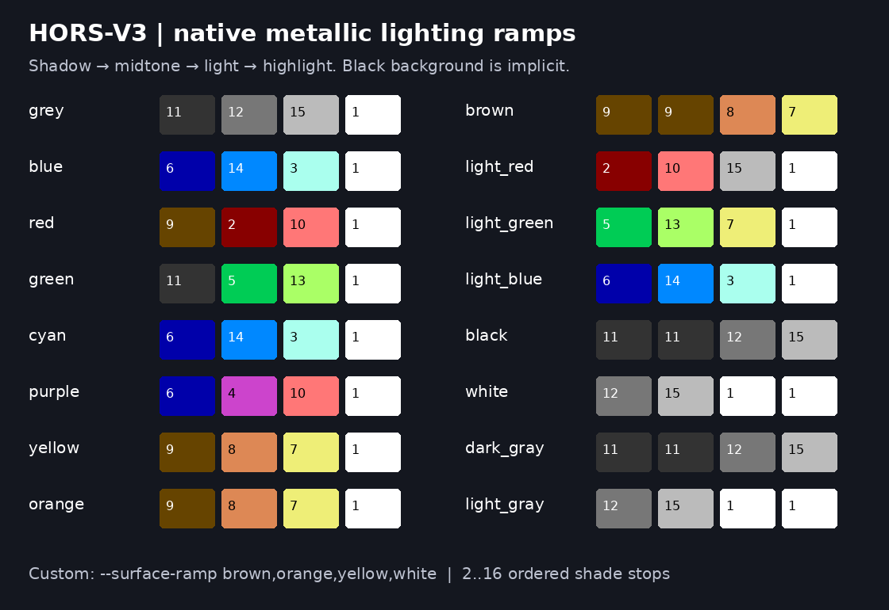

> Historical HORS-V3 / 0.7.9 checkpoint. Current defaults are HORS-V4 / GMod3; see [0.8.0](RELEASE_0.8.0.md).

# HORS-V3 defaults and source-colour checkpoint

Based on the supplied 0.7.8 snapshot. Public GitHub `VERSION` also reported
0.7.8 when checked on 13 September 2026; this is not a full commit/tree match.
This work ships in **0.7.9**. `HORS_V3_CHECKPOINT_VALIDATION.json` preserves
the original pre-release checkpoint checks; the current full release results
are in `benchmarks/release-0.7.9/validation.json` and [the release notes](RELEASE_0.7.9.md).

## Default conversion

`build`, its `build.sh` shortcuts and `cart-stream` now select
`hors-renderer-v3` (`hors-render-v3` remains an alias). This includes procedural
objects, OBJ/SVG objects, and authored `.blend` / `.c643dscene` wireframes.
OBJ and authored-scene defaults remain wireframe. SVG builds now preserve mapped source fills and strokes; see [SVG pipeline](SVG_PIPELINE.md).

```bash
python c643d.py build --obj model.obj --frames 128
python c643d.py build --blend animation.blend --frame-ticks 2 --run
python c643d.py build --obj model.obj --surface-fill material --frames 128
python c643d.py build --obj model.obj --surface-fill textured --frames 128
```

Textures need OBJ faces with UV coordinates (`vt`), material assignments
(`usemtl`), a referenced MTL (`mtllib`) and a used `map_Kd` image. Plain MTL
`Kd` colours use `--surface-fill material`. The optional value of
`--surface-fill` by itself is `material`.

The V3 surface rasterizer supports standalone spin/recede/crawl animations. Filled/textured
Blender scenes, arbitrary Blender shader graphs, alpha transparency, normal maps
and physically based material rendering are not implemented. Blender animation
exports evaluated geometry and per-face colours. V3 authored scenes retain
paced playback, paged directories and the 2,048-sample format ceiling, subject
to cartridge capacity. Standalone spins retain the 255-orientation ceiling.

`cart-demos` is the existing V2 comparison/menu builder and still defaults to
V2. The 0.7.9 release rebuilds the Dragon/Pretzel V3 carts with the current shared controls; historical versioned cartridges remain available.
Explicit V1/V2/resident renderer choices retain their own implementations.
This checkpoint makes no new performance ranking or release-wide benchmark claim.

## Nearest material and texture colours

Source RGB is mapped to the fixed 16-entry toolkit C64 reference palette.
This already existed in 0.7.8: MTL `Kd`, and image pixels multiplied by `Kd`,
use the shared nearest-colour mapper. The distance is weighted CIELAB:
`0.5 * delta_L^2 + delta_a^2 + delta_b^2`. It deliberately favours preserving
hue over choosing a dark neutral of similar brightness. Actual analogue C64
output varies with the machine/display; this is a fixed conversion reference.

This checkpoint also uses that metric when material/textured surfaces must
reduce an 8x8 cell to two colours. Previously this second reduction used RGB
squared distance. `--surface-color-metric rgb` reproduces that older cell
reduction. Metallic shading retains its original RGB shade reduction.

The two stages matter: a source colour first chooses a nearest C64 entry; when
more than two colours share an 8x8 cell, the cell must choose a pair among its
colours. Black silhouette pixels remain black. Therefore an individual texture
pixel can be reassigned at the cell stage. There is no 16-colours-per-cell mode.
All matching and rasterization happen on the host, not on the 6510.

The generated `-surface.json` and cartridge manifest include the mapping rule,
per-material source RGB and selected colour name/index, plus each loaded
texture's mapped colour histogram. Those histograms describe the source image
after `Kd`, before visibility and per-cell reduction.

Blender unlinked Principled BSDF Base Color is now preferred over the viewport
swatch. Scene-linear Blender RGB is converted to sRGB before palette matching.
Explicit material/object `c643d_color` overrides still take precedence. Linked
Base Color graphs fall back to the material viewport swatch; they are not baked.

## All colour families and custom gradients

```bash
python c643d.py build --obj model.obj --surface-fill metallic --surface-palette purple
python c643d.py build --obj model.obj --surface-fill metallic --surface-palette cyan
python c643d.py build --obj model.obj --surface-fill metallic --surface-palette orange
python c643d.py build --obj model.obj --surface-fill metallic \
  --surface-ramp brown,orange,yellow,white --frames 128 --run
python c643d.py build --obj model.obj --surface-fill metallic \
  --surface-ramp blue,purple,light_red,white --interactive-cart
```

`--surface-ramp` accepts 2..16 comma-separated shade stops, in the supplied
order from dark to light. It overrides the named palette. Native names,
indices and RGB hex values work (`'#220022,#cc44cc,#ff7777,#ffffff'`). Repeated
stops are allowed. The black background is implicit; a black shade stop is
also allowed and intentionally makes that lighting level disappear into it.
Use native encoding; coloured ramps do not apply to black/white dithering.

The original grey/red/green/blue ramps retain their exact colour order and
lighting thresholds. New names are cyan, purple, yellow, orange, brown,
light_red, light_green, light_blue, black, white, dark_gray and light_gray.
Aliases include gray/metallic/silver -> grey, magenta -> purple, pink ->
light_red, gold -> yellow and aqua -> cyan. Spaces and hyphens in names work.
Several names share a ramp because the VIC-II has no intermediate colours
between them; custom stops let you change that artistic choice.



## Sande's reports: what is established

| Report / hypothesis | Finding |
| --- | --- |
| `v2 metadata span count exceeds one byte` | A single frame has more than 255 clear spans or enabled colour spans. The exception alone does not identify which; the new message prints both counts and the failed sample. |
| Was 180 frames too long? | Not the cause of this exception. Per-frame metadata, per-frame 8 KiB staging, frame directory count and total cartridge ROM are separate limits. |
| All vertices animate | Supported when evaluated vertex order and polygon connectivity remain stable. Deformation may increase visible detail/fragmentation, but is not itself forbidden. |
| Alembic cannot be read by the exporter | The exporter already uses `evaluated_get(depsgraph).to_mesh(...)` every sample. Blender evaluates its cache modifier. A readable cache does not inherently need conversion to shape keys. The original .blend/.abc files are needed to diagnose that specific failure. |
| MDD requires an add-on | An add-on can import it as shape keys. Blender also has a native Mesh Cache modifier for MDD/PC2; the exporter can sample that evaluated mesh. Matching topology and vertex order remain essential. |
| Flicker is culling or Z depth | Plausible, but unconfirmed without the Testarossa mesh, settings and output. Hidden-line visibility, edge-on faces, intersecting/near-coplanar surfaces, coarse pixel sampling and material selection can all change lines between frames. |
| Subpixel details disappear | Correct as a possibility: the standard geometry viewport is 256x192. Details below a pixel cannot stay distinct; filled texture colours additionally share the 8x8 two-colour restriction. |

V3 now handles the demonstrated fragmentation class by compacting clear spans
to row ranges when needed and covering gaps in a too-fragmented shared colour
address plan. Gap cells receive their actual colour values. The decoder format,
pixels, geometry and sample order stay intact. Expanded clears can do more
work than the original sparse clears; this is a capacity fallback, not a speed
claim. Remaining per-frame/total-ROM failures still reject the build explicitly.

The V2 error now gives actionable counts. Reducing animation duration cannot
fix the same bad frame's per-frame metadata. V3 does not remove the C64's actual
RAM, staging-buffer or cartridge-capacity limits.

## Alembic/MDD checks and flicker diagnosis

Keep external `.abc`, `.mdd` or `.pc2` files beside the project or repair their
paths in Blender. The exporter now checks enabled cache modifiers for missing
files and warns when a cache modifier is disabled in the viewport. Relative
paths are resolved through Blender, including linked datablock libraries.
A Blender binary compiled without Alembic also receives an explicit diagnostic; choose an Alembic-enabled installation with `--blender`. Changing-topology caches remain unsupported. The active camera must be
perspective. Materials and camera conversions lost between LightWave and
Blender cannot be recovered by the C64 exporter.

For the Testarossa, hold the camera, scale, sample range and colours fixed and
compare `--visibility surface` against `--visibility frontface`. The latter
removes surface-depth clipping but still culls back-facing edges, so it is a
diagnostic comparison, not a correct hidden-line replacement. If needed,
compare several small `--z-tolerance` values. This is a reciprocal-depth
threshold, not a world-space Z offset: increasing it may restore lines but
also leak hidden lines through foreground faces. The horse-head preset's
threshold is not a universal value for imported scene scales.

Try `--no-color --color white` to distinguish wire geometry changes from
per-cell material-colour changes. Frame the car larger in Blender to test the
subpixel-detail hypothesis. Recalculate outward normals and check duplicate,
intersecting and near-coplanar faces. Do not alter mesh geometry before saving
a reproducible failing example.

`--run` already provides a build-then-launch Blender -> exporter -> CRT -> VICE
preview cycle. It is not continuous live synchronization: each preview rebuilds
the cartridge. A Blender add-on/watch mode would be a separate feature.

References: [Blender Mesh Sequence Cache](https://docs.blender.org/manual/en/latest/modeling/modifiers/modify/mesh_sequence_cache.html),
[Mesh Cache](https://docs.blender.org/manual/en/latest/modeling/modifiers/modify/mesh_cache.html),
[evaluated dependency graph API](https://docs.blender.org/api/current/bpy.types.Depsgraph.html).

## Validation recorded for this checkpoint

- 246 unit tests: 243 passed, three existing skips, no failures.
- PAL VICE 3.10 bitmap/colour checks: default cube; 180-frame deforming scene;
  texture-filled Pretzel; custom interactive gradient; purple indexed gradient;
  a four-frame fixture with 384 clear and 384 colour spans per frame.
- Custom gradient controls: key handling, all 16 background colours, all three
  bitmap/screen buffers, preservation of nonblack shades and border behavior.
- Blender 4.0.2 native MDD evaluation, four distinct deformation samples,
  missing/disabled-cache diagnostics, linear/Principled material mapping;
  exported scene cartridge verified in VICE with intro and ending enabled.
- Alembic round trip skipped: supplied Blender binary lacks Alembic support.
- Original four ramps matched baseline raster, bitmap and screen bytes over
  eight orientations each. Existing C64 assembly sources are unchanged.

## Reproduce the checkpoint checks

```bash
python -m unittest discover -s tests
python tools/verify_hors_v3_checkpoint.py --output-dir build/v3-check \
  --tass 64tass --cartconv cartconv --vice x64sc --vice-data /path/to/vice-data
blender --background --factory-startup --python-exit-code 1 \
  --python tools/verify_blender_vertex_caches.py -- --output-dir build/cache-check
```

The cache test reports Alembic as skipped if the selected Blender was built
without it. The supplied Blender 4.0.2 binary has that limitation: native MDD
was exercised, while an Alembic round trip was not. An Alembic-enabled Blender
will additionally execute the generated `.abc` round trip. None of these
synthetic fixtures is Sande's original LightWave project.
