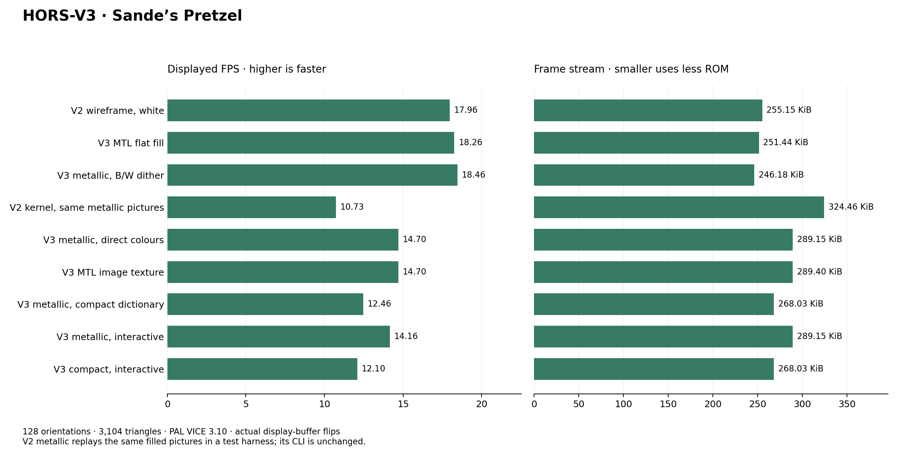
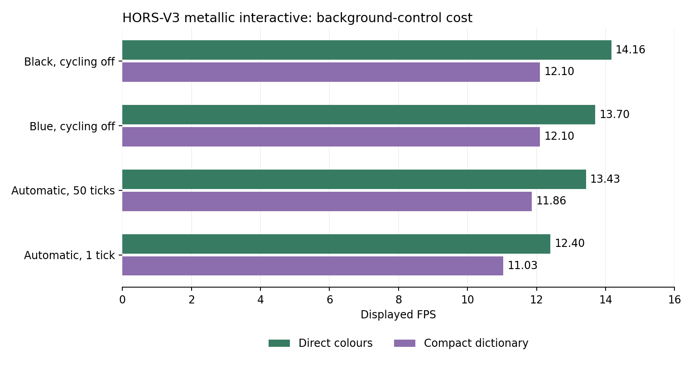

# Renderer performance comparison

Canonical lookup table for comparing methods and toolkit releases. **Historical method matrices use normal PLAY ALL. F5 is an exhibition mode and MUST NOT be used for benchmarking.** The separately labelled Sande standalone tests measure ordinary object playback and interactive idle cost; compare results within each protocol.

Measured on PAL VICE 3.10, 985,248 cycles/s, default machine settings, sound disabled, seed 1; 64tass 1.59.3120. This is emulated C64 time, not host wall time or the HUD FPS counter. Physical C64 and NTSC are not measured.

Each cell is actual display flips / elapsed emulated time across 3 normal PLAY ALL visits. Every visit uses the unchanged 10-second setting. Observation starts on the first timer-count IRQ and ends at automatic-next: 499 PAL refresh intervals (about 9.955 s). The first visible picture is outside that window. Rates are rounded to two decimals; **bold** marks the highest displayed-frame count among FPS-preferred methods for that animation, including ties. Tiny timer-phase differences are not ranked as wins.

## Best method for each animation

| Animation | Source samples | Best method(s), FPS preference | Display FPS | V9 vs V8 displayed frames | HORS v2 vs v1 displayed frames |
| --- | ---: | --- | ---: | ---: | ---: |
| TORUS | 32 | hors-render-v2, hors-renderer-v3 | **17.68** | +0.00% | +10.00% |
| TORUS DENSE | 32 | hors-render-v2, hors-renderer-v3 | **17.18** | +0.00% | +8.92% |
| CUBE | 36 | yunroll, cart scaffold | **30.27** | +0.00% | +9.52% |
| SPHERE | 24 | hors-render-v2, hors-renderer-v3 | **17.38** | +0.00% | +9.49% |
| HORSE HEAD | 32 | hors-render-v2, hors-renderer-v3 | **29.34** | +0.73% | +6.96% |
| SUNFLOWER TORUS | 28 | hors-render-v2, hors-renderer-v3 | **28.73** | +0.00% | +5.93% |
| SUNFLOWER COLOR | 20 | hors-renderer-v3 | **22.70** | +0.96% | +4.52% |
| SPACE HORSE SPIN | 24 | hors-render-v2, hors-renderer-v3 | **19.08** | +0.94% | +8.57% |
| SPACE HORSE CRAWL | 32 | hors-render-v2, hors-renderer-v3 | **38.27** | +2.63% | +7.63% |
| FALLING CUBES | 18 | hors-renderer-v3 | **21.30** | +0.00% | +6.12% |
| HORSE HEAD HIFI | 128 | hors-renderer-v3 | **23.10** | +0.99% | +3.88% |
| SUNFLOWER TORUS HIFI | 128 | hors-renderer-v3 | **22.70** | +16.13% | +2.53% |

**Bold FPS values** mark the highest value within each comparable row or workload group, independently for high/average/low statistics. **(tie)** marks equal values at the displayed precision. Storage sizes are not ranked as FPS wins. The best-method summary uses actual displayed-frame counts; brief peak bursts do not establish sustained speed.


## Demo Cart 2.0

The seven-scene showcase has its own **hors-render-v1 vs hors-render-v2** comparison. Both methods use identical complete source pictures, colours and sample order. PAL VICE, FPS preference, normal PLAY ALL, three ten-second visits per entry. F5 is excluded.

These are the measured shipped showcase cartridges, with their per-scene encoding policy. This is a separate workload from the original twelve-animation matrix; the COLOUR CUBE 24 here is not its CUBE or FALLING CUBES entry. Gains rank displayed-frame counts rather than tiny timer-phase differences.

| Scene | Samples | v1 FPS | v2 FPS | Gain | v1 worst display ms | v2 worst display ms |
| --- | ---: | ---: | ---: | ---: | ---: | ---: |
| COLOUR CUBE 24 | 24 | 32.45 | **35.56** | +9.60% | 43.90 | 42.71 |
| COLOUR TORUS 18 | 18 | 18.38 | **19.99** | +8.74% | 79.80 | 62.59 |
| TWIST TUNNEL | 48 | 9.14 | **9.94** | +8.79% | 119.72 | 119.70 |
| RIBBON DANCE | 48 | 31.64 | **33.45** | +5.71% | 44.34 | 44.42 |
| ORBITAL CUBES | 48 | 28.73 | **31.45** | +9.44% | 44.07 | 44.09 |
| WAVE LATTICE | 48 | 22.00 | **24.81** | +12.79% | 64.27 | 63.07 |
| RIPPLES LITE | 100 | 12.46 | **16.88** | +35.48% | 99.75 | 79.80 |

All seven entries passed bitmap and colour checks for both methods. Worst intervals describe the observed window; a higher average FPS does not guarantee a lower worst interval.

[Demo Cart 2.0 and source scenes](../examples/cart_demos_v2/README.md) · [v1 raw results](benchmarks/hors-v2/showcase/v1/play-all.json) · [v2 raw results](benchmarks/hors-v2/showcase/v2/play-all.json) · [Release and HiFi results](HORS_RENDER_V2_RESULTS.md)

The chart fingerprint includes both reports and the shipped v2 CRT; generation verifies their cartridge hash and matching picture oracles. The release/check runner refreshes the showcase evidence before generating this page.


## Sande's Models

Models contributed by **Sande**: **Sande's Pretzel** and **Sande's TAC-2 joystick**. This is a separate workload from the original twelve animations and Demo Cart 2.0.

Each standalone cart uses the complete OBJ topology, white-on-black output, 192 Y-axis orientations, automatic surface visibility, the normal HUD and uncapped playback. V1/V2 and FPS/RAM builds use identical picture oracles. PAL VICE measures actual display-slot changes after each raster IRQ; every observed bitmap, colour matrix and Sande HUD is checked. The initial full-loop warmup is excluded.

| Model | V / E | Renderer | Preference | High FPS | Average FPS | Low FPS | CRT bytes | Frame data ROM bytes |
| --- | ---: | --- | --- | ---: | ---: | ---: | ---: | ---: |
| Sande's Pretzel | 1552 / 3104 | hors-render-v1 | fps | **25.82 (tie)** | 17.30 | **12.53 (tie)** | 492,544 | 389,676 |
| Sande's TAC-2 joystick | 178 / 344 | hors-render-v1 | fps | 26.50 | 21.86 | 16.13 | 287,344 | 235,981 |
| Sande's Pretzel | 1552 / 3104 | hors-render-v1 | ram | **25.82 (tie)** | 17.30 | **12.53 (tie)** | 492,544 | 389,676 |
| Sande's TAC-2 joystick | 178 / 344 | hors-render-v1 | ram | 26.50 | 21.86 | 16.13 | 287,344 | 235,981 |
| Sande's Pretzel | 1552 / 3104 | hors-render-v2 | fps | 25.71 | **18.00 (tie)** | **12.53 (tie)** | 500,752 | 392,010 |
| Sande's TAC-2 joystick | 178 / 344 | hors-render-v2 | fps | **54.49 (tie)** | **24.60 (tie)** | **16.29 (tie)** | 295,552 | 240,004 |
| Sande's Pretzel | 1552 / 3104 | hors-render-v2 | ram | 25.71 | **18.00 (tie)** | **12.53 (tie)** | 500,752 | 392,010 |
| Sande's TAC-2 joystick | 178 / 344 | hors-render-v2 | ram | **54.49 (tie)** | **24.60 (tie)** | **16.29 (tie)** | 295,552 | 240,004 |

### Interactive path, no input

The separate interactive v2/FPS builds poll the keyboard and both joystick ports once per produced sample. These rows include the top-right INTERACTIVE label and measure their cost with no control held, using the same source pictures and observation window. The label is checked separately over the model oracle.

| Model | Automatic FPS | Interactive idle FPS | Change |
| --- | ---: | ---: | ---: |
| Sande's Pretzel | **18.00** | 17.50 | -2.77% |
| Sande's TAC-2 joystick | **24.60** | 23.73 | -3.53% |

### Interactive palette cycling

F5 toggles sequential colour changes, alternating foreground and background. F6 slows the rate; F7 speeds it up. F8 toggles a persistent black border or background-follow mode (the default); Ctrl+F7 selects an independent border colour. F2 flashes white briefly and resets. Cycling uses the existing PAL tick counter; palette writes run only on a change event. The fastest setting requests one change per PAL tick but is limited to one event per produced frame.

| Model | Cycle setting | High FPS | Average FPS | Low FPS | Change versus interactive idle |
| --- | --- | ---: | ---: | ---: | ---: |
| Sande's Pretzel | Default: about 1 s per change | **26.20** | **17.14** | 10.02 | -2.07% |
| Sande's Pretzel | Fastest: at most once per produced frame | 20.18 | 13.26 | **10.48** | -24.21% |
| Sande's TAC-2 joystick | Default: about 1 s per change | **26.48** | **23.30** | 12.37 | -1.79% |
| Sande's TAC-2 joystick | Fastest: at most once per produced frame | 25.06 | 16.60 | **12.53** | -30.03% |

All cases use 1,504 PAL refresh intervals per observation window (approximately 30.01 seconds). Average FPS is displayed frames divided by emulated elapsed time. High/low are interval extrema, not sustained rates. A difference below one flip per window is within measurement granularity.

**V/E are source-mesh totals, not runtime transformations or a count of visible lines drawn each frame.** Projection and visibility are computed offline; hors-render-v2 draws precomputed bitmap spans. No mesh simplification or orientation reduction is used. These are emulator measurements, not physical-hardware results.

[Sande models, carts and reproduction](../examples/demos_sande/README.md) · [Raw Sande measurements](benchmarks/sande/summary.json)

```bash
python tools/run_sande_perfs.py --workspace ../c64-sande-perfs --vice-data /usr/local/share/vice
```

The Sande benchmark is also part of `RUN-CHECKS.sh`. Its checked report, source hashes and shipped cart hashes are verified when this page is generated and by `--check`.

### Standalone material-colour variants

These separate `-color` carts use the original MTL diffuse colours with the same 192 Y-axis orientations, visibility and gap-6 encoding recipe as the bw defaults. Pretzel maps to dark grey; TAC-2 retains red, white and greys. The measurements use the same PAL display-slot and complete-picture checks as the bw table.

| Model | Renderer | Preference | High FPS | Average FPS | Low FPS | CRT bytes | Frame data ROM bytes |
| --- | --- | --- | ---: | ---: | ---: | ---: | ---: |
| Sande's Pretzel | hors-render-v1 | fps | **25.82 (tie)** | 17.30 | **12.53 (tie)** | 492,544 | 389,676 |
| Sande's TAC-2 joystick | hors-render-v1 | fps | **28.19 (tie)** | 16.93 | 12.53 | 328,384 | 270,153 |
| Sande's Pretzel | hors-render-v1 | ram | **25.82 (tie)** | 17.30 | **12.53 (tie)** | 492,544 | 389,676 |
| Sande's TAC-2 joystick | hors-render-v1 | ram | **28.19 (tie)** | 16.93 | 12.53 | 328,384 | 270,153 |
| Sande's Pretzel | hors-render-v2 | fps | 25.71 | **18.00 (tie)** | **12.53 (tie)** | 500,752 | 392,010 |
| Sande's TAC-2 joystick | hors-render-v2 | fps | 28.02 | **18.53 (tie)** | **15.61 (tie)** | 336,592 | 274,176 |
| Sande's Pretzel | hors-render-v2 | ram | 25.71 | **18.00 (tie)** | **12.53 (tie)** | 500,752 | 392,010 |
| Sande's TAC-2 joystick | hors-render-v2 | ram | 28.02 | **18.53 (tie)** | **15.61 (tie)** | 336,592 | 274,176 |

Shared colour-test window: 1,504 PAL refresh intervals; high/low are interval extrema, not sustained rates.

[Raw material-colour measurements](benchmarks/sande/summary-color.json)

```bash
python tools/run_sande_perfs.py --source-colors --workspace ../c64-sande-color-perfs --vice-data /usr/local/share/vice
```


### Sande bw models across renderer methods

This matrix uses the same isolated **normal PLAY ALL** harness as the original renderer comparison: three ten-second visits per model, all 192 orientations, no controls and no FPS cap. Each model gets its own comparison cart so another model cannot consume its cartridge budget. V2 uses the canonical comparison encoder settings (gap 3, batch budget 2048); the standalone carts above use gap 6. Menu/controller cost and encoding settings mean these rates should be compared within this matrix.

`hors-render-v1` is the public name for `yunroll-cart-v10`. N/A is a recorded capacity failure with the original data, never a simplified substitute.

#### Sande's Pretzel

| Method | Preference | High FPS | Average FPS | Low FPS | Frame-table RAM (B) | Frame data ROM (B) |
| --- | --- | ---: | ---: | ---: | ---: | ---: |
| step | fps | N/A | N/A | N/A | N/A | N/A |
| bytechunk | fps | N/A | N/A | N/A | N/A | N/A |
| yunroll | fps | N/A | N/A | N/A | N/A | N/A |
| yunroll-cart | fps | N/A | N/A | N/A | N/A | N/A |
| yunroll-cart-v2 | fps | N/A | N/A | N/A | N/A | N/A |
| yunroll-cart-v3 | fps | N/A | N/A | N/A | N/A | N/A |
| yunroll-cart-v4 | fps | N/A | N/A | N/A | N/A | N/A |
| yunroll-cart-v5 | fps | N/A | N/A | N/A | N/A | N/A |
| yunroll-cart-v6 | fps | N/A | N/A | N/A | N/A | N/A |
| yunroll-cart-v7 | fps | 3.15 | 2.91 | 2.78 | 0 | 504,239 |
| yunroll-cart-v8 | fps | 17.53 | 10.95 | 9.76 | 0 | 389,676 |
| yunroll-cart-v9 | fps | **26.26 (tie)** | 17.38 | **12.53 (tie)** | 0 | 389,676 |
| hors-render-v1 (v10) | fps | **26.26 (tie)** | 17.38 | **12.53 (tie)** | 0 | 389,676 |
| yunroll-cart-v7 | ram | 2.96 | 2.71 | 2.64 | 0 | 504,239 |
| yunroll-cart-v8 | ram | 17.53 | 10.95 | 9.91 | 0 | 389,676 |
| yunroll-cart-v9 | ram | 25.79 | 17.38 | **12.53 (tie)** | 0 | 389,676 |
| hors-render-v1 (v10) | ram | 25.79 | 17.38 | **12.53 (tie)** | 0 | 389,676 |
| hors-render-v2 | fps | 26.02 | **17.58 (tie)** | **12.53 (tie)** | 0 | 389,676 |
| hors-render-v2 | ram | 25.74 | 17.48 | **12.53 (tie)** | 0 | 389,676 |
| hors-renderer-v3 | fps | 26.02 | **17.58 (tie)** | **12.53 (tie)** | 0 | 389,676 |
| hors-renderer-v3 | ram | 25.74 | 17.48 | **12.53 (tie)** | 0 | 389,676 |

Recorded capacity limits:

- `step` (fps): resident record count exceeds 255
- `bytechunk` (fps): resident record count exceeds 255
- `yunroll` (fps): resident record count exceeds 255
- `yunroll-cart` (fps): resident record count exceeds 255
- `yunroll-cart-v2` (fps): frame block 8654 exceeds 8192-byte staging buffer
- `yunroll-cart-v3` (fps): frame block 8654 exceeds 8192-byte staging buffer
- `yunroll-cart-v4` (fps): frame block 8654 exceeds 8192-byte staging buffer
- `yunroll-cart-v5` (fps): uniform demo frames exceed EasyFlash capacity; samples were not reduced
- `yunroll-cart-v6` (fps): uniform demo frames exceed EasyFlash capacity; samples were not reduced

#### Sande's TAC-2 joystick

| Method | Preference | High FPS | Average FPS | Low FPS | Frame-table RAM (B) | Frame data ROM (B) |
| --- | --- | ---: | ---: | ---: | ---: | ---: |
| step | fps | N/A | N/A | N/A | N/A | N/A |
| bytechunk | fps | N/A | N/A | N/A | N/A | N/A |
| yunroll | fps | N/A | N/A | N/A | N/A | N/A |
| yunroll-cart | fps | N/A | N/A | N/A | N/A | N/A |
| yunroll-cart-v2 | fps | 6.25 | 5.42 | 4.93 | 0 | 315,789 |
| yunroll-cart-v3 | fps | 7.23 | 6.13 | 5.48 | 0 | 315,789 |
| yunroll-cart-v4 | fps | 7.24 | 6.23 | 5.49 | 0 | 315,789 |
| yunroll-cart-v5 | fps | 8.61 | 7.33 | 6.24 | 0 | 253,516 |
| yunroll-cart-v6 | fps | 8.56 | 7.60 | 7.02 | 0 | 253,516 |
| yunroll-cart-v7 | fps | 10.32 | 9.04 | 8.16 | 0 | 180,514 |
| yunroll-cart-v8 | fps | 10.32 | 9.04 | 8.16 | 0 | 180,514 |
| yunroll-cart-v9 | fps | 10.31 | 9.14 | 8.17 | 0 | 180,514 |
| hors-render-v1 (v10) | fps | 51.63 | 21.69 | 16.14 | 0 | 235,981 |
| yunroll-cart-v7 | ram | 10.31 | 8.54 | 7.06 | 0 | 180,514 |
| yunroll-cart-v8 | ram | 10.31 | 8.54 | 7.06 | 0 | 180,514 |
| yunroll-cart-v9 | ram | 10.30 | 8.54 | 7.05 | 0 | 180,514 |
| hors-render-v1 (v10) | ram | 50.32 | 21.63 | **16.17** | 0 | 235,981 |
| hors-render-v2 | fps | **54.44 (tie)** | **23.20 (tie)** | 16.16 | 0 | 235,981 |
| hors-render-v2 | ram | 50.85 | **23.20 (tie)** | 16.15 | 0 | 235,981 |
| hors-renderer-v3 | fps | **54.44 (tie)** | **23.20 (tie)** | 16.16 | 0 | 235,981 |
| hors-renderer-v3 | ram | 50.85 | **23.20 (tie)** | 16.15 | 0 | 235,981 |

Recorded capacity limits:

- `step` (fps): resident record count exceeds 255
- `bytechunk` (fps): resident record count exceeds 255
- `yunroll` (fps): resident record count exceeds 255
- `yunroll-cart` (fps): resident record count exceeds 255

[Raw historical Sande method results](benchmarks/sande/methods.json)

```bash
python tools/run_sande_methods.py --workspace ../c64-sande-methods --vice-data /usr/local/share/vice
```


### Sande material colours across renderer methods

This matrix uses the same isolated **normal PLAY ALL** harness as the original renderer comparison: three ten-second visits per model, all 192 orientations, no controls and no FPS cap. Each model gets its own comparison cart so another model cannot consume its cartridge budget. V2 uses the canonical comparison encoder settings (gap 3, batch budget 2048); the standalone carts above use gap 6. Menu/controller cost and encoding settings mean these rates should be compared within this matrix.

`hors-render-v1` is the public name for `yunroll-cart-v10`. N/A is a recorded capacity failure with the original data, never a simplified substitute.

#### Sande's Pretzel

| Method | Preference | High FPS | Average FPS | Low FPS | Frame-table RAM (B) | Frame data ROM (B) |
| --- | --- | ---: | ---: | ---: | ---: | ---: |
| step | fps | N/A | N/A | N/A | N/A | N/A |
| bytechunk | fps | N/A | N/A | N/A | N/A | N/A |
| yunroll | fps | N/A | N/A | N/A | N/A | N/A |
| yunroll-cart | fps | N/A | N/A | N/A | N/A | N/A |
| yunroll-cart-v2 | fps | N/A | N/A | N/A | N/A | N/A |
| yunroll-cart-v3 | fps | N/A | N/A | N/A | N/A | N/A |
| yunroll-cart-v4 | fps | N/A | N/A | N/A | N/A | N/A |
| yunroll-cart-v5 | fps | N/A | N/A | N/A | N/A | N/A |
| yunroll-cart-v6 | fps | N/A | N/A | N/A | N/A | N/A |
| yunroll-cart-v7 | fps | 3.15 | 2.91 | 2.78 | 0 | 504,239 |
| yunroll-cart-v8 | fps | 17.53 | 10.95 | 9.76 | 0 | 389,676 |
| yunroll-cart-v9 | fps | **26.26 (tie)** | 17.38 | **12.53 (tie)** | 0 | 389,676 |
| hors-render-v1 (v10) | fps | **26.26 (tie)** | 17.38 | **12.53 (tie)** | 0 | 389,676 |
| yunroll-cart-v7 | ram | 2.96 | 2.71 | 2.64 | 0 | 504,239 |
| yunroll-cart-v8 | ram | 17.53 | 10.95 | 9.91 | 0 | 389,676 |
| yunroll-cart-v9 | ram | 25.79 | 17.38 | **12.53 (tie)** | 0 | 389,676 |
| hors-render-v1 (v10) | ram | 25.79 | 17.38 | **12.53 (tie)** | 0 | 389,676 |
| hors-render-v2 | fps | 26.02 | **17.58 (tie)** | **12.53 (tie)** | 0 | 389,676 |
| hors-render-v2 | ram | 25.74 | 17.48 | **12.53 (tie)** | 0 | 389,676 |
| hors-renderer-v3 | fps | 26.02 | **17.58 (tie)** | **12.53 (tie)** | 0 | 389,676 |
| hors-renderer-v3 | ram | 25.74 | 17.48 | **12.53 (tie)** | 0 | 389,676 |

Recorded capacity limits:

- `step` (fps): resident record count exceeds 255
- `bytechunk` (fps): resident record count exceeds 255
- `yunroll` (fps): resident record count exceeds 255
- `yunroll-cart` (fps): resident record count exceeds 255
- `yunroll-cart-v2` (fps): frame block 8654 exceeds 8192-byte staging buffer
- `yunroll-cart-v3` (fps): frame block 8654 exceeds 8192-byte staging buffer
- `yunroll-cart-v4` (fps): frame block 8654 exceeds 8192-byte staging buffer
- `yunroll-cart-v5` (fps): uniform demo frames exceed EasyFlash capacity; samples were not reduced
- `yunroll-cart-v6` (fps): uniform demo frames exceed EasyFlash capacity; samples were not reduced

#### Sande's TAC-2 joystick

| Method | Preference | High FPS | Average FPS | Low FPS | Frame-table RAM (B) | Frame data ROM (B) |
| --- | --- | ---: | ---: | ---: | ---: | ---: |
| step | fps | N/A | N/A | N/A | N/A | N/A |
| bytechunk | fps | N/A | N/A | N/A | N/A | N/A |
| yunroll | fps | N/A | N/A | N/A | N/A | N/A |
| yunroll-cart | fps | N/A | N/A | N/A | N/A | N/A |
| yunroll-cart-v2 | fps | 5.68 | 4.92 | 4.51 | 0 | 349,961 |
| yunroll-cart-v3 | fps | 6.34 | 5.52 | 4.96 | 0 | 349,961 |
| yunroll-cart-v4 | fps | 6.32 | 5.63 | 4.95 | 0 | 349,961 |
| yunroll-cart-v5 | fps | 8.21 | 6.63 | 5.59 | 0 | 287,688 |
| yunroll-cart-v6 | fps | 8.54 | 6.93 | 6.12 | 0 | 287,688 |
| yunroll-cart-v7 | fps | 10.03 | 8.04 | 6.96 | 0 | 214,686 |
| yunroll-cart-v8 | fps | 10.03 | 8.04 | 6.96 | 0 | 214,686 |
| yunroll-cart-v9 | fps | 10.44 | 8.14 | 6.96 | 0 | 214,686 |
| hors-render-v1 (v10) | fps | 27.69 | 16.88 | 12.53 | 0 | 270,153 |
| yunroll-cart-v7 | ram | 8.64 | 7.63 | 6.97 | 0 | 214,686 |
| yunroll-cart-v8 | ram | 8.64 | 7.63 | 6.97 | 0 | 214,686 |
| yunroll-cart-v9 | ram | 8.65 | 7.63 | 6.96 | 0 | 214,686 |
| hors-render-v1 (v10) | ram | 27.83 | 16.88 | 12.53 | 0 | 270,153 |
| hors-render-v2 | fps | 50.14 | 17.78 | 15.66 | 0 | 270,153 |
| hors-render-v2 | ram | 27.29 | 17.78 | 15.84 | 0 | 270,153 |
| hors-renderer-v3 | fps | **50.27** | **19.59 (tie)** | 15.97 | 0 | 278,221 |
| hors-renderer-v3 | ram | 26.90 | **19.59 (tie)** | **15.98** | 0 | 278,221 |

Recorded capacity limits:

- `step` (fps): resident record count exceeds 255
- `bytechunk` (fps): resident record count exceeds 255
- `yunroll` (fps): resident record count exceeds 255
- `yunroll-cart` (fps): resident record count exceeds 255

[Raw historical Sande method results](benchmarks/sande/methods-color.json)

```bash
python tools/run_sande_methods.py --source-colors --workspace ../c64-sande-methods --vice-data /usr/local/share/vice
```


## HORS-V3 surfaces and textures

Sande’s complete Pretzel mesh, PAL VICE 3.10, 1,504-refresh windows. FPS counts actual display-buffer flips. These standalone workloads are separate from normal PLAY ALL. The V2 metallic row replays identical filled pictures through the unchanged V2 kernel as a comparison harness; V2 does not gain a surface-fill CLI.

| Workload | Orientations | Displayed FPS | Frame stream bytes | CRT bytes |
| --- | ---: | ---: | ---: | ---: |
| V2 wireframe, white | 128 | 17.96 | 261,277 | 344,800 |
| V3 wireframe, white | 128 | 17.96 | 261,277 | 344,800 |
| V3 MTL flat fill | 128 | 18.26 | 257,470 | 336,592 |
| V3 metallic, B/W dither | 128 | **18.46** | 252,089 | 328,384 |
| V2 kernel, same metallic pictures | 128 | 10.73 | 332,248 | 451,504 |
| V3 metallic, direct colours | 128 | 14.70 | 296,092 | 377,632 |
| V3 MTL image texture | 128 | 14.70 | 296,344 | 377,632 |
| V3 metallic, compact dictionary | 128 | 12.46 | 274,460 | 361,216 |
| V3 metallic, interactive | 128 | 14.16 | 296,092 | 377,632 |
| V3 compact, interactive | 128 | 12.10 | 274,460 | 361,216 |
| V3 metallic, compact / 192 | 192 | 12.46 | 411,701 | 517,168 |



Direct colour bytes remain the speed default. Compact dictionary encoding is optional: smaller streams, additional decoding cost. [Method, limitations and raw evidence](HORS_RENDER_V3_RESULTS.md).

### Background controls and performance

| Background mode | Direct FPS | Compact FPS |
| --- | ---: | ---: |
| Black, cycling off | **14.16** | 12.10 |
| Blue, cycling off | **13.70** | 12.10 |
| Automatic, 50 ticks | **13.43** | 11.86 |
| Automatic, 1 tick | **12.40** | 11.03 |



Interactive controls replace originally black pixels only; other metallic shades are preserved. Default cycling requests 50 PAL ticks between changes; the fastest setting requests one tick but performs at most one change per produced picture. The displayed border follows its buffer’s background unless locked or independently selected.


## Stanford Dragon: HORS-V3 palettes

The official Stanford res4 mesh: 5,205 vertices, 15,796 edges and 11,102 triangles; 128 orientations. PAL VICE, FPS preference, 1,504-refresh display windows after warmup. Projection, visibility and surface lighting are precomputed on the host.

| Surface | Average displayed FPS | Longest display hold (ms) | Frame stream bytes | CRT bytes |
| --- | ---: | ---: | ---: | ---: |
| wireframe | **20.00** | 59.85 | 233,306 | 303,760 |
| metallic (grey) | 15.13 | 79.80 | 279,935 | 361,216 |
| red | 15.10 | 79.80 | 277,791 | 353,008 |
| green | 15.13 | 79.80 | 279,215 | 361,216 |
| blue | 15.13 | 79.80 | 280,945 | 361,216 |
| golden | 15.13 | 79.80 | 280,195 | 361,216 |

[Cartridges, correctly timed GIFs, source credits and full results](../examples/stanford_dragon/README.md).


## SAKU 2026: SVG paint, interactive controls and starfield

30 samples per presentation, 8 presentations on one HORS-V3 cart. PAL VICE; actual displayed-buffer transitions after warmup. Star motion runs independently at PAL refresh rate. Fast/slow controls change angular tempo, not CPU clock.

| Presentation / setting | Displayed FPS | Longest hold (ms) | Stars / density | HUD | Speed level |
| --- | ---: | ---: | --- | --- | ---: |
| gradient-stars | 13.70 | 82.59 | full / 16 | shown | 3 |
| gradient-no-stars | 18.11 | 63.54 | off | shown | 3 |
| solid-no-stars | 18.44 | 64.07 | off | shown | 3 |
| solid-stars | 14.37 | 83.49 | full / 16 | shown | 3 |
| gradient-crawl-stars | 16.24 | 83.81 | full / 16 | shown | 3 |
| solid-crawl | **21.99** | 63.36 | off | shown | 3 |
| gradient-stars-cycle | 9.69 | 142.33 | full / 16 | shown | 3 |
| gradient-stars-hue | 12.30 | 102.83 | full / 16 | shown | 3 |
| card-spin | 11.36 | 121.37 | full / 16 | shown | 3 |
| card-crawl | 14.10 | 101.83 | full / 16 | shown | 3 |
| outline-spin | 13.70 | 102.70 | full / 16 | shown | 3 |
| outline-crawl | 15.31 | 104.18 | full / 16 | shown | 3 |
| gradient-light-stars | 15.91 | 82.45 | light / 8 | shown | 3 |
| card-light-stars | 12.97 | 102.24 | light / 8 | shown | 3 |
| crawl-light-stars | 19.05 | 81.20 | light / 8 | shown | 3 |
| outline-light-stars | 16.24 | 82.57 | light / 8 | shown | 3 |
| outline-crawl-light-stars | 18.92 | 79.84 | light / 8 | shown | 3 |
| slowest | 2.03 | 618.82 | full / 16 | shown | 0 |
| fastest | 13.43 | 100.32 | full / 16 | shown | 10 |
| gradient-stars-hud-hidden | 14.04 | 83.86 | full / 16 | hidden | 3 |
| gradient-no-stars-hud-hidden | 18.65 | 63.33 | off | hidden | 3 |
| gradient-exhibition-active | 18.58 | 63.72 | off | hidden | 3 |
| exhibition-tour | 17.23 | 82.49 | off | hidden | 3 |
| gradient-stars-density-2 | 17.31 | 83.36 | full / 2 | shown | 3 |
| gradient-stars-density-8 | 14.91 | 83.14 | full / 8 | shown | 3 |
| gradient-stars-density-32 | 12.10 | 103.46 | full / 32 | shown | 3 |

### Light versus full starfield

| Same gradient spin, HUD shown | Displayed FPS |
| --- | ---: |
| Stars off | **18.11** |
| Original light, 8 points (SAKU default) | 15.91 |
| Full, 16 points | 13.70 |

`4` switches the two resident kernels. Light improves throughput by **16.10%** over full on this cart. Both are measured in the same binary; original light is not zero-cost. `1` resets the selected density; `2`/`3` increase/decrease it. Each mode remembers its density, and switching preserves whether stars are enabled.

Light trajectories reserve another 1 KiB at $8000–$83ff. Its kernel fits the existing $9c00–$9fff density reservation. Changing the IRQ call operand only on key events adds zero per-refresh dispatch instructions. The 4 key adds 13 CPU cycles per idle input poll, reusing an existing CIA row read.


Starfield difference on this cart: **-24.35%** displayed throughput. This includes sprite setup and VIC-II DMA. Default speed is level 3; source/style, input, hue and background controls remain enabled in both rows.

Speed and HUD controls share a 2,048-byte reservation at $9000–$97ff. HUD switches use its second KiB without additional reserved RAM; hidden glyph rendering returns immediately. The starfield reuses the literal-only vector LUT allocation at $1700–$1fff and uses 384 bytes of sprite patterns when interactive (192 bytes for automatic stars). Interactive density controls reserve 1 KiB at $9c00–$9fff and retain separate light (8 points by default) and full (16 points by default) densities. SAKU starts light; --starfield-profile selects the initial/F2-reset profile for future interactive builds. Use 1 = reset, 2 = more, 3 = less, 4 = light/full. Extra points are checked against filled cells and opaque masks; unsafe groups are suppressed. Opaque SAKU variants reserve another 2 KiB at $8800–$8fff for bounding-box masks and relocated star paths. Toggling an already included mode/effect adds no frame-stream ROM; additional precomputed presentations do consume ROM. See the manifests for actual code extents and total cartridge capacity.

[Source, CRTs, keyboard map, GIF and raw measurements](../examples/saku_2026/README.md).

| Routine / state | Mean cycles | Minimum cycles | Maximum cycles |
| --- | ---: | ---: | ---: |
| stars-on | 3936.88 | 3686 | 4219 |
| stars-off | 32.00 | 32 | 32 |
| light-stars-on | 1818.94 | 1796 | 1841 |
| light-stars-off | 32.00 | 32 | 32 |
| speed-poll-idle | 243.16 | 218 | 424 |
| effects-poll-idle | 86.03 | 82 | 125 |

VICE stopwatch, 32 calls per routine, including call/return; elapsed machine cycles. RUN/STOP (Esc in the bundled VICE keymaps) and Shift+H open/close help. RUN/STOP reuses the density row with nine extra CPU cycles per idle input poll and no extra CIA read; without stars, its short scan adds 34 cycles per poll. The HUD key-release latch adds six CPU cycles per ordinary unshifted poll when effects are included (three without them); no per-frame visibility branch is added to drawing. Paged help uses a 1 KiB text screen, 1 KiB code reservation and 1 KiB packed text reservation at $c000–$c3ff; it pauses the producer/IRQ while open, and restores all three picture buffers and presentation state. The startup screen is excluded from these measurements.

HUD hidden versus shown, gradient-stars: **+2.44%** displayed throughput, same cartridge and default speed.

HUD hidden versus shown, gradient-no-stars: **+2.95%** displayed throughput, same cartridge and default speed.

### Exhibition scheduler: matched gradient, HUD and stars hidden

| Scheduler | Displayed FPS |
| --- | ---: |
| Inactive | **18.65** |
| Active (60-second interval, no switch in measurement window) | 18.58 |

Measured scheduler-only throughput difference: **-0.36%**. The separate exhibition-tour row cycles the three styles every five seconds; its mixed workload is not a scheduler-overhead comparison.

`5` toggles exhibition, `6` selects ordered/random, `7`/`8` adjust the interval by five seconds (5–60). Entry hides HUD and stars; manual star selections persist across scene changes. Ordinary interactive builds still start with stars disabled unless explicitly enabled. Inactive exhibition adds no IRQ instructions; its key scan adds 67 CPU cycles per idle input poll. Help expands packed text only on opening or page changes. [Shared controls and CLI settings](EXHIBITION.md).

### Optional starfield: matched ordinary interactive builds

48-sample metallic torus; identical geometry and host pictures. 1504 PAL refreshes after warmup; actual display transitions; help/startup excluded.

| Starfield build / startup | Displayed FPS | Frame stream bytes |
| --- | ---: | ---: |
| excluded | **9.60** | 170,815 |
| included-disabled | 9.56 | 170,815 |
| included-enabled | 7.47 | 170,815 |

Excluded builds retain help and speed controls but contain no starfield IRQ routine, paths or sprite setup. The included-disabled build allows Shift+S; the enabled build starts with stars. All model picture oracles are identical. The separate indexed4 and no-stars SVG presentation builds also pass native pixel/control checks.


## Per-animation lookup

High/low are 985,248 divided by the shortest/longest **actual display-flip interval within a normal PLAY ALL window**, including VIC and IRQ stalls. Average is total displayed frames / measured time, not an arithmetic average of instantaneous FPS. Window edges are excluded from interval extrema. High FPS can include a brief queued-frame burst; it does not describe sustained throughput. Bold marks each column maximum, including ties, across the shown FPS/RAM variants. The best-method summary above uses frame counts among FPS-preferred methods. All values are FPS unless the header says bytes.

### TORUS

| Method | High | Average | Low | Resident frame-table RAM (B) | Frame data ROM (B) | Runtime PRG (B) |
| --- | ---: | ---: | ---: | ---: | ---: | ---: |
| step | 25.06 | 12.29 | 10.02 | 18,760 | 0 | 43,546 |
| bytechunk | 25.07 | 13.86 | 10.02 | 18,760 | 0 | 43,546 |
| yunroll | 25.07 | 14.10 | 10.02 | 18,760 | 0 | 43,546 |
| cart scaffold | 25.07 | 14.10 | 10.02 | 18,760 | 0 | 43,546 |
| V2 | 17.06 | 11.25 | 8.35 | 0 | 18,664 | 16,609 |
| V3 | 23.70 | 12.05 | 9.84 | 0 | 18,664 | 18,433 |
| V4 | 23.52 | 12.05 | 9.86 | 0 | 18,664 | 18,433 |
| V5 | 24.47 | 12.36 | 9.88 | 0 | 18,500 | 21,777 |
| V6 | 25.87 | 12.76 | 9.68 | 0 | 18,500 | 21,777 |
| V7 | **27.31 (tie)** | 13.46 | 9.77 | 0 | 16,505 | 21,777 |
| V8 | **27.31 (tie)** | 13.46 | 9.77 | 0 | 16,505 | 21,777 |
| V9 | 27.06 | 13.46 | 9.72 | 0 | 16,505 | 21,777 |
| hors-render-v1 | 27.00 | 16.07 | **12.10** | 0 | 46,217 | 21,777 |
| V7-ram | 27.01 | 12.86 | 9.74 | 0 | 16,505 | 18,433 |
| V8-ram | 27.01 | 12.86 | 9.74 | 0 | 16,505 | 18,433 |
| V9-ram | 26.80 | 12.86 | 9.72 | 0 | 16,505 | 18,433 |
| hors-render-v1-ram | 27.04 | 16.07 | 12.04 | 0 | 46,217 | 18,433 |
| hors-render-v2 | 27.18 | **17.68 (tie)** | 12.09 | 0 | 46,217 | 21,777 |
| hors-render-v2-ram | 27.20 | **17.68 (tie)** | 12.00 | 0 | 46,217 | 18,203 |
| hors-renderer-v3 | 27.18 | **17.68 (tie)** | 12.09 | 0 | 46,217 | 21,777 |
| hors-renderer-v3-ram | 27.20 | **17.68 (tie)** | 12.00 | 0 | 46,217 | 18,203 |

### TORUS DENSE

| Method | High | Average | Low | Resident frame-table RAM (B) | Frame data ROM (B) | Runtime PRG (B) |
| --- | ---: | ---: | ---: | ---: | ---: | ---: |
| step | 25.07 | 10.95 | 8.35 | 22,081 | 0 | 47,017 |
| bytechunk | 25.06 | 12.19 | 8.35 | 22,081 | 0 | 47,017 |
| yunroll | 25.06 | 12.42 | 10.02 | 22,081 | 0 | 47,017 |
| cart scaffold | 25.06 | 12.42 | 10.02 | 22,081 | 0 | 47,017 |
| V2 | 16.90 | 9.84 | 8.22 | 0 | 21,985 | 16,609 |
| V3 | 23.55 | 10.65 | 8.35 | 0 | 21,985 | 18,433 |
| V4 | 17.17 | 10.75 | 8.35 | 0 | 21,985 | 18,433 |
| V5 | 16.71 | 10.95 | 8.35 | 0 | 21,767 | 21,777 |
| V6 | **27.60** | 11.25 | 8.35 | 0 | 21,767 | 21,777 |
| V7 | 27.21 | 12.15 | 9.71 | 0 | 18,302 | 21,777 |
| V8 | 27.21 | 12.15 | 9.71 | 0 | 18,302 | 21,777 |
| V9 | 27.29 | 12.15 | 9.94 | 0 | 18,302 | 21,777 |
| hors-render-v1 | 27.04 | 15.77 | 12.20 | 0 | 48,568 | 21,777 |
| V7-ram | 26.82 | 11.55 | 8.35 | 0 | 18,302 | 18,433 |
| V8-ram | 26.82 | 11.55 | 8.35 | 0 | 18,302 | 18,433 |
| V9-ram | 26.73 | 11.55 | 8.35 | 0 | 18,302 | 18,433 |
| hors-render-v1-ram | 26.78 | 15.77 | 12.04 | 0 | 48,568 | 18,433 |
| hors-render-v2 | 27.12 | **17.18 (tie)** | **12.53 (tie)** | 0 | 48,568 | 21,777 |
| hors-render-v2-ram | 25.54 | **17.18 (tie)** | **12.53 (tie)** | 0 | 48,568 | 18,203 |
| hors-renderer-v3 | 27.12 | **17.18 (tie)** | **12.53 (tie)** | 0 | 48,568 | 21,777 |
| hors-renderer-v3-ram | 25.54 | **17.18 (tie)** | **12.53 (tie)** | 0 | 48,568 | 18,203 |

### CUBE

| Method | High | Average | Low | Resident frame-table RAM (B) | Frame data ROM (B) | Runtime PRG (B) |
| --- | ---: | ---: | ---: | ---: | ---: | ---: |
| step | 50.14 | 26.45 | 16.71 | 10,264 | 0 | 35,381 |
| bytechunk | 50.17 | 29.40 | **25.05 (tie)** | 10,264 | 0 | 35,381 |
| yunroll | 50.16 | **30.27 (tie)** | **25.05 (tie)** | 10,264 | 0 | 35,381 |
| cart scaffold | 50.16 | **30.27 (tie)** | **25.05 (tie)** | 10,264 | 0 | 35,381 |
| V2 | 46.05 | 23.00 | 16.71 | 0 | 10,156 | 16,637 |
| V3 | 50.17 | 24.72 | 16.71 | 0 | 10,156 | 18,433 |
| V4 | 50.13 | 24.72 | 16.70 | 0 | 10,156 | 18,433 |
| V5 | 50.13 | 25.51 | 16.71 | 0 | 2,539 | 21,919 |
| V6 | **55.98** | 26.82 | 16.71 | 0 | 2,539 | 21,919 |
| V7 | 55.55 | 26.82 | 16.71 | 0 | 2,539 | 21,919 |
| V8 | 55.55 | 26.82 | 16.71 | 0 | 2,539 | 21,919 |
| V9 | 55.84 | 26.82 | 16.71 | 0 | 2,539 | 21,919 |
| hors-render-v1 | 50.82 | 27.42 | 16.64 | 0 | 7,824 | 21,919 |
| V7-ram | 53.31 | 24.61 | 16.05 | 0 | 2,539 | 21,647 |
| V8-ram | 53.31 | 24.61 | 16.05 | 0 | 2,539 | 21,647 |
| V9-ram | 53.40 | 24.61 | 16.18 | 0 | 2,539 | 21,647 |
| hors-render-v1-ram | 50.85 | 27.42 | 16.68 | 0 | 7,824 | 21,647 |
| hors-render-v2 | 55.93 | 30.03 | 23.16 | 0 | 7,824 | 21,919 |
| hors-render-v2-ram | 55.54 | 30.04 | 23.13 | 0 | 7,824 | 21,647 |
| hors-renderer-v3 | 55.93 | 30.03 | 23.16 | 0 | 7,824 | 21,919 |
| hors-renderer-v3-ram | 55.54 | 30.04 | 23.13 | 0 | 7,824 | 21,647 |

### SPHERE

| Method | High | Average | Low | Resident frame-table RAM (B) | Frame data ROM (B) | Runtime PRG (B) |
| --- | ---: | ---: | ---: | ---: | ---: | ---: |
| step | 25.05 | 13.63 | 12.53 | 12,710 | 0 | 37,749 |
| bytechunk | 25.06 | 15.00 | 12.53 | 12,710 | 0 | 37,749 |
| yunroll | 25.06 | 15.50 | 12.53 | 12,710 | 0 | 37,749 |
| cart scaffold | 25.06 | 15.50 | 12.53 | 12,710 | 0 | 37,749 |
| V2 | 16.71 | 12.25 | 10.02 | 0 | 12,638 | 16,553 |
| V3 | 16.93 | 13.16 | 10.02 | 0 | 12,638 | 18,433 |
| V4 | 16.97 | 13.16 | 10.28 | 0 | 12,638 | 18,433 |
| V5 | 23.92 | 13.66 | 12.04 | 0 | 6,314 | 21,919 |
| V6 | 25.06 | 14.26 | 11.93 | 0 | 6,314 | 21,919 |
| V7 | 18.00 | 14.67 | 11.89 | 0 | 5,824 | 21,919 |
| V8 | 18.00 | 14.67 | 11.89 | 0 | 5,824 | 21,919 |
| V9 | 18.01 | 14.67 | 11.89 | 0 | 5,824 | 21,919 |
| hors-render-v1 | 25.11 | 15.87 | 11.88 | 0 | 18,108 | 21,919 |
| V7-ram | 17.90 | 13.46 | 11.91 | 0 | 5,824 | 21,647 |
| V8-ram | 17.90 | 13.46 | 11.91 | 0 | 5,824 | 21,647 |
| V9-ram | 18.02 | 13.46 | 11.93 | 0 | 5,824 | 21,647 |
| hors-render-v1-ram | 25.16 | 15.87 | 11.87 | 0 | 18,108 | 21,647 |
| hors-render-v2 | 28.08 | **17.38 (tie)** | 15.53 | 0 | 18,108 | 21,919 |
| hors-render-v2-ram | **28.17 (tie)** | **17.38 (tie)** | **15.56 (tie)** | 0 | 18,108 | 21,647 |
| hors-renderer-v3 | 28.08 | **17.38 (tie)** | 15.53 | 0 | 18,108 | 21,919 |
| hors-renderer-v3-ram | **28.17 (tie)** | **17.38 (tie)** | **15.56 (tie)** | 0 | 18,108 | 21,647 |

### HORSE HEAD

| Method | High | Average | Low | Resident frame-table RAM (B) | Frame data ROM (B) | Runtime PRG (B) |
| --- | ---: | ---: | ---: | ---: | ---: | ---: |
| step | 16.71 | 12.15 | 10.02 | 22,658 | 0 | 49,076 |
| bytechunk | 25.06 | 12.92 | 10.02 | 22,658 | 0 | 49,076 |
| yunroll | 25.06 | 13.23 | 10.02 | 22,658 | 0 | 49,076 |
| cart scaffold | 25.06 | 13.23 | 10.02 | 22,658 | 0 | 49,076 |
| V2 | 16.58 | 10.55 | 8.41 | 0 | 22,562 | 16,609 |
| V3 | 16.71 | 11.65 | 9.64 | 0 | 22,562 | 18,433 |
| V4 | 16.71 | 11.75 | 9.93 | 0 | 22,562 | 18,433 |
| V5 | 17.13 | 12.46 | 9.79 | 0 | 21,447 | 21,777 |
| V6 | 17.56 | 12.86 | 9.75 | 0 | 21,447 | 21,777 |
| V7 | 17.75 | 13.76 | 9.87 | 0 | 18,245 | 21,777 |
| V8 | 17.75 | 13.76 | 9.87 | 0 | 18,245 | 21,777 |
| V9 | 25.90 | 13.86 | 9.77 | 0 | 18,245 | 21,777 |
| hors-render-v1 | 52.46 | 27.42 | 16.55 | 0 | 30,840 | 21,777 |
| V7-ram | 25.06 | 12.76 | 9.75 | 0 | 18,245 | 18,433 |
| V8-ram | 25.06 | 12.76 | 9.75 | 0 | 18,245 | 18,433 |
| V9-ram | 17.51 | 12.76 | 9.62 | 0 | 18,245 | 18,433 |
| hors-render-v1-ram | 52.58 | 27.42 | 16.60 | 0 | 30,840 | 18,433 |
| hors-render-v2 | 54.55 | **29.34 (tie)** | **23.89 (tie)** | 0 | 30,840 | 21,777 |
| hors-render-v2-ram | **54.76 (tie)** | 29.33 | 23.66 | 0 | 30,840 | 18,203 |
| hors-renderer-v3 | 54.55 | **29.34 (tie)** | **23.89 (tie)** | 0 | 30,840 | 21,777 |
| hors-renderer-v3-ram | **54.76 (tie)** | 29.33 | 23.66 | 0 | 30,840 | 18,203 |

### SUNFLOWER TORUS

| Method | High | Average | Low | Resident frame-table RAM (B) | Frame data ROM (B) | Runtime PRG (B) |
| --- | ---: | ---: | ---: | ---: | ---: | ---: |
| step | 16.71 | 11.02 | 8.35 | 21,752 | 0 | 48,971 |
| bytechunk | 16.71 | 11.35 | 10.02 | 21,752 | 0 | 48,971 |
| yunroll | 16.71 | 11.55 | 10.02 | 21,752 | 0 | 48,971 |
| cart scaffold | 16.71 | 11.55 | 10.02 | 21,752 | 0 | 48,971 |
| V2 | 12.61 | 9.44 | 8.17 | 0 | 21,668 | 16,581 |
| V3 | 16.55 | 10.25 | 8.35 | 0 | 21,668 | 18,433 |
| V4 | 16.48 | 10.35 | 8.35 | 0 | 21,668 | 18,433 |
| V5 | 16.71 | 10.95 | 9.96 | 0 | 20,777 | 21,777 |
| V6 | 25.08 | 11.15 | 9.74 | 0 | 20,777 | 21,777 |
| V7 | 25.55 | 12.15 | 9.75 | 0 | 17,168 | 21,777 |
| V8 | 25.55 | 12.15 | 9.75 | 0 | 17,168 | 21,777 |
| V9 | 25.46 | 12.15 | 9.74 | 0 | 17,168 | 21,777 |
| hors-render-v1 | 53.22 | 27.12 | 16.25 | 0 | 29,308 | 21,777 |
| V7-ram | 16.89 | 11.15 | 8.31 | 0 | 17,168 | 18,433 |
| V8-ram | 16.89 | 11.15 | 8.31 | 0 | 17,168 | 18,433 |
| V9-ram | 25.06 | 11.15 | 9.71 | 0 | 17,168 | 18,433 |
| hors-render-v1-ram | 53.28 | 27.12 | **16.35** | 0 | 29,308 | 18,433 |
| hors-render-v2 | 54.33 | **28.73 (tie)** | 16.30 | 0 | 29,308 | 21,777 |
| hors-render-v2-ram | **54.78 (tie)** | **28.73 (tie)** | 16.28 | 0 | 29,308 | 18,203 |
| hors-renderer-v3 | 54.33 | **28.73 (tie)** | 16.30 | 0 | 29,308 | 21,777 |
| hors-renderer-v3-ram | **54.78 (tie)** | **28.73 (tie)** | 16.28 | 0 | 29,308 | 18,203 |

### SUNFLOWER COLOR

| Method | High | Average | Low | Resident frame-table RAM (B) | Frame data ROM (B) | Runtime PRG (B) |
| --- | ---: | ---: | ---: | ---: | ---: | ---: |
| step | 16.71 | 9.68 | 8.35 | 19,385 | 0 | 44,450 |
| bytechunk | 16.71 | 9.98 | 8.35 | 19,385 | 0 | 44,450 |
| yunroll | 16.71 | 10.18 | 8.35 | 19,385 | 0 | 44,450 |
| cart scaffold | 16.71 | 10.18 | 8.35 | 19,385 | 0 | 44,450 |
| V2 | 10.28 | 8.04 | 6.92 | 0 | 19,325 | 16,525 |
| V3 | 12.64 | 8.84 | 7.16 | 0 | 19,325 | 18,433 |
| V4 | 12.53 | 8.94 | 7.32 | 0 | 19,325 | 18,433 |
| V5 | 16.36 | 9.34 | 8.11 | 0 | 18,597 | 21,777 |
| V6 | 16.71 | 9.74 | 8.32 | 0 | 18,597 | 21,777 |
| V7 | 17.60 | 10.45 | 8.35 | 0 | 16,028 | 21,777 |
| V8 | 17.60 | 10.45 | 8.35 | 0 | 16,028 | 21,777 |
| V9 | 16.71 | 10.55 | 8.35 | 0 | 16,028 | 21,777 |
| hors-render-v1 | 53.04 | 19.99 | 12.53 | 0 | 24,790 | 21,777 |
| V7-ram | 17.64 | 9.74 | 8.14 | 0 | 16,028 | 18,433 |
| V8-ram | 17.64 | 9.74 | 8.14 | 0 | 16,028 | 18,433 |
| V9-ram | 16.71 | 9.74 | 8.18 | 0 | 16,028 | 18,433 |
| hors-render-v1-ram | 52.91 | 19.99 | 12.53 | 0 | 24,790 | 18,433 |
| hors-render-v2 | **60.16** | 20.89 | 15.83 | 0 | 24,790 | 21,777 |
| hors-render-v2-ram | 51.25 | 20.89 | **16.15** | 0 | 24,790 | 18,203 |
| hors-renderer-v3 | 53.37 | **22.70 (tie)** | 16.01 | 0 | 25,898 | 21,777 |
| hors-renderer-v3-ram | 52.94 | **22.70 (tie)** | 15.99 | 0 | 25,898 | 18,203 |

### SPACE HORSE SPIN

| Method | High | Average | Low | Resident frame-table RAM (B) | Frame data ROM (B) | Runtime PRG (B) |
| --- | ---: | ---: | ---: | ---: | ---: | ---: |
| step | 12.53 | 9.98 | 8.35 | 21,930 | 0 | 48,828 |
| bytechunk | 12.53 | 10.55 | 8.35 | 21,930 | 0 | 48,828 |
| yunroll | 12.53 | 10.65 | 8.35 | 21,930 | 0 | 48,828 |
| cart scaffold | 12.53 | 10.65 | 8.35 | 21,930 | 0 | 48,828 |
| V2 | 10.10 | 8.54 | 7.17 | 0 | 21,858 | 16,553 |
| V3 | 12.46 | 9.34 | 8.17 | 0 | 21,858 | 18,433 |
| V4 | 12.53 | 9.44 | 8.27 | 0 | 21,858 | 18,433 |
| V5 | 50.13 | 10.15 | 8.21 | 0 | 20,489 | 21,777 |
| V6 | 50.14 | 10.55 | 8.22 | 0 | 20,489 | 21,777 |
| V7 | 50.13 | 10.65 | 8.19 | 0 | 20,119 | 21,777 |
| V8 | 50.13 | 10.65 | 8.19 | 0 | 20,119 | 21,777 |
| V9 | 52.80 | 10.75 | 8.23 | 0 | 20,119 | 21,777 |
| hors-render-v1 | 52.06 | 17.58 | 12.17 | 0 | 34,107 | 21,777 |
| V7-ram | 50.12 | 9.94 | 8.35 | 0 | 20,119 | 18,433 |
| V8-ram | 50.12 | 9.94 | 8.35 | 0 | 20,119 | 18,433 |
| V9-ram | 50.48 | 10.04 | 8.21 | 0 | 20,119 | 18,433 |
| hors-render-v1-ram | 50.13 | 17.58 | 12.52 | 0 | 34,107 | 18,433 |
| hors-render-v2 | 50.13 | 19.08 | **12.53 (tie)** | 0 | 34,107 | 21,777 |
| hors-render-v2-ram | 51.64 | **19.09 (tie)** | 12.21 | 0 | 34,107 | 18,203 |
| hors-renderer-v3 | **53.54** | **19.09 (tie)** | **12.53 (tie)** | 0 | 34,107 | 21,777 |
| hors-renderer-v3-ram | 50.14 | **19.09 (tie)** | **12.53 (tie)** | 0 | 34,107 | 18,203 |

### SPACE HORSE CRAWL

| Method | High | Average | Low | Resident frame-table RAM (B) | Frame data ROM (B) | Runtime PRG (B) |
| --- | ---: | ---: | ---: | ---: | ---: | ---: |
| step | 25.07 | 15.13 | 10.02 | 23,680 | 0 | 49,153 |
| bytechunk | 25.07 | 16.61 | 12.53 | 23,680 | 0 | 49,153 |
| yunroll | 25.07 | 16.61 | 12.53 | 23,680 | 0 | 49,153 |
| cart scaffold | 25.07 | 16.61 | 12.53 | 23,680 | 0 | 49,153 |
| V2 | 17.59 | 12.86 | 9.81 | 0 | 23,584 | 16,609 |
| V3 | 23.66 | 14.06 | 10.02 | 0 | 23,584 | 18,433 |
| V4 | 24.95 | 14.26 | 10.08 | 0 | 23,584 | 18,433 |
| V5 | 25.06 | 14.67 | 10.04 | 0 | 22,981 | 21,777 |
| V6 | 25.95 | 15.47 | 9.69 | 0 | 22,981 | 21,777 |
| V7 | 26.93 | 16.57 | 10.01 | 0 | 20,603 | 21,777 |
| V8 | **59.03** | 22.90 | 12.13 | 0 | 17,765 | 21,777 |
| V9 | 52.42 | 23.51 | 12.18 | 0 | 17,765 | 21,777 |
| hors-render-v1 | 52.44 | 35.56 | 16.60 | 0 | 20,292 | 21,777 |
| V7-ram | 25.65 | 16.27 | 12.20 | 0 | 20,603 | 18,433 |
| V8-ram | 58.38 | 22.70 | 12.12 | 0 | 17,765 | 18,433 |
| V9-ram | 53.29 | 23.30 | 12.13 | 0 | 17,765 | 18,433 |
| hors-render-v1-ram | 54.09 | 35.66 | 16.60 | 0 | 20,292 | 18,433 |
| hors-render-v2 | 54.67 | 38.27 | **24.07 (tie)** | 0 | 20,292 | 21,777 |
| hors-render-v2-ram | 54.67 | 38.27 | **24.07 (tie)** | 0 | 20,292 | 18,203 |
| hors-renderer-v3 | 54.69 | 38.27 | **24.07 (tie)** | 0 | 20,292 | 21,777 |
| hors-renderer-v3-ram | 54.73 | **38.28** | **24.07 (tie)** | 0 | 20,292 | 18,203 |

### FALLING CUBES

| Method | High | Average | Low | Resident frame-table RAM (B) | Frame data ROM (B) | Runtime PRG (B) |
| --- | ---: | ---: | ---: | ---: | ---: | ---: |
| step | 25.07 | 13.56 | 10.02 | 12,804 | 0 | 38,586 |
| bytechunk | 50.12 | 14.80 | 10.02 | 12,804 | 0 | 38,586 |
| yunroll | 50.13 | 14.90 | 10.02 | 12,804 | 0 | 38,586 |
| cart scaffold | 50.13 | 14.90 | 10.02 | 12,804 | 0 | 38,586 |
| V2 | 25.06 | 11.55 | 8.29 | 0 | 12,750 | 16,511 |
| V3 | 24.98 | 12.46 | 9.82 | 0 | 12,750 | 18,433 |
| V4 | 25.06 | 12.66 | 9.74 | 0 | 12,750 | 18,433 |
| V5 | 25.06 | 13.16 | 9.93 | 0 | 12,542 | 21,777 |
| V6 | 27.75 | 13.66 | 9.74 | 0 | 12,542 | 21,777 |
| V7 | 26.97 | 13.86 | 9.81 | 0 | 12,007 | 21,777 |
| V8 | 27.06 | 13.86 | 9.83 | 0 | 12,007 | 21,777 |
| V9 | 28.15 | 13.86 | 9.83 | 0 | 12,007 | 21,777 |
| hors-render-v1 | **50.15** | 19.69 | 12.28 | 0 | 19,518 | 21,777 |
| V7-ram | 26.82 | 13.46 | 9.76 | 0 | 12,007 | 18,433 |
| V8-ram | 26.68 | 13.46 | 9.76 | 0 | 12,007 | 18,433 |
| V9-ram | 27.26 | 13.56 | 9.78 | 0 | 12,007 | 18,433 |
| hors-render-v1-ram | 27.46 | 19.59 | 12.13 | 0 | 19,518 | 18,433 |
| hors-render-v2 | 50.13 | 20.89 | 15.98 | 0 | 19,518 | 21,777 |
| hors-render-v2-ram | 50.13 | 20.89 | 15.98 | 0 | 19,518 | 18,203 |
| hors-renderer-v3 | 50.13 | **21.30 (tie)** | 15.98 | 0 | 21,374 | 21,777 |
| hors-renderer-v3-ram | 50.12 | **21.30 (tie)** | **16.03** | 0 | 21,374 | 18,203 |

### HORSE HEAD HIFI

| Method | High | Average | Low | Resident frame-table RAM (B) | Frame data ROM (B) | Runtime PRG (B) |
| --- | ---: | ---: | ---: | ---: | ---: | ---: |
| step | N/A¹ | N/A¹ | N/A¹ | N/A | N/A | N/A |
| bytechunk | N/A¹ | N/A¹ | N/A¹ | N/A | N/A | N/A |
| yunroll | N/A¹ | N/A¹ | N/A¹ | N/A | N/A | N/A |
| cart scaffold | N/A¹ | N/A¹ | N/A¹ | N/A | N/A | N/A |
| V2 | 8.69 | 7.03 | 6.16 | 0 | 147,346 | 17,281 |
| V3 | 10.15 | 7.84 | 7.00 | 0 | 147,346 | 18,433 |
| V4 | 10.03 | 7.94 | 7.03 | 0 | 147,346 | 18,433 |
| V5 | 10.22 | 8.34 | 7.00 | 0 | 141,625 | 21,777 |
| V6 | 12.53 | 8.64 | 7.00 | 0 | 141,625 | 21,777 |
| V7 | 13.00 | 10.14 | 8.11 | 0 | 105,831 | 21,777 |
| V8 | 25.06 | 10.15 | 8.10 | 0 | 105,759 | 21,777 |
| V9 | 50.17 | 10.25 | 8.08 | 0 | 105,759 | 21,777 |
| hors-render-v1 | 51.01 | 20.69 | 15.67 | 0 | 158,181 | 21,777 |
| V7-ram | 12.98 | 9.34 | 8.09 | 0 | 105,831 | 18,433 |
| V8-ram | 27.19 | 9.44 | 8.07 | 0 | 105,759 | 18,433 |
| V9-ram | 50.13 | 9.54 | 8.10 | 0 | 105,759 | 18,433 |
| hors-render-v1-ram | 51.33 | 20.79 | 15.72 | 0 | 158,181 | 18,433 |
| hors-render-v2 | 50.16 | 21.50 | 15.64 | 0 | 158,181 | 21,777 |
| hors-render-v2-ram | **56.72** | 21.60 | 15.56 | 0 | 158,181 | 18,203 |
| hors-renderer-v3 | 53.60 | 23.10 | **16.03 (tie)** | 0 | 168,425 | 21,777 |
| hors-renderer-v3-ram | 51.85 | **23.21** | **16.03 (tie)** | 0 | 168,425 | 18,203 |

### SUNFLOWER TORUS HIFI

| Method | High | Average | Low | Resident frame-table RAM (B) | Frame data ROM (B) | Runtime PRG (B) |
| --- | ---: | ---: | ---: | ---: | ---: | ---: |
| step | N/A¹ | N/A¹ | N/A¹ | N/A | N/A | N/A |
| bytechunk | N/A¹ | N/A¹ | N/A¹ | N/A | N/A | N/A |
| yunroll | N/A¹ | N/A¹ | N/A¹ | N/A | N/A | N/A |
| cart scaffold | N/A¹ | N/A¹ | N/A¹ | N/A | N/A | N/A |
| V2 | 9.83 | 4.72 | 3.60 | 0 | 247,481 | 17,281 |
| V3 | 10.30 | 5.42 | 4.16 | 0 | 247,481 | 18,433 |
| V4 | 10.17 | 5.42 | 4.13 | 0 | 247,481 | 18,433 |
| V5 | 12.36 | 5.83 | 4.51 | 0 | 230,752 | 21,777 |
| V6 | 12.97 | 6.03 | 4.56 | 0 | 230,752 | 21,777 |
| V7 | 16.85 | 6.83 | 5.01 | 0 | 181,152 | 21,777 |
| V8 | 50.16 | 12.46 | 6.27 | 0 | 160,415 | 21,777 |
| V9 | 56.34 | 14.46 | 6.27 | 0 | 160,415 | 21,777 |
| hors-render-v1 | 57.46 | 19.89 | 12.53 | 0 | 163,780 | 21,777 |
| V7-ram | 12.84 | 6.43 | 5.01 | 0 | 181,152 | 18,433 |
| V8-ram | 60.30 | 12.05 | 6.27 | 0 | 160,415 | 18,433 |
| V9-ram | 56.71 | 14.06 | 6.19 | 0 | 160,415 | 18,433 |
| hors-render-v1-ram | **60.62** | 19.89 | 12.53 | 0 | 163,780 | 18,433 |
| hors-render-v2 | 58.80 | 20.39 | 15.98 | 0 | 163,780 | 21,777 |
| hors-render-v2-ram | 60.00 | 20.39 | 15.98 | 0 | 163,780 | 18,203 |
| hors-renderer-v3 | 53.24 | **22.70 (tie)** | **16.12** | 0 | 168,484 | 21,777 |
| hors-renderer-v3-ram | 52.94 | **22.70 (tie)** | 15.99 | 0 | 168,484 | 18,203 |


## Storage and fixed RAM allocations

| Method | Comparison CRT bytes | Entries | Runtime PRG size range, bytes | Fixed bitmap + screen storage | Stream staging + metadata caches |
| --- | ---: | ---: | ---: | ---: | ---: |
| step | 500,752 | 10 | 35,381–49,153 | 27,000 B | 0 B |
| bytechunk | 500,752 | 10 | 35,381–49,153 | 27,000 B | 0 B |
| yunroll | 500,752 | 10 | 35,381–49,153 | 27,000 B | 0 B |
| cart scaffold | 500,752 | 10 | 35,381–49,153 | 27,000 B | 0 B |
| V2 | 968,608 | 12 | 16,511–17,281 | 27,000 B | 11,264 B |
| V3 | 968,608 | 12 | 18,433–18,433 | 27,000 B | 11,264 B |
| V4 | 968,608 | 12 | 18,433–18,433 | 27,000 B | 11,264 B |
| V5 | 927,568 | 12 | 21,777–21,919 | 27,000 B | 11,264 B |
| V6 | 927,568 | 12 | 21,777–21,919 | 27,000 B | 11,264 B |
| V7 | 804,448 | 12 | 21,777–21,919 | 27,000 B | 11,264 B |
| V8 | 771,616 | 12 | 21,777–21,919 | 27,000 B | 11,264 B |
| V9 | 771,616 | 12 | 21,777–21,919 | 27,000 B | 11,264 B |
| hors-render-v1 | 985,024 | 12 | 21,777–21,919 | 27,000 B | 11,264 B |
| V7-ram | 804,448 | 12 | 18,433–21,647 | 27,000 B | 11,264 B |
| V8-ram | 771,616 | 12 | 18,433–21,647 | 27,000 B | 11,264 B |
| V9-ram | 771,616 | 12 | 18,433–21,647 | 27,000 B | 11,264 B |
| hors-render-v1-ram | 985,024 | 12 | 18,433–21,647 | 27,000 B | 11,264 B |
| hors-render-v2 | 985,024 | 12 | 21,777–21,919 | 27,000 B | 11,264 B |
| hors-render-v2-ram | 985,024 | 12 | 18,203–21,647 | 27,000 B | 11,264 B |
| hors-renderer-v3 | 1,009,648 | 12 | 21,777–21,919 | 27,000 B | 11,264 B |
| hors-renderer-v3-ram | 1,009,648 | 12 | 18,203–21,647 | 27,000 B | 11,264 B |

Fixed graphics storage counts three 8,000-byte bitmaps and three 1,000-byte screen-colour matrices. Streamed methods also reserve 8,192 bytes staging and three 1,024-byte metadata caches. These are allocation components, **not total used or free RAM**: renderer code, LUTs, state, directories, menu/control storage and padding also occupy address space. RAM preference saves code but does not reclaim those fixed buffers. PRG length includes load address and gaps; it must not be added to these figures as if it were a disjoint allocation. The resident comparison CRT has fewer entries because HiFi does not fit, so its whole-cart size is not directly comparable to twelve-entry streamed carts.

| Animation | Resident frame tables (RAM bytes) | V2–V4 vectors (ROM bytes) | V5 | V6 | V7 | V8 | V9 |
| --- | ---: | ---: | ---: | ---: | ---: | ---: | ---: |
| TORUS | 18,760 | 18,664 | 18,500 | 18,500 | 16,505 | 16,505 | 16,505 |
| TORUS DENSE | 22,081 | 21,985 | 21,767 | 21,767 | 18,302 | 18,302 | 18,302 |
| CUBE | 10,264 | 10,156 | 2,539 | 2,539 | 2,539 | 2,539 | 2,539 |
| SPHERE | 12,710 | 12,638 | 6,314 | 6,314 | 5,824 | 5,824 | 5,824 |
| HORSE HEAD | 22,658 | 22,562 | 21,447 | 21,447 | 18,245 | 18,245 | 18,245 |
| SUNFLOWER TORUS | 21,752 | 21,668 | 20,777 | 20,777 | 17,168 | 17,168 | 17,168 |
| SUNFLOWER COLOR | 19,385 | 19,325 | 18,597 | 18,597 | 16,028 | 16,028 | 16,028 |
| SPACE HORSE SPIN | 21,930 | 21,858 | 20,489 | 20,489 | 20,119 | 20,119 | 20,119 |
| SPACE HORSE CRAWL | 23,680 | 23,584 | 22,981 | 22,981 | 20,603 | 17,765 | 17,765 |
| FALLING CUBES | 12,804 | 12,750 | 12,542 | 12,542 | 12,007 | 12,007 | 12,007 |
| HORSE HEAD HIFI | N/A | 147,346 | 141,625 | 141,625 | 105,831 | 105,759 | 105,759 |
| SUNFLOWER TORUS HIFI | N/A | 247,481 | 230,752 | 230,752 | 181,152 | 160,415 | 160,415 |

Resident table bytes count pointer, clear/colour and line records, excluding renderer code/LUTs. ROM bytes count unique encoded frame blocks, excluding menu/runtime/CHIP headers and unused bank space. These figures explain capacity tradeoffs; they do not pretend to be a free-RAM measurement.

¹ N/A means the complete dataset does not fit that preserved resident implementation. In the shipped dataset, 128 HiFi orientations exceed the 64-entry pointer arena, and HiFi sunflower also exceeds the 8-bit run-count limit. Exact per-method rejection reasons are in the external `*-unsupported.json` files. No frames, geometry or colours were removed to force a result. `yunroll-cart` is the initial resident scaffold, not V2 streaming.

## Authored scenes: separate paced diagnostics

These are **not PLAY ALL A/B FPS results** and must not be mixed into the menu tables or used to rank renderer throughput. The unchanged authored sequence runs with its original pacing and intro/ending behavior. Samples/s includes waits; mean active render cycles shows rendering cost. Clean/HUD Marbles and Horse & Sunflower use matching full source samples across V4–V10, frozen in `assets/comparison-scene-vector-reference.json.gz` from the original V4/V7 cartridges. No external history directory is required. For V10, the monitor acknowledges the indefinite SPACE build screen through its normal exit before running the authored intro; no cartridge bytes or measured renderer instructions are changed. Earlier generations do not provide the authored scene backend.

| Scene | Method | Samples/s (paced) | Mean render cycles | Worst render cycles | Over-budget samples |
| --- | --- | ---: | ---: | ---: | ---: |
| marbles-clean | V4-scene | 5.504 | 168,769 | 329,444 | 134 / 200 |
| marbles-clean | V5-scene | 6.237 | 142,997 | 304,457 | 107 / 200 |
| marbles-clean | V6-scene | 6.364 | 137,812 | 297,383 | 93 / 200 |
| marbles-clean | V7-scene | 6.568 | 125,941 | 282,700 | 47 / 200 |
| marbles-clean | V8-scene | 6.903 | 83,822 | 282,735 | 8 / 200 |
| marbles-clean | V9-scene | 6.903 | 78,073 | 280,843 | 8 / 200 |
| marbles-clean | V10-scene | **7.149** | 57,446 | 106,461 | 0 / 200 |
| marbles-hud | V4-scene | 5.499 | 168,959 | 329,882 | 135 / 200 |
| marbles-hud | V5-scene | 6.227 | 143,252 | 304,859 | 107 / 200 |
| marbles-hud | V6-scene | 6.357 | 137,957 | 297,677 | 93 / 200 |
| marbles-hud | V7-scene | 6.569 | 126,052 | 282,842 | 47 / 200 |
| marbles-hud | V8-scene | 6.899 | 83,970 | 283,024 | 8 / 200 |
| marbles-hud | V9-scene | 6.904 | 78,212 | 281,085 | 8 / 200 |
| marbles-hud | V10-scene | **7.145** | 57,590 | 106,810 | 0 / 200 |
| horse-sunflower | V4-scene | 3.350 | 293,992 | 301,456 | 84 / 84 |
| horse-sunflower | V5-scene | 4.132 | 203,307 | 296,295 | 59 / 84 |
| horse-sunflower | V6-scene | 4.275 | 195,348 | 284,084 | 59 / 84 |
| horse-sunflower | V7-scene | 4.279 | 195,116 | 283,624 | 59 / 84 |
| horse-sunflower | V8-scene | 4.279 | 195,116 | 283,624 | 59 / 84 |
| horse-sunflower | V9-scene | 4.301 | 193,946 | 282,090 | 59 / 84 |
| horse-sunflower | V10-scene | **7.335** | 99,173 | 146,290 | 57 / 84 |

## Workload and interpretation

- All menu builds use the exact released V4 vector reference (`assets/v4-menu-vector-reference.json.gz`), including colours, HUD and animation sample order. Native method-specific lossless encoding is retained.
- The explicit hors-renderer-v3 comparison rows run the V3 literal colour pipeline inside the same external PLAY ALL wrapper and frozen inputs. The public menu default remains V2. V3 FPS/RAM rows are measured independently; no V2 number is relabelled.
- hors-render-v2 uses gap 3 / batch budget 2048 in this canonical twelve-entry cart, retaining the v1 byte-span payload sizes to fit the same cartridge budget. Its independent pictures and guarded vector-page reuse are built in a private assembly tree. The seven-entry Demo Cart 2.0 uses separate measured encoding choices and is reported in its own section above.
- The public matrix compares released renderer generations. The authored-scene diagnostic rows preserve the unchanged V4–V10 productions.
- This table compares preserved renderer implementations under one **external comparison PLAY ALL wrapper**, not the exact historical release cartridges. The V9 normal PLAY ALL controller is used for every method. Its identical timer instructions live at `$0334` instead of `$c700`, because resident data occupies `$c700`; launch metadata is cached before loading and shared menu data restored between entries. Renderer code is unchanged apart from the existing cartridge IRQ-vector redirection. All these wrapper adaptations are generated outside the repo.
- Resident and streamed methods have different memory/ROM costs. A faster resident method does not imply it can hold the larger HiFi datasets. Compare the same named animation and sample count.
- A frame count tie is reported as a tie; a few extra samples over roughly 30 seconds are a small gain. Compare individual animations before quoting a suite total.
- Full bitmap and colour verification covered **25,109 completed pictures**. Raw traces, cartridge hashes, per-entry oracle hashes, unsupported-build reasons and individual results remain in the external workspace.
- These measurements do not establish a universal performance floor or guarantee behavior for untested inputs.

## Reproduce and keep this chart current

Run from the repository root. The tool defaults to ignored `comparison-tests/`; an external `--workspace` is also supported. It creates an isolated source snapshot and never writes old test cartridges into `examples` or `build` in this checkout. Python, 64tass, cartconv and PAL VICE with its data files are required.

```bash
python tools/compare_renderers.py \
  --workspace ../c64-renderer-comparison \
  --tass 64tass --cartconv cartconv --vice x64sc \
  --vice-data /usr/local/share/vice

# Only after the complete run succeeds:
cp ../c64-renderer-comparison/PERFORMANCE_COMPARISON.md docs/PERFORMANCE_COMPARISON.md
python tools/compare_renderers.py --check
```

Future demos: `--current-demos` compiles the current registry once and tests every resulting named entry across methods. Alternatively pass `--reference-json dataset.json.gz` in the `c643d-vector-reference-v1` format. Dataset files are saved outside tracked source and frozen for all methods. RAM-limited resident combinations are reported as N/A without dropping frames; bank capacity/build failures stop the comparison rather than silently simplify it. New renderer generations must be added to `METHODS` and the supported builders; chart rows themselves come from the data, not a twelve-row constant.

Optional pacing: `--max-fps 10` creates separate paced comparison carts after the uncapped pass. Integer rates 1–50 are supported; 10 FPS holds five PAL refreshes, while 12 FPS alternates four/five. `--lock-to-min-fps` measures two complete uncapped animation cycles, chooses a fixed per-demo refresh interval from the worst frame plus one refresh guard, then builds and verifies the paced copy. These options are mutually exclusive and **off by default** (`fps locking: not set`). A fixed cap cannot make an overloaded renderer meet a deadline; reports include observed hold intervals and missed deadlines. Pacing applies to these experimental menu reels, not the unchanged authored-scene timing or normal shipped cartridges. Paced/subset runs do not generate the release chart.

Use `--resume` only with the same source/tool fingerprint and options. Logs and JSON reports stay outside the repo. Archive that workspace with the release if long-term raw evidence is needed.

**Release gate:** run `--check` before publishing. If renderer code, builders, input assets, examples, version or this tester changes, rerun the complete uncapped matrix and replace this chart before tagging. Preserve old method rows; add new generations to the tester and regenerate. Never silently copy old numbers into a changed workload. Capped runs are separate experiments and must not replace this uncapped baseline.

<!-- comparison-input-sha256: 6dde2d3bf99a5197c2a33e645196a06976974c494963aab655a52dedd94cb5c1 -->
<!-- comparison-source-version: 0.7.9 -->
