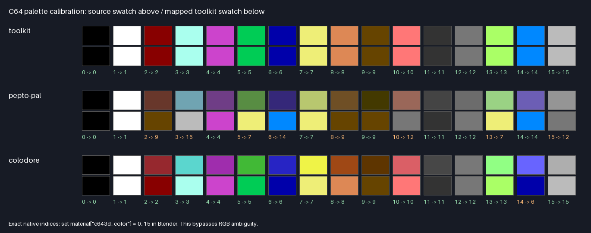

# Blender colour calibration

This diagnostic separates nearest-RGB mapping, source colour space and explicit
C64 palette indices. It does not change conversion defaults or guess an
unidentified source palette.



The card compares all 16 colours from the toolkit, VICE 3.10 Pepto PAL and
VICE 3.10 Colodore. [Exact values and source checksums](palettes.json),
[all 48 mappings](MAPPING_RESULTS.md) and [machine-readable results](mapping-results.json)
are included. All 16 toolkit swatches map to their original index; 8/16 Pepto
PAL and 15/16 Colodore swatches retain their index under the same nearest-RGB
mapper. A different RGB representation of a C64 colour is not guaranteed to
map back to that colour's index in a different reference palette.

For example, Pepto PAL red `(104, 55, 43)` maps to brown in the current toolkit
palette, whereas Colodore red `(150, 40, 46)` maps to red. Pure RGB red is **not**
a requirement for selecting red. The mapper compares all palette entries
using its existing weighted perceptual distance.

## Editable Blender card

`create_scene.py` makes `color-calibration.blend`: 96 quad materials in six
rows, with columns in native C64 index order 0–15. Each palette has an automatic
row and an explicit-index row. The script converts authored sRGB swatches to
Blender's scene-linear material values, reads the actual exporter result and
writes `material-results.json`. All 48 explicit indices and all 16 toolkit
automatic swatches must pass. A separate diagnostic checks Principled Base
Color against a deliberately different viewport/diffuse colour.

```sh
blender -b --factory-startup --python examples/blender_color_calibration/create_scene.py
blender -b examples/blender_color_calibration/color-calibration.blend --python tools/blender_export.py -- --output examples/blender_color_calibration/color-calibration.c643dscene --frame-start 1 --frame-end 1 --viewport-width 320
python examples/blender_color_calibration/report.py
```

Use Blender's Standard view transform, neutral look, exposure 0 and gamma 1
for inspecting the card. Lighting/render view settings can alter its visible
preview; the toolkit's exporter reads material values, not a rendered image.
The PNG above is generated directly from exact RGB values, without lighting.

Verified with Blender 4.0.2: all 96 exported face indices match the recorded
material results, with 384 vertices and one calibration frame. The editable
[Blender scene](color-calibration.blend), [exported scene](color-calibration.c643dscene)
and [actual material/export results](material-results.json) are included.

## What changed in recent releases

The v0.7.9 changelog records the Blender exporter switching to an unlinked
Principled Base Color when connected directly to the active material output,
and converting scene-linear material RGB to sRGB before matching. A material
can therefore produce a different result if its node colour differs from its
viewport/diffuse colour, or if an import stored sRGB numbers as linear values.

The recovery update adds explicit `--blender-color-space linear|srgb` selection.
The global mapper remains unchanged. For `(152,53,45)/255`, raw sRGB maps to
red; linear-to-sRGB conversion produces `(203,126,117)`, mapping to orange.
Standard Blender data retains the `linear` default; select `srgb` when material
numbers were imported directly as sRGB. The calibration card uses actual
scene-linear values and should retain the default. See the
[colour-space FAQ](../../docs/BLENDER_FAQ.md#why-can-red-become-orange).

To preserve an authored C64 palette index regardless of RGB representation,
set a material custom property, for example in Blender's Python console:

```python
bpy.context.object.active_material["c643d_color"] = 2  # native C64 red
```

This existing override is read before RGB matching. Material overrides take
precedence over the object property. Indices 0–15 and supported colour names
are accepted. For monochrome wire output, `--foreground-color red` provides
an explicit build-level override; it does not preserve multiple material hues.

## Comparing builds

Use the same Blender source, version, camera/frame range, viewport width,
colour interpretation, picture stream, pacing and PAL machine. Re-export a
scene when changing `--blender-color-space`; already-exported scenes contain
mapped C64 indices. The [interactive v3.0/v3.1 A/B](../../docs/INTERACTIVE_BASELINE_PERFORMANCE.md)
measures collection controls, not an unrelated authored-scene workload.

[Blender pipeline](../../docs/BLENDER_PIPELINE.md) · [Installation](../../docs/INSTALLATION.md)
