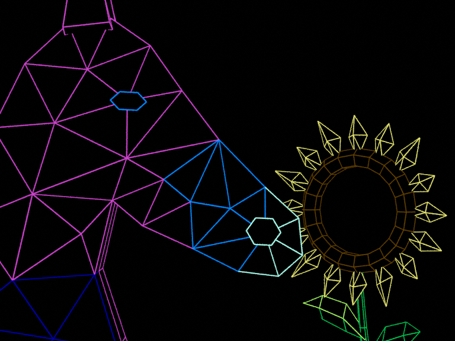

⚠️🐴 Attention! For best quality, please enjoy each animation with `hors-render-v1` or a newer variant.

Recommended for quality and FPS: the `hors-render-v1` cartridge linked below.

**Current hors-render-v1 cartridge:** [play the example](../cart_horse_and_sunflower/README.md).

# Horse and sunflower

**v0.7.0 uses hors-render-v1-scene.** The Blender shot was introduced in v0.6.7
and remains separate from the multi-demo menu.

A very close side-view shot of the HiFi horse sniffing the HiFi sunflower.
The original purple/blue/cyan horse and yellow/brown/green flower retain all
378 vertices, 416 polygons and their original material assignments. The flower
faces partly toward the camera. Only the horse moves: approach, two gentle
sniffs, linger, then ease back into a seamless loop.

- [Editable Blender scene](horse_and_sunflower.blend)
- [Standalone C64 cartridge and emulator preview](../cart_horse_and_sunflower/README.md)
- [Scene generator](horse_and_sunflower.py)



## Opening and editing

Open `horse_and_sunflower.blend` in Blender 4.0 or newer. The saved view is the
active camera. The timeline runs from 1 to 250 at 25 FPS. The `Horse_motion`
empty carries the only animation; its child is the original horse mesh.
Timeline markers identify the approach, sniffing beats and return.

The camera uses a fixed 82 mm perspective lens and 4:3 framing at 768×576.
The tight crop of the neck, ear tips and lower stem is intentional. The flower
and camera have no animation. The scene contains no external texture files.

`Original HiFi meshes - C64 export` contains the two source meshes. Coloured
CURVE objects in `Coloured wire preview - Blender only` draw the original edges
for the desktop render; the C64 exporter ignores them. Mesh material viewport
colours and `c643d_color` properties retain the source MTL palette. Black surface
shaders occlude the rear preview edges. The original asset files are unchanged.

Blender's smooth wire render shows the composition. The C64 capture shows its
256×192 rasterized geometry, native 8×8-cell colour choices and actual emulator
timing. The C64 bitmap is 320×200, so this existing renderer also has an unused
strip on the right and a blank bottom HUD row in the clean build.

## Rebuilding with hors-render-v1

For a fresh Blender compilation, use the [current scene build
command](../../docs/CARTRIDGE_SCENES.md#current-scene-path-in-071). It exports
every third source frame (84 samples), requests six PAL ticks per sample and
writes to a separate `build/` directory. This avoids treating newly evaluated
Blender geometry as a byte-exact copy of the supplied cart. Use `--prefer ram`
for the smaller-kernel alternative.

The preserved `tools/build_horse_and_sunflower.py` is a **V7 reproduction tool**;
it still emits V7, not hors-render-v1. Its `--regenerate` option recreates the
source scene, so omit it to preserve Blender edits. To deliberately regenerate
only the Blender scene from its original OBJ/MTL inputs:

```bash
blender --background --python-exit-code 1 --python examples/blender_horse_and_sunflower/horse_and_sunflower.py
```

## Historical V7 playback measurement

The original V7 test requested six PAL ticks per sample (about 8.33 FPS). Its
84-sample loop took 19.71 seconds, about 4.3 samples per second, in the recorded
PAL VICE test. That number describes V7; it is not a measured speed for the
current hors-render-v1 cartridge. Current FPS/RAM carts are linked above.

## Verification

The saved scene was reopened in Blender 4.0.2 and checked against both source
OBJs/MTLs: exact topology, material IDs and vertex coordinates within Blender's
float precision. Camera/flower transforms stay constant across the full loop;
the horse's closing pose equals its opening pose. No horse/flower surface
intersections were found at the twelve checked rest, approach and sniff poses.
See [scene validation](scene-validation.json).

The shared export regression checks a moving ordinary and mirrored mesh with a
rotated, shifted camera. Projection agrees with Blender within **0.00002 pixels**,
outward normals match and face material IDs are preserved. See
[camera validation](blender-camera-validation.json) and
[the pipeline guide](../../docs/BLENDER_PIPELINE.md).

```bash
blender --background --python-exit-code 1 --python tools/verify_blender_camera.py -- --output build/blender-camera-validation.json
blender --background examples/blender_horse_and_sunflower/horse_and_sunflower.blend --python-exit-code 1 --python examples/blender_horse_and_sunflower/verify_scene.py
```
