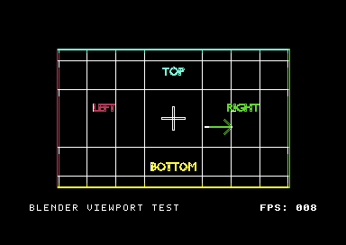
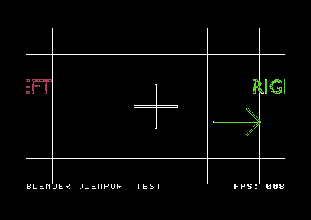

# Blender viewport test cards

Two editable Blender scenes and HORS-V3 cartridges test orientation, camera framing and the complete **320×192** artwork viewport. The bottom eight pixels of the 320×200 bitmap hold the unchanged HUD. These are calibration examples, not tests of the starfield or exhibition mode.

| Source / cart | Shot | What to check |
| --- | --- | --- |
| `viewport-test.blend` / `cartridges/viewport-test.crt` | 16-frame lens zoom | LEFT and RIGHT readable, right arrow points right, centre cross fixed, grid reaches all four edges |
| `tracking-test.blend` / `cartridges/tracking-test.crt` | 16-frame moving camera with a Track To constraint | Target stays centred while perspective changes; readable labels retain their orientation |

The original source .blend files, Blender-neutral .c643dscene files, scene generator and projection check are included. All materials use named C64 colours. Neither scene requires external image textures, fonts or simulation caches.




[Zoom animation](previews/viewport-test.gif) · [Tracking animation](previews/tracking-test.gif)

## Verification

Both carts pass **51 completed-frame checks each** over three loops and all three bitmap/colour buffers, including HUD preservation and clearing on loop wrap. The displayed zoom and tracking captures each recognize all 16 source pictures in actual VIC display buffers. Twelve zoom frames reach all four artwork boundaries; the symmetric outline around the centre is preserved throughout ([edge coverage](evidence/edge-coverage.json)). Screenshots are VICE PNG captures taken after the display has settled, rather than host-rendered mockups.

The Blender projection checks compare 4,976 exported vertices per scene against `world_to_camera_view`. Maximum error is below 0.00005 pixels; target-centre error is below 0.000001 in normalized camera coordinates. The camera-transform check separately covers a reflected object and a shifted, rotated, scaled camera. Hardware testing is not claimed.

## Performance

PAL VICE 3.10, same 16-frame zoom, HORS-V3 literal colours, one-tick requested cadence, three-frame warmup. These are measured scene throughput figures, not the requested playback target.

| Drawing width | Measured FPS | Mean render cycles |
| --- | ---: | ---: |
| 256 (explicit legacy width) | **8.74** | 112,533.56 |
| 320 (new Blender default) | 8.09 | 121,579.00 |

The wider picture costs 7.46% throughput in this test because it draws more pixels/cells. Full width adds no per-pixel runtime branches or fixed frame-buffer allocation. Existing 40-cell bitmap character rows (320 bytes each) and screen RAM already provide the space. Wide clear spans are split on the host into at most 32 cells each, avoiding an 8-bit Y-index wrap. Workload complexity, frame stream size and existing metadata/ROM limits still apply.

The supplied carts request 10 FPS: zoom measures 8.13 completed frames/s and tracking 8.07, since these detailed wireframe calibration cards exceed that rendering budget. Raw reports and cartridge hashes are in [evidence](evidence/).

## Cartridge capacity

| Cartridge | Allocated ROM | Free EasyFlash ROM | Encoded frame payload |
| --- | ---: | ---: | ---: |
| Zoom card | 112 KiB | 912 KiB | 56,797 bytes |
| Tracking card | 104 KiB | 920 KiB | 56,219 bytes |

Allocated ROM counts 8 KiB CHIP slots, including boot/runtime and padding. Frame payload is only part of that allocation; CRT container headers are separate.

## Rebuild

```bash
blender -b --python examples/blender_viewport_test/create_scene.py -- \
  --output examples/blender_viewport_test/viewport-test.blend
blender -b --python examples/blender_viewport_test/create_scene.py -- \
  --variant tracking --output examples/blender_viewport_test/tracking-test.blend
python c643d.py build --blend examples/blender_viewport_test/viewport-test.blend \
  --output viewport-test --output-dir examples/blender_viewport_test/cartridges --frame-ticks 5
python c643d.py build --blend examples/blender_viewport_test/tracking-test.blend \
  --output tracking-test --output-dir examples/blender_viewport_test/cartridges --frame-ticks 5
blender -b examples/blender_viewport_test/tracking-test.blend \
  --python examples/blender_viewport_test/verify_projection.py -- --output build/tracking-projection.json
python tools/verify_cart_stream.py examples/blender_viewport_test/cartridges/viewport-test.crt \
  --vice x64sc --vice-data /usr/share/vice --cycles 3 --capture build/viewport-captures
```

After rebuilding, run the same native verifier for `tracking-test.crt`. `--scene` can use the bundled interchange files without Blender. `--viewport-width 256` explicitly reproduces the old drawing width when exporting a .blend. An explicit width override on an existing interchange file changes its clipping area only; re-export the .blend to recalculate camera projection for a different aspect ratio.

[Blender FAQ: width, framing, mirroring and rebuilding old scenes](../../docs/BLENDER_FAQ.md).
