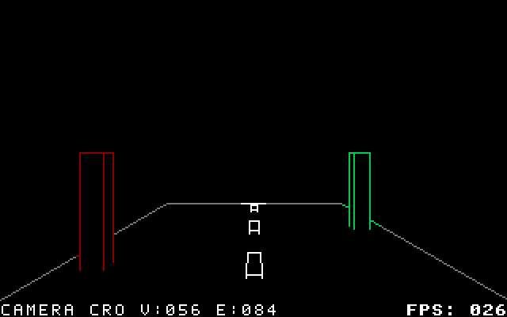

# Camera-crossing road diagnostic

An original road with lane marks and coloured posts moves through the active
camera, becomes fully invisible, then returns. The 17 authored samples include
nine consecutive invisible frames. The source has 56 vertices and 84 edges.



- [Editable Blender scene](camera-crossing.blend)
- [Exported camera-space scene](camera-crossing.c643dscene)
- [GMod3 cartridge](camera-crossing-gmod3.crt)
- [EasyFlash cartridge](camera-crossing-easyflash.crt)

Both cartridge builds use a target of two PAL refreshes per sample. The display
check observes all 17 samples in order, all three bitmap buffers, and two-refresh
holds even for invisible samples. Its complete loop takes about 0.6783 seconds.
The GIF uses measured display holds; GIF timestamps round to centiseconds.

Clipping occurs on the host. Crossing edges retain their visible portions;
clipped triangles continue to occlude unrelated edges. Fully hidden/off-screen
geometry produces blank pictures without removing samples or inventing caps
along the cut plane. HUD information can remain visible above a blank artwork
buffer. Geometry outside the view does not need to be manually deleted.

## Validation

| Check | Result |
| --- | --- |
| GMod3 completed buffers | 54 frames; bitmap, colour and border match |
| EasyFlash completed buffers | 54 frames; bitmap, colour, border and HUD match |
| Resident yunroll PRG, 256-pixel viewport | 54 frames; bitmap and colour match across all three buffers |
| Actual GMod3 display | 300 PAL refreshes; every sample and all three buffers covered, sequence intact |
| Blank authored samples | Nine consecutive samples retained |
| Existing scene comparison | Four prior scenes, first/middle/last samples, mono and colour: identical frame records |
| Blender camera integration | Reflected object, shifted/rotated/scaled camera and exact material indices pass |

[Clipping counts](evidence/clipping.json), [GMod3 buffers](evidence/gmod3-completed-frames.json),
[EasyFlash buffers](evidence/easyflash-completed-frames.json), [resident buffers](evidence/resident-validation.json),
[actual display and timing](evidence/camera-crossing-gmod3-display.json),
[baseline record comparison](evidence/baseline-preservation.json), [Blender camera check](camera-validation.json).

## Reproduce

```sh
blender -b --factory-startup --python tools/create_camera_crossing.py -- --output examples/camera_crossing/camera-crossing.blend
blender -b --disable-autoexec examples/camera_crossing/camera-crossing.blend --python tools/blender_export.py -- --output examples/camera_crossing/camera-crossing.c643dscene --viewport-height 192
python tools/verify_camera_crossing.py --output-dir ../camera-crossing-checks --vice-data /path/to/vice-data
```

Pass `--tass`, `--cartconv` and `--vice` when the tools are outside PATH. The
native verifier rebuilds both cartridge backends and a resident PRG before
checking them. To check a supplied cartridge without rebuilding, pass its
included oracle explicitly:

```sh
python tools/verify_cart_stream.py examples/camera_crossing/camera-crossing-gmod3.crt --oracle examples/camera_crossing/camera-crossing-gmod3-oracle.json --vice-data /path/to/vice-data --cycles 3
```

`--ignore-warnings` hides the single clipping summary. It does not suppress
invalid input, missing dependency, topology or capacity errors.
