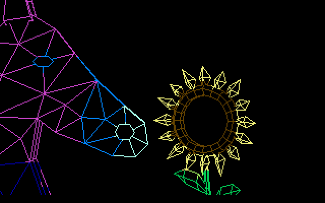

# Horse and sunflower — C64 test cartridge

**0.6.7, yunroll-cart-v7-scene, FPS preference.** This is a separate test
of the [authored Blender close-up](../blender_horse_and_sunflower/README.md).
The scene is kept separate from the twelve-demo menu.

[Download the CRT](horse_and_sunflower-yunroll-cart-v7-scene.crt)

```bash
x64sc -pal -cartcrt examples/cart_horse_and_sunflower/horse_and_sunflower-yunroll-cart-v7-scene.crt
```

The silent scene loops continuously, with no title/FPS overlay. Use emulator
reset or detach the cartridge to leave. This standalone test does not install
the multi-demo menu's F1/SPACE control shim.



The original HiFi meshes and colours are preserved. The stationary flower faces
the camera at an angle; the horse leans in, sniffs twice and eases back.

| PAL VICE result | Value |
| --- | ---: |
| Authored samples per loop | 84 |
| Requested cadence | 8.33 FPS / 6 raster ticks |
| Measured loop duration | 19.71 seconds |
| Measured sample throughput | About 4.3 per second |
| Samples checked | 171, covering two loops and all three buffers |
| Bitmap and colour comparison | Exact match for every checked sample |
| Cartridge size | 197,056 bytes |

This is a large close-up of both HiFi meshes. Rendering exceeds the requested
cadence, so playback takes longer than the ten-second Blender animation. The
runtime preserves the samples and their order. V7's lossless optimizations
still share duplicate pictures and remove redundant drawing records.

The GIF is reconstructed from VICE bitmap/colour RAM, with measured completed-frame
intervals. It is not a recording of a physical C64 or the host display output.
See [validation](validation.json) and
[per-sample timing](horse_and_sunflower-yunroll-cart-v7-scene-timing.json).

Rebuild with `python tools/build_horse_and_sunflower.py`. For emulator validation:

```bash
python tools/verify_cart_stream.py examples/cart_horse_and_sunflower/horse_and_sunflower-yunroll-cart-v7-scene.crt --vice-data /path/to/vice-data --capture build/horse-capture --report build/horse-validation.json
```
