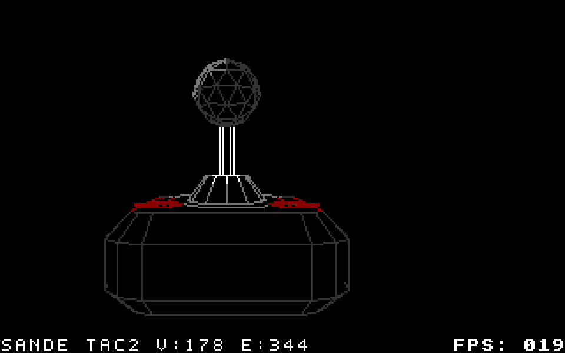
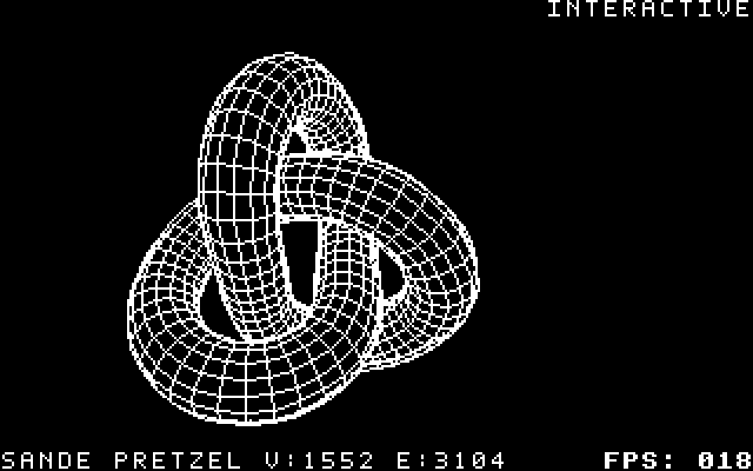

# Sande's Models

Models contributed by **Sande**. This separate set currently contains
**Sande's Pretzel** and **Sande's TAC-2 joystick**. Toolkit **0.7.6**.
The internal test-set ID is `sande_models`.

| Model | Source pair | Vertices | Edges | Faces |
| --- | --- | ---: | ---: | ---: |
| Sande's Pretzel | [OBJ](sande_pretzel.obj) + [MTL](sande_pretzel.mtl) | 1,552 | 3,104 | 1,552 |
| Sande's TAC-2 joystick | [OBJ](sande_tac2.obj) + [MTL](sande_tac2.mtl) | 178 | 344 | 174 |

The original geometry and MTL bytes are preserved. OBJ object names and
`mtllib` references match the new filenames. The material files contain
repeated material definitions from the original LightWave export; these
are retained. Default demo builds intentionally ignore source colours and
start **white on black, with a black border**.

## Cartridges

| Model | Automatic playback / benchmark | Interactive rotation and colours |
| --- | --- | --- |
| Pretzel | [sande_pretzel-hors-render-v2.crt](sande_pretzel-hors-render-v2.crt) | [sande_pretzel-hors-render-v2-interactive.crt](sande_pretzel-hors-render-v2-interactive.crt) |
| TAC-2 | [sande_tac2-hors-render-v2.crt](sande_tac2-hors-render-v2.crt) | [sande_tac2-hors-render-v2-interactive.crt](sande_tac2-hors-render-v2-interactive.crt) |

The defaults above are **bw** (white on black). Separate automatic HORS-V2
`-color` variants use the original OBJ/MTL diffuse colours:

| Model | Material-colour cartridge | Supplied material colours |
| --- | --- | --- |
| Pretzel | [sande_pretzel-hors-render-v2-color.crt](sande_pretzel-hors-render-v2-color.crt) | Grey only; the supplied MTL has no chromatic colours |
| TAC-2 | [sande_tac2-hors-render-v2-color.crt](sande_tac2-hors-render-v2-color.crt) | Red, white and greys |

MTL colours map to the C64 palette. Repeated definitions retain the OBJ
loader's existing last-definition-wins behavior. The grey Pretzel uses the
single-foreground fast path; TAC-2 uses per-cell colours. These carts have
automatic rotation and preserve material colours; the existing interactive
variants provide uniform foreground/background controls.



HUD and EasyFlash names are `SANDE PRETZEL` and `SANDE TAC2`; the toolkit's
display convention renders filename underscores as spaces. Source filenames,
cart basenames and manifest names use `sande_pretzel` and `sande_tac2`.

## Interactive controls

| Input | Effect |
| --- | --- |
| Cursor left / right | Select backward / forward traversal of the Y-axis rotation |
| Joystick port 1 or 2, left / right | The same persistent direction selection |
| F2 (Shift+F1) | Brief white flash, then reset original colours, speed and border-follow mode; stop cycling |
| F3 | Cycle foreground through the 16 C64 colours |
| F4 (Shift+F3) | Cycle background; border follows unless locked black or set to a custom colour |
| F5 | Start/stop alternating foreground and background palette cycling |
| F6 (Shift+F5) | Decrease cycling speed |
| F7 | Increase cycling speed |
| F8 (Shift+F7) | Toggle persistent solid-black border / background-follow mode |
| Ctrl+F7 | Cycle an independent border colour and hold it through background changes |

The border **follows the background by default**. F8's black-border lock
persists through manual and automatic colour changes; toggle it off to
immediately match the current background again. Ctrl+F7 selects a custom
border; F8 returns it to follow mode. F2 restores the defaults.
On the C64, F8 is already Shift+F7, so Shift+F8 cannot be distinguished as
an additional key. Ctrl+F7 supplies that separate border-colour action.
With text overlays enabled, `INTERACTIVE` appears at the top right in the
same font as the model HUD. The ordinary HORS-V2 cart path currently requires
its standard text overlay; `--no-text-overlay` is rejected by that renderer.

Cycling starts off. F5 starts a sequential C64 palette cycle: foreground
first, then background/border, alternating on each event. It skips a colour
that would make foreground and background identical. The initial interval
is about one second per event. Eight rates use 200, 100, 50, 25, 12, 6, 3 or 1
PAL ticks, ranging from about four seconds to at most one change per produced
frame. F6/F7 stop at the slowest/fastest setting. F2's white flash lasts five
PAL ticks (about 0.1 s) and runs only on reset.

On a real C64, left is Shift+CRSR right; both Shift keys are supported.
VICE must map the host arrow keys to those C64 cursor keys. Configure the
desired joystick input device in VICE to use either emulated port.
Releasing a direction continues the selected rotation. Opposite directions
held together leave it unchanged. Keyboard decoding waits while a joystick
is active to avoid false keys from the shared CIA keyboard/joystick wiring.

The interactive runtime is separate. It polls once per produced sample,
keeps all 192 precomputed orientations and changes the next frame-directory
index. It does not compute a new camera or arbitrary 3D rotation on the C64.
A queued frame may still display before a direction change takes effect.



## Reproduce

Run from the repository root; Python, 64tass and VICE/cartconv are required.

```bash
python tools/build_sande_examples.py
python tools/build_sande_examples.py --interactive
python tools/build_sande_examples.py --source-colors

python c643d.py run-cart examples/demos_sande/sande_pretzel-hors-render-v2-interactive.crt
python c643d.py run-cart examples/demos_sande/sande_tac2-hors-render-v2-interactive.crt
```

The pinned [recipe](recipe.json) ignores local render settings. It uses
192 Y-axis samples, automatic surface visibility, a 192-line viewport,
the normal HUD, FPS preference and v2 gap 6 / batch budget 2048. Mesh detail
and orientation counts are never silently reduced.
`--tass`, `--cartconv`, `--output-dir`, `--models` and `--prefer ram` are available.
`--source-colors` removes only the recipe's monochrome overrides and appends
`-color` to the cartridge basename. It cannot be combined with `--interactive`.
Use `tools/build_current_examples.py` or `COMPILE-RELEASE.sh` to include the
whole current example collection.

The main CLI also supports other standalone v2 spin objects:

```bash
python c643d.py build --obj examples/demos_sande/sande_pretzel.obj \
  --name sande_pretzel --renderer hors-render-v2 --frames 192 \
  --spin-axis y --interactive-cart --color white \
  --background-color black --border-color black
```

`--interactive-cart` enables uniform monochrome colours. PRG renderers,
other stream renderers, authored scenes and non-spin animations are rejected.
Explicit outputs must be extensionless basenames or end in `.crt`.
The ordinary build path has no input polling added.

## Performance tests

```bash
bash RUN-SANDE-CHECKS.sh
```

This rebuilds bw, interactive and material-colour variants, verifies the MTL
palette and completed colour pictures, checks direction and palette controls,
compares standalone v1/v2 FPS/RAM builds, measures interactive idle cost,
and runs every historical comparison method on each registered model in
both bw and original material colours.
Results go to a new directory beside the repository, including a
`sande-perf-logs.zip` bundle suitable for sharing. To select a destination:

```bash
JOBS=3 VICE_DATA=/usr/local/share/vice \
  bash RUN-SANDE-CHECKS.sh ../c64-sande-local-results
```

Individual stages:

```bash
python tools/run_sande_perfs.py --workspace ../sande-standalone --vice-data /usr/local/share/vice
python tools/run_sande_methods.py --workspace ../sande-methods --vice-data /usr/local/share/vice
python tools/run_sande_perfs.py --source-colors --workspace ../sande-color-standalone --vice-data /usr/local/share/vice
python tools/run_sande_methods.py --source-colors --workspace ../sande-color-methods --vice-data /usr/local/share/vice
```

[Performance comparison](../../docs/PERFORMANCE_COMPARISON.md#sandes-models)
contains both the standalone and historical-method tables. The automatic
release check includes this set. V/E are source topology totals, not live
transformation rates or counts of lines drawn each frame. Reported display
FPS is measured from emulated cycles and actual buffer flips, not VICE host
speed, the rounded HUD counter or model edges multiplied by FPS.
The comparison presents bw and material colours in separate tables with
matching rotation samples. The interactive idle rows belong to the bw set.

## Adding another Sande model

Add its `sande_<name>.obj` and `.mtl`, update the OBJ `mtllib` reference, and
add its title and exact topology under `models` in [recipe.json](recipe.json).
The builder, dedicated benchmarks and input verifier discover this registry;
there is no fixed two-model limit. New authored scene formats would require
their own appropriate recipe rather than being treated as OBJ spins.
Rebuild and rerun the complete checks before publishing fresh comparisons.


## HORS-V3 metallic surface cartridges

The metallic Pretzel is also available as a filled HORS-V3 surface, with direct or compact colour streams and a separate interactive version of each.

- [Direct metallic interactive cartridge](../hors_v3_preview/cartridges/sande_pretzel-surface-metallic-128-v3-interactive.crt)
- [Compact metallic interactive cartridge](../hors_v3_preview/cartridges/sande_pretzel-surface-metallic-128-v3-indexed4-interactive.crt)
- [Build commands, variants and controls](../hors_v3_preview/README.md)
- [Measured performance and storage](../../docs/HORS_RENDER_V3_RESULTS.md)

Use `--renderer hors-renderer-v3 --surface-fill metallic --interactive-cart`. `hors-render-v3` remains an alias. Cursor left/right or either joystick port selects persistent rotation direction; both C64 Shift keys work. The top-right `INTERACTIVE` label uses the HUD font. V3 preserves all nonblack metallic shades. Its background controls are:

| Key | HORS-V3 action |
| --- | --- |
| F2 (Shift+F1) | White flash, reset background to black, follow border, auto off, default speed |
| F3 | No action; foreground shades are preserved |
| F4 (Shift+F3) | Next background colour, replacing only original black pixels |
| F5 | Toggle automatic background palette cycling |
| F6 (Shift+F5) / F7 | Slower / faster cycling |
| F8 (Shift+F7) | Toggle persistent black border / follow background |
| Ctrl+F7 | Next independent border colour |

The border follows the background by default. Black lock and custom borders persist through background changes. Cycling is sequential, initially about once per second; intervals range from 200 to 1 PAL tick and are limited by the rate of produced pictures. Nonblack grey/white shades are never remapped. Release function keys between presses. V2 retains its existing foreground/background controls.
