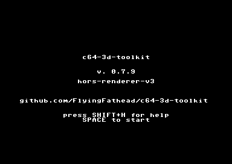
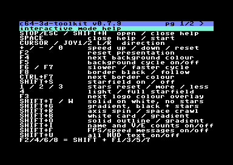
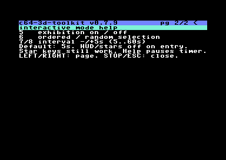

# SAKU 2026

The 2026 logo of Suomen Amiga-käyttäjät ry (Saku), supplied for this example.

[SAKU official home page](https://suomenamigakayttajat.fi/) · [Saku magazine](https://sakulehti.fi/)

The cropped [SVG](saku_2026.svg) contains the eight original vector paths, including outlined year glyphs. The page background is transparent. Two additional references use those same paths: [white outlines on transparent space](saku_2026-white-outline.svg) and [original artwork on a white rectangle](saku_2026-white-background.svg). The white strokes belong only to the transparent variant. The [source PDF](source/Saku_2026_logo.pdf) and [extraction provenance](source/provenance.json) are included.


## Interactive keyboard map

| Key | Action |
| --- | --- |
| Shift+I | Show/hide the lower-left name and V:/E: counts |
| Shift+F | Show/hide FPS and speed feedback; controls keep working |
| Shift+U | Hide all HUD text, or show all when hidden (including INTERACTIVE) |
| RUN/STOP (Esc in VICE) / Shift+H | Open/close the versioned keymap; Space also closes |
| Cursor left / right | Help page 1/2 while help is open; during playback, persistent rotation direction; left is Shift+cursor-right on a C64 |
| Joystick left / right, ports 1 or 2 | Same direction controls |
| `+` / `-` | Increase / decrease rotational speed; skipped orientations or longer holds |
| `0` | Reset rotational speed |
| Shift+S | Toggle the forward starfield |
| `1` / `2` / `3` | Reset / more / fewer stars in the selected field |
| `4` | Switch original light / full starfield; remember each density and preserve on/off state |
| `5` | Exhibition on/off; hide HUD/stars on entry |
| `6` | Sequential/random presentation order |
| `7` / `8` | Change exhibition interval by -/+5 seconds (5–60) |
| Shift+T / Shift+W | Original solid black/red on white; axis spin; stars and automatic cycling off |
| Shift+G | Source-colour gradients on black; stars on, automatic cycling off |
| Shift+R | Switch axis rotation / perspective crawl |
| Shift+B | Toggle the original logo on a padded, rounded rotating/flying white card; preserve spin/crawl and starfield on/off |
| Shift+O | Toggle solid black/red with white SAKU outlines; preserve spin/crawl and starfield on/off |
| F2 / Shift+F1 | Reset to the gradient space presentation |
| F3 | Cycle the foreground hue overlay, eventually restoring the source palette |
| F4 / Shift+F3 | Next background colour |
| F5 | Toggle automatic background cycling |
| F6 / Shift+F5 | Slower cycling |
| F7 | Faster cycling |
| F8 / Shift+F7 | Toggle black border / follow background |
| Ctrl+F7 | Next independent border colour |

## Cartridges and rebuilding

[Interactive: gradients, stars, solid mode and crawl](cartridges/saku_2026-interactive.crt) ·
[Solid source colours on white](cartridges/saku_2026-solid.crt) ·
[Automatic gradient spin](cartridges/saku_2026-gradient.crt)

```bash
python -m pip install -r requirements-svg.txt
python examples/saku_2026/build.py
python examples/saku_2026/verify.py --vice x64sc --vice-data /usr/share/vice --install
```

The interactive cart has 30 samples for each of eight presentations (240 total), all on one EasyFlash cartridge: original solid and gradient spin/crawl, white-card spin/crawl, and solid outlined spin/crawl. The final manifest records the frame-stream bytes, bank padding and total CRT size.
The default is gradient spin with the original light field: eight single-pixel stars. Press `4` for the fuller 16-point field, or again to return to light. Both routines are already in RAM; switching needs no cartridge reload. The whole turn fits
inside the model viewport with its aspect ratio preserved. Star motion runs
independently at PAL refresh rate. The solid white presentation preserves the
logo's original black SAKU and red year, mapped into the C64 palette. The red source gradient uses red for both darkest levels, then light red and white; its shadow no longer borrows brown. The white-card modes keep that original artwork on a padded rounded card which rotates or flies toward the horizon. Gradient and solid outlined space modes use the separate white-outline source. Stars are masked behind the painted bounding box in card/solid outlined modes, including its interior whitespace; they never show through black letters.

The original intro waits indefinitely for SPACE. `press SHIFT+H for help`
appears on its own row directly above `SPACE to start`. RUN/STOP (Esc in the bundled VICE keymaps) or Shift+H opens help
from the intro; closing it returns to the intro and still waits for SPACE.
During playback, **RUN/STOP / Esc or Shift+H** opens help with playback paused. Closing help
restores the picture, stars, speed, colours and selected presentation.







## Exhibition

Press **5** to cycle the solid outlined, gradient and rounded white-card styles. HUD and stars start off; Shift+S and the density/profile keys still work, and your choices survive scene changes. Spin/crawl stays selected. **6** chooses sequential or random order without immediate repeats; **7/8** changes the interval by five seconds, from 5 to 60 (default 5). Help pauses the timer. Leaving exhibition restores the pre-exhibition HUD and star on/off states.


[Shared exhibition options and behavior](../../docs/EXHIBITION.md) include `--exhibition-default enabled|disabled`, `--exhibition-order sequential|random`, and `--exhibition-interval SECONDS` for future interactive builds. A cart cycles only its compiled styles; single-loop carts keep playing that loop.


Future interactive builds include the starfield disabled by default. Use
`--starfield-default enabled` to start with stars, or `--no-starfield` (alias
`--no-include-starfield`) to exclude its code and data entirely. SAKU's recipe
explicitly enables it and selects `--starfield-profile light`. The profile option
accepts light or full, independently of whether stars start on; F2 restores
the selected startup profile. Help and speed controls remain when stars are excluded.

Speed feedback appears above FPS: `SPD.INC`, `SPD.DEC`, `SPD.RST`; `SPD.MIN` is
red, while maximum shows `WOW!` then white/red `SPD.MAX`. These controls are also
available in future HORS-V3 interactive builds. They adjust angular tempo;
skipping frames does not create additional rendered frames per second.

The **HUD**, including the top-right INTERACTIVE label, starts visible. For a clean presentation, use `--hide-hud`;
`--show-hud` restores the normal build default. `--hud-default enabled|disabled`
(alias `--default-info-text-mode`) explicitly selects the initial state.
Interactive builds allow the three HUD shortcuts by default; `--no-hud-toggle`
omits them, while `--allow-hud-toggle` explicitly includes them. Hiding the HUD
does not change picture fitting, speed controls or internal FPS measurement.
Shift+U also hides/restores the top-right INTERACTIVE label.

[SVG options and fidelity](../../docs/SVG_PIPELINE.md) ·
[Starfield implementation and RAM](../../docs/STARFIELD.md) ·
[Measured results](evidence/results.json) ·
[Full performance comparison](../../docs/PERFORMANCE_COMPARISON.md)

The GIF is captured from actual PAL VICE screenshots, including hardware
sprites. See the saved evidence for source/cartridge identities, all-mode
pixel checks, key checks, and separate performance measurements. Physical
hardware testing is not claimed.

## Starfield performance

Measured in this exact interactive cart in PAL VICE 3.10: 750 refreshes after warmup, normal rotation speed, HUD shown. FPS counts displayed-buffer changes, including sprite work and VIC-II DMA.

| Starfield | Displayed FPS | Average visible points |
| --- | ---: | ---: |
| Stars off | **18.11** | 0.00 |
| Original light, 8 points (SAKU default) | 15.91 | 4.04 |
| Full, 16 points | 13.70 | 10.99 |

Light is **16.1% faster than full** on this animation. Relative to stars off, light costs 12.2% of displayed throughput; full costs 24.3%. Neither field is free.

Configured counts differ from visible counts because points outside the viewport or behind the logo are suppressed. `1/2/3` resets/increases/decreases density and `4` switches resident light/full kernels without a ROM reload.

[Detailed scheduler, density, history and RAM results](PERFORMANCE.md) · [All raw measurements](evidence/results.json)
