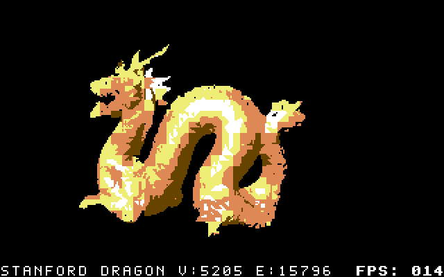
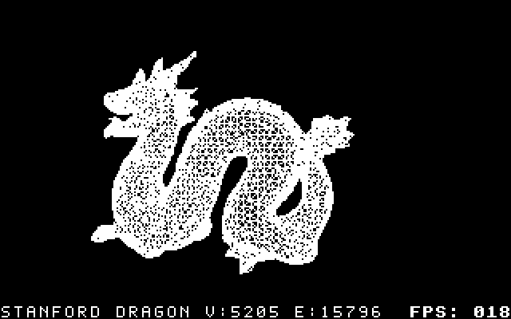
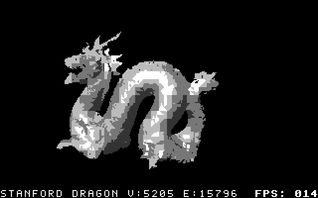
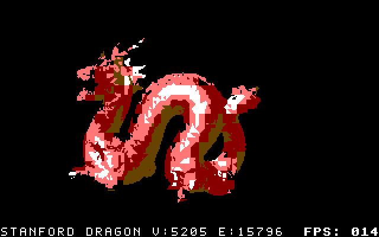
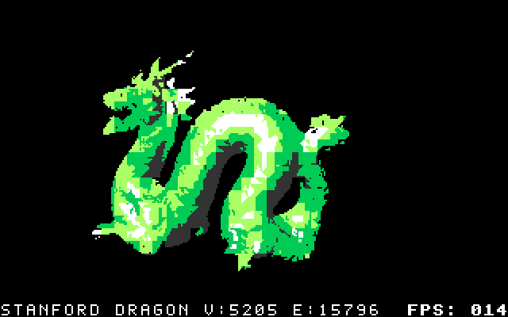
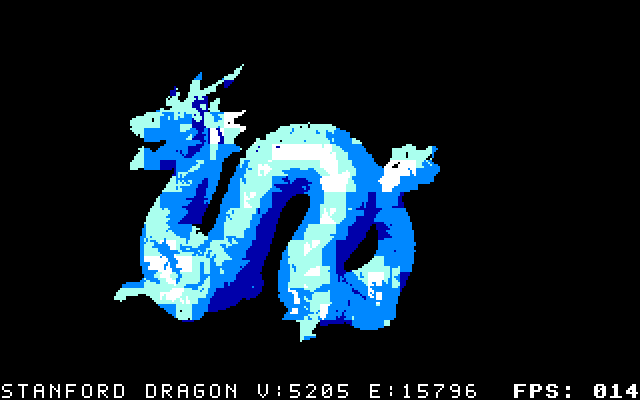

# Stanford Dragon: HORS-V3

Six standalone EasyFlash demos, introduced in **v0.7.8: The Stanford Dragon Has Arrived!** and rebuilt for **v0.7.9**: wireframe and metallic (grey), golden, red, green and blue shaded surfaces. All use Stanford's official res4 mesh: **5,205 vertices, 15,796 edges and 11,102 triangles**, with **128 orientations** and `--prefer fps`.

Model data: **Stanford University Computer Graphics Laboratory**. [Original source, usage terms and conversion provenance](SOURCE.md).

## Golden Dragon — new in v0.7.9

[Download the golden cart](cartridges/stanford_dragon-golden-hors-v3.crt)



The custom ramp runs from brown through orange and yellow to white.

## Original five-way showcase

One complete rotation each: **wireframe → metallic (grey) → red → green → blue**, with the measured PAL timing of each cartridge.



## Wireframe

[Download the wireframe cart](cartridges/stanford_dragon-wireframe-hors-v3.crt)


The complete res4 triangle mesh is retained. Its dense wire pattern is intentional; no edges are removed from the model. The host pipeline hides occluded line portions before encoding the frames.

## Metallic (grey)

[Download the metallic cart](cartridges/stanford_dragon-metallic-hors-v3.crt)



The metallic surface uses HORS-V3's generated grey lighting preset and direct colour bytes. The C64 hires limit of two colours per 8×8 cell produces visible colour blocks at some shade boundaries.

Each 640×400 GIF contains one complete turn captured from actual VICE display buffers. Frame delays follow PAL display holds, with cumulative centisecond rounding. The combined showcase preserves those delays. The longer performance window below includes several turns, so its average need not equal a single captured loop exactly.

## Red shading

[Download the red cart](cartridges/stanford_dragon-red-hors-v3.crt)



## Green shading

[Download the green cart](cartridges/stanford_dragon-green-hors-v3.crt)



## Blue shading

[Download the blue cart](cartridges/stanford_dragon-blue-hors-v3.crt)



## Surface palette options

```bash
# Original metallic appearance; grey is an alias for metallic.
python c643d.py build --renderer hors-renderer-v3 \
  --obj examples/stanford_dragon/stanford_dragon.obj --frames 128 \
  --surface-fill grey

# Shaded surface in red; any native colour family is available.
python c643d.py build --renderer hors-renderer-v3 \
  --obj examples/stanford_dragon/stanford_dragon.obj --frames 128 \
  --surface-fill metallic --surface-palette red

# Gold: custom shading with the showcase camera and all 128 orientations.
python c643d.py build --obj examples/stanford_dragon/stanford_dragon.obj \
  --obj-up y --spin-axis y --frames 128 --rotate-y 20 --keep-winding \
  --visibility surface --camera 110 --focal 180 --margin 6 --max-fit-scale 1.4 \
  --prefer fps --background-color black --border-color black --text-overlay \
  --surface-fill metallic --surface-ramp brown,orange,yellow,white \
  --output stanford_dragon-golden-hors-v3 --run
```

| Palette | Darkest shade → brightest highlight |
| --- | --- |
| metallic (grey) | dark grey → grey → light grey → white |
| red | brown → red → light red → white |
| green | dark grey → green → light green → white |
| blue | blue → light blue → cyan → white |
| custom gold | brown → orange → yellow → white |

**v0.7.9 adds all native hue families and custom gradients.** The original five looks remain available. The golden variant is also prebuilt in v0.7.9. [All colour ramps and custom stops](../../docs/HORS_V3_DEFAULTS_CHECKPOINT.md).

All ramps also preserve black silhouette pixels. They colour the generated surface shading; `--surface-fill textured` continues to use the original `map_Kd` image. Coloured ramps require native encoding; black/white dithering remains available with grey. Auto-generated filenames include a non-grey palette suffix, so the different looks have distinct output names.

## Performance

PAL VICE 3.10, stock timing: 985,248 cycles/s and 19,656 cycles/refresh. Each cart uses 128 orientations and a 1,504-refresh observation window after warmup. Display FPS counts actual buffer flips. Bold marks the highest rate in each column; ties use the shown precision. These different surface appearances are not identical-picture optimization candidates.

| Surface | Average displayed FPS | High FPS | Low FPS | Longest hold (ms) | Frame ROM bytes | CRT bytes |
| --- | ---: | ---: | ---: | ---: | ---: | ---: |
| wireframe | **20.00** | **50.12** | **16.71** | 59.85 | 233,306 | 303,760 |
| metallic | 15.13 | 25.06 | 12.53 | 79.80 | 279,935 | 361,216 |
| red | 15.10 | 25.06 | 12.53 | 79.80 | 277,791 | 353,008 |
| green | 15.13 | 25.06 | 12.53 | 79.80 | 279,215 | 361,216 |
| blue | 15.13 | 25.06 | 12.53 | 79.80 | 280,945 | 361,216 |
| golden | 15.13 | 25.06 | 12.53 | 79.80 | 280,195 | 361,216 |

All 6 carts retain the complete source mesh. Each has an 896-byte frame directory, 8,192-byte staging buffer and 3,072-byte metadata cache, in addition to graphics, code and other state. The original five-way showcase remains 640 pictures and 40.32 seconds; the golden GIF is separate.

The high/low rates describe individual display holds, not sustained throughput. GIF delays follow the actual PAL display sequence with cumulative centisecond rounding. All these carts start automatically and loop.

## Validation

- 259 completed pictures checked per cart: two full turns plus three buffer-reuse samples, **1,554 total**.
- Every bitmap and colour byte matched the independent host oracle across all three buffers.
- All 128 orientations also appeared in the actual display-buffer measurements; HUD, VIC bank selection and black border/background passed.
- EasyFlash mapper ID 32, reset vectors, CHIP packets, PETSCII name and the exact bundled EasyAPI payload passed validation.
- Cart SHA-256 values stayed unchanged after VICE runs.
- All individual GIFs and the combined showcase were reopened to verify their frame counts and encoded durations. Surface/texture tests cover the original features, colour ramps and grey/metallic aliases.

[Saved results](evidence/results.json) · [File and source fingerprints](validation.json)

These results cover PAL VICE. Physical C64 hardware and NTSC were not tested. Full release validation also runs the existing renderer matrix and HORS-V3 collection. Required test transcripts use tracked `.txt` files.

## Run

Open any `.crt` in VICE, or use the toolkit launcher from the repository root:

```bash
python c643d.py run-cart examples/stanford_dragon/cartridges/stanford_dragon-wireframe-hors-v3.crt
python c643d.py run-cart examples/stanford_dragon/cartridges/stanford_dragon-metallic-hors-v3.crt
```

The launcher disables CRT write-back and starts PAL/windowed playback at normal emulation speed.

## Rebuild and measure

Run from the repository root. Requires Python, NumPy, Pillow, 64tass and VICE `cartconv`; VICE `x64sc` plus its data files are needed for verification. Blender and network downloads are not required.

```bash
# Verify the included files and recorded evidence, without running VICE.
python examples/stanford_dragon/verify.py --check

# Optional: reproduce the OBJ from the bundled original PLY.
python examples/stanford_dragon/prepare_model.py

# Build fresh carts and compressed host oracles under build/stanford-dragon/.
python examples/stanford_dragon/build.py

# Verify those rebuilds, measure displayed FPS and produce new GIFs.
python examples/stanford_dragon/verify.py --run \
  --cartridge-dir build/stanford-dragon \
  --vice x64sc --vice-data /usr/local/share/vice
```

The build accepts `--tass`, `--cartconv`, `--variants wireframe metallic red green blue` and `--output-dir`. The verifier accepts `--output-dir`; fresh reports and GIFs default to `build/stanford-dragon-verification/`. [recipe.json](recipe.json) contains the exact renderer, camera and encoding arguments. Normal rebuilds leave the shipped examples and evidence in place.
